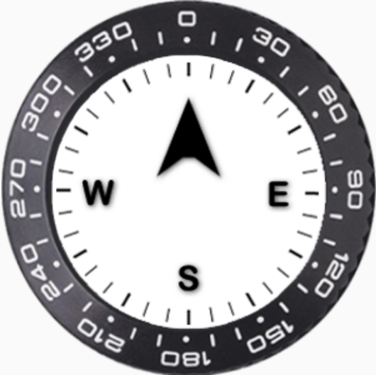
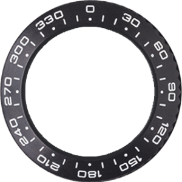
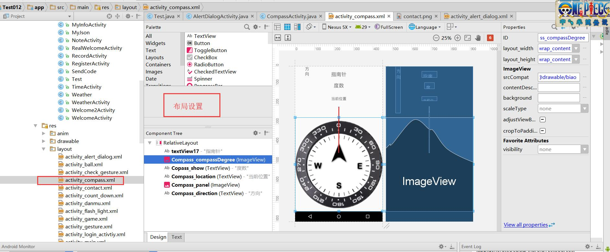

# 10指南针传感器及定位 0423

## 指南针旋转

**1.指南针图片**





2  新建CompassActivity,在main主界面中添加按钮跳转到对应的界面。


3 页面布局设置



代码：

```xml
<?xml version="1.0" encoding="utf-8"?>
<RelativeLayout xmlns:android="http://schemas.android.com/apk/res/android"
    xmlns:app="http://schemas.android.com/apk/res-auto"
    xmlns:tools="http://schemas.android.com/tools"
    android:layout_width="match_parent"
    android:layout_height="match_parent"
    tools:context="com.test01.CompassActivity">

    <TextView
        android:id="@+id/textView17"
        android:layout_width="wrap_content"
        android:layout_height="wrap_content"
        android:layout_marginTop="24dp"
        android:text="指南针"
        android:textSize="24sp"
        android:layout_alignParentTop="true"
        android:layout_centerHorizontal="true" />

    <ImageView
        android:id="@+id/Compass_compassDegree"
        android:layout_width="wrap_content"
        android:layout_height="wrap_content"
        app:srcCompat="@drawable/biao"
        android:layout_marginTop="136dp"
        android:layout_below="@+id/Copass_show"
        android:layout_alignParentStart="true"
        android:layout_centerVertical="true"/>

    <TextView
        android:id="@+id/Copass_show"
        android:layout_width="wrap_content"
        android:layout_height="wrap_content"
        android:layout_marginTop="24dp"
        android:text="度数"
        android:textSize="24sp"
        android:layout_below="@+id/textView17"
        android:layout_centerHorizontal="true" />

    <TextView
        android:id="@+id/Compass_location"
        android:layout_width="wrap_content"
        android:layout_height="wrap_content"
        android:layout_below="@+id/Copass_show"
        android:layout_centerHorizontal="true"
        android:layout_marginTop="37dp"
        android:text="当前位置"
        android:textSize="18sp" />

    <ImageView
        android:id="@+id/Compass_panel"
        android:layout_width="wrap_content"
        android:layout_height="wrap_content"
        app:srcCompat="@drawable/needle"
        android:layout_below="@+id/Compass_location"
        android:layout_centerHorizontal="true"
        android:layout_marginTop="27dp" />

    <TextView
        android:id="@+id/Compass_direction"
        android:layout_width="wrap_content"
        android:layout_height="220dp"
        android:layout_alignParentStart="true"
        android:layout_marginStart="46dp"
        android:ems="1"
        android:text="方向"
        android:textSize="20sp" />

</RelativeLayout>

```

4   找id,

```java
    private ImageView CompassPanel;
    private ImageView CompassCompassDegree;
    private TextView CompassShow;
    private TextView CompassLocation;
    private TextView CompassDirection;
    
     //找控件
        CompassPanel = (ImageView) findViewById(R.id.Compass_panel);
        CompassCompassDegree = (ImageView) findViewById(R.id.Compass_compassDegree);
        CompassShow = (TextView) findViewById(R.id.Copass_show);
        CompassLocation = (TextView) findViewById(R.id.Compass_location);
        CompassDirection = (TextView) findViewById(R.id.Compass_direction);
```

新建传感器对象

```java
//传感器对象
    SensorManager sensorManager;
    SensorListener sensorListener = new SensorListener();
```

获得传感器服务，生成对象

```java
  //获得传感器对象
        sensorManager = (   SensorManager) getSystemService(Context.SENSOR_SERVICE);
        Sensor sensor =sensorManager.getDefaultSensor(Sensor.TYPE_ORIENTATION); //方向传感器

        //传感器注册监听， 监听对象名字，传感器名字，监听的内容
        sensorManager.registerListener(sensorListener,sensor,SensorManager.SENSOR_DELAY_NORMAL);
```

传感器监听方法的实现

```java
 private  class SensorListener implements SensorEventListener{

        //定义变量 记录之前的角度
        float predegree = 0;


        @Override
        public void onSensorChanged(SensorEvent event) {
            //方向传感器的值
            float degree = event.values[0];
            //显示角度
            CompassShow.setText("角度"+degree);

            //显示方向
            int d1=0; //d1表示方位
            String sd1=":";
            int d2=0; //d2表示偏角度
            d1 = (int)degree/90;
            d2 = (int) degree%90;
            String dd[]={"正北","东北","正东","东南","正南","西南","正西","西北"};
            switch (d1){
                case 0:
                    if(degree==0){
                        sd1 =sd1+dd[0];
                    }else {
                        sd1 = sd1 + dd[1] + d2;
                    }
                    break;
                case 1:
                    if(degree==90){
                        sd1 =sd1+dd[2];
                    }else {
                        sd1 = sd1 + dd[3] + (d2);
                    }
                    break;
                case 2:
                    if(degree==180){
                        sd1 =sd1+dd[4];
                    }else {
                        sd1 = sd1 + dd[5] + (d2);
                    }
                    break;
                case 3:
                    if(degree==270){
                        sd1 =sd1+dd[6];
                    }else {
                        sd1 = sd1 + dd[7] + (45-d2);
                    }
                    break;
                case 4:
                    if(degree==360){
                        sd1 =sd1+dd[0];
                    }
                    break;

            }

            CompassDirection.setText(sd1);
//动画设置
            float pivotY = 0.5f;
            //旋转动画的设置
            RotateAnimation an = new RotateAnimation(predegree,-degree,
                    Animation.RELATIVE_TO_SELF, 0.5f,
                    Animation.RELATIVE_TO_SELF,0.5f);
            //设置动画持续时间
            an.setDuration(250);
            //让imageView和动画绑定
            CompassCompassDegree.setAnimation(an);
            //CompassPanel.setAnimation(an);
            predegree=-degree;
        }

        @Override
        public void onAccuracyChanged(Sensor sensor, int accuracy) {

        }
        }
```


## 内置GPS定位

1.定位器管理对象

```java
//定位的管理器LocationManager locationManger;
```

2.获取系统服务

```java
locationManger = (LocationManager) getSystemService(Context.LOCATION_SERVICE);
```

3.打开GPS

```java

if(!isGPSAble(locationManger)){ //判断GPS状态
            Toast.makeText(CompassActivity.this,"未打开GPS",Toast.LENGTH_SHORT).show();
    		//跳转到界面打开GPS
            Intent intent = new Intent(Settings.ACTION_LOCATION_SOURCE_SETTINGS);
            startActivityForResult(intent,0);
            CompassActivity.this.finish();
        }


private boolean isGPSAble(LocationManager locationManager){//判断GPS状态
        return locationManager.isProviderEnabled(LocationManager.GPS_PROVIDER)?true:false;
    }
```

4.由GPS获取信息

首先要开启权限

```java
 //声明数组，用来保存所有需要动态开启的权限
    private static String[] PERMISSION_STORGE={
            Manifest.permission.ACCESS_FINE_LOCATION,
            Manifest.permission.ACCESS_COARSE_LOCATION

    };
    //权限的请求编码
    //常量 1
    private  static  int REQUEST_PERMISSION_CODE = 1;
```

获得定位信息

```java
 final Location lc = locationManger.getLastKnownLocation(LocationManager.NETWORK_PROVIDER);

        if(lc!=null) {
            getAddress(lc);
        }
 
 
 public  void getAddress(Location lc){
        if(lc!=null){
            //lc = locationManger.getLastKnownLocation(LocationManager.NETWORK_PROVIDER);

            StringBuilder sb = new StringBuilder();
            sb.append("当前位置: \n");
            DecimalFormat df = new DecimalFormat(".00");
            sb.append("经度"+lc.getLongitude()+"\n");
            sb.append("经度"+lc.getLatitude()+"\n");

            Geocoder gc = new Geocoder(CompassActivity.this);
            List<Address> addList=null;
            try{
                //sb.append("当前城市"+gc.getFromLocation(lc.getLatitude(),lc.getLongitude(),1).get(0))
                addList =gc.getFromLocation(lc.getLatitude(),lc.getLongitude(),1);


            }catch (Exception e){
                e.printStackTrace();
            }
            Address ad = addList.get(0);
            sb.append("省份"+ad.getAdminArea()+"\n");  //省份
            sb.append("城市"+ad.getLocality()+"\n");   // 城市
            sb.append("街道"+ad.getFeatureName()+"\n"); // 街道
            CompassLocation.setText(sb.toString());

        }else{
            CompassLocation.setText("当前位置：暂无信息");
            Toast.makeText(CompassActivity.this,"定位失败",Toast.LENGTH_SHORT).show();
        }

    }
```

当位置变化时，重新获得权限，重写监听器类方法

```java
locationManger.requestLocationUpdates(LocationManager.NETWORK_PROVIDER, 500, 10, new LocationListener() {
            @Override
            public void onLocationChanged(Location location) {
                //当定位信息发生变化
                getAddress(lc);


            }

            @Override
            public void onStatusChanged(String provider, int status, Bundle extras) {

            }

            @Override
            public void onProviderEnabled(String provider) {


            }

            @Override
            public void onProviderDisabled(String provider) {


            }
        });
```

总代码：

```java
package com.test01;

import android.Manifest;
import android.content.Context;
import android.content.Intent;
import android.content.pm.PackageManager;
import android.hardware.Sensor;
import android.hardware.SensorEvent;
import android.hardware.SensorEventListener;
import android.hardware.SensorListener;
import android.hardware.SensorManager;
import android.icu.text.DecimalFormat;
import android.location.Address;
import android.location.Geocoder;
import android.location.Location;
import android.location.LocationListener;
import android.location.LocationManager;
import android.os.Build;
import android.provider.Settings;
import android.support.v4.app.ActivityCompat;
import android.support.v7.app.AppCompatActivity;
import android.os.Bundle;
import android.view.animation.Animation;
import android.view.animation.RotateAnimation;
import android.widget.ImageView;
import android.widget.TextView;
import android.widget.Toast;

import java.util.List;

public class CompassActivity extends AppCompatActivity {


    private ImageView CompassPanel;
    private ImageView CompassCompassDegree;
    private TextView CompassShow;
    private TextView CompassLocation;
    private TextView CompassDirection;


    //声明数组，用来保存所有需要动态开启的权限
    private static String[] PERMISSION_STORGE={
            Manifest.permission.ACCESS_FINE_LOCATION,
            Manifest.permission.ACCESS_COARSE_LOCATION

    };
    //权限的请求编码
    //常量 1
    private  static  int REQUEST_PERMISSION_CODE = 1;


    //传感器对象
    SensorManager sensorManager;
    SensorListener sensorListener = new SensorListener();

    //定位的管理器
    LocationManager locationManger;
    @Override
    protected void onCreate(Bundle savedInstanceState) {
        super.onCreate(savedInstanceState);
        setContentView(R.layout.activity_compass);

        //判断版本
        //如果版本大于5.0
        if(Build.VERSION.SDK_INT > Build.VERSION_CODES.LOLLIPOP){
            //如果没有被授权
            if(ActivityCompat.checkSelfPermission(this, Manifest.permission.CAMERA)!= PackageManager.PERMISSION_GRANTED){
                //在当前界面，请求数组的所有权限 --应该逐个请求
                ActivityCompat.requestPermissions(this,PERMISSION_STORGE,REQUEST_PERMISSION_CODE);//参数，请求的页面，请求的编码

            }


        }

        //位置传感器

       // android.hardware.Sensor.TYPE_ORIENTATION

        //找控件
        CompassPanel = (ImageView) findViewById(R.id.Compass_panel);
        CompassCompassDegree = (ImageView) findViewById(R.id.Compass_compassDegree);
        CompassShow = (TextView) findViewById(R.id.Copass_show);
        CompassLocation = (TextView) findViewById(R.id.Compass_location);
        CompassDirection = (TextView) findViewById(R.id.Compass_direction);

        //屏幕常亮
        CompassPanel.setKeepScreenOn(true);

        //获得传感器对象

        sensorManager = (   SensorManager) getSystemService(Context.SENSOR_SERVICE);
        Sensor sensor =sensorManager.getDefaultSensor(Sensor.TYPE_ORIENTATION); //方向传感器

        //传感器注册监听， 监听对象名字，传感器名字，监听的内容
        sensorManager.registerListener(sensorListener,sensor,SensorManager.SENSOR_DELAY_NORMAL);
        //

        locationManger = (LocationManager) getSystemService(Context.LOCATION_SERVICE);


        if(!isGPSAble(locationManger)){
            Toast.makeText(CompassActivity.this,"未打开GPS",Toast.LENGTH_SHORT).show();
            Intent intent = new Intent(Settings.ACTION_LOCATION_SOURCE_SETTINGS);
            startActivityForResult(intent,0);
            CompassActivity.this.finish();
        }
//通过GPS获取信息
        final Location lc = locationManger.getLastKnownLocation(LocationManager.NETWORK_PROVIDER);

        if(lc!=null) {
            getAddress(lc);
        }

        locationManger.requestLocationUpdates(LocationManager.NETWORK_PROVIDER, 500, 10, new LocationListener() {
            @Override
            public void onLocationChanged(Location location) {
                //当定位信息发生变化
                getAddress(lc);


            }

            @Override
            public void onStatusChanged(String provider, int status, Bundle extras) {

            }

            @Override
            public void onProviderEnabled(String provider) {


            }

            @Override
            public void onProviderDisabled(String provider) {


            }
        });


    }

//    protected void onResume(){
//        super.onResume();
//
//        //方向传感器
//        Sensor sensor =sensorManager.getDefaultSensor(Sensor.TYPE_ORIENTATION);
//
//        sensorManager.registerListener(sensorListener,sensor,SensorManager.SENSOR_DELAY_GAME);
//
//
//    }

    private  class SensorListener implements SensorEventListener{

        //定义变量 记录之前的角度
        float predegree = 0;


        @Override
        public void onSensorChanged(SensorEvent event) {
            //定义变量记录之前的角度
            float degree = event.values[0];
//显示角度
            CompassShow.setText("角度"+degree);

//显示方向
            int d1=0; //d1表示方位
            String sd1=":";
            int d2=0; //d2表示偏角度
            d1 = (int)degree/90;
            d2 = (int) degree%90;
            String dd[]={"正北","东北","正东","东南","正南","西南","正西","西北"};
            switch (d1){
                case 0:
                    if(degree==0){
                        sd1 =sd1+dd[0];
                    }else {
                        sd1 = sd1 + dd[1] + d2;
                    }
                    break;
                case 1:
                    if(degree==90){
                        sd1 =sd1+dd[2];
                    }else {
                        sd1 = sd1 + dd[3] + (d2);
                    }
                    break;
                case 2:
                    if(degree==180){
                        sd1 =sd1+dd[4];
                    }else {
                        sd1 = sd1 + dd[5] + (d2);
                    }
                    break;
                case 3:
                    if(degree==270){
                        sd1 =sd1+dd[6];
                    }else {
                        sd1 = sd1 + dd[7] + (45-d2);
                    }
                    break;
                case 4:
                    if(degree==360){
                        sd1 =sd1+dd[0];
                    }
                    break;

            }
            CompassDirection.setText(sd1);

//设置动画
            float pivotY = 0.5f;
            //旋转动画，
            RotateAnimation an = new RotateAnimation(predegree,-degree,
                    Animation.RELATIVE_TO_SELF, 0.5f,
                    Animation.RELATIVE_TO_SELF,0.5f);

            //设置动画持续时间
            an.setDuration(250);
            //让imageView显示动画
            CompassCompassDegree.setAnimation(an);
            //CompassPanel.setAnimation(an);
            //角度重新赋值
            predegree=-degree;
        }

        @Override
        public void onAccuracyChanged(Sensor sensor, int accuracy) {

        }
    }

    private boolean isGPSAble(LocationManager locationManager){
        return locationManager.isProviderEnabled(LocationManager.GPS_PROVIDER)?true:false;
    }

    public  void getAddress(Location lc){
        if(lc!=null){
            //lc = locationManger.getLastKnownLocation(LocationManager.NETWORK_PROVIDER);

            StringBuilder sb = new StringBuilder();
            sb.append("当前位置: \n");
            DecimalFormat df = new DecimalFormat(".00");
            sb.append("经度"+lc.getLongitude()+"\n");
            sb.append("经度"+lc.getLatitude()+"\n");

            Geocoder gc = new Geocoder(CompassActivity.this);
            List<Address> addList=null;
            try{
                //sb.append("当前城市"+gc.getFromLocation(lc.getLatitude(),lc.getLongitude(),1).get(0))
                addList =gc.getFromLocation(lc.getLatitude(),lc.getLongitude(),1);


            }catch (Exception e){
                e.printStackTrace();
            }
            Address ad = addList.get(0);
            sb.append("省份"+ad.getAdminArea()+"\n");  //省份
            sb.append("城市"+ad.getLocality()+"\n");   // 城市
            sb.append("街道"+ad.getFeatureName()+"\n"); // 街道
            CompassLocation.setText(sb.toString());

        }else{
            CompassLocation.setText("当前位置：暂无信息");
            Toast.makeText(CompassActivity.this,"定位失败",Toast.LENGTH_SHORT).show();
        }

    }


}

```


## 知识点：

指南针传感器

imageView的旋转动画

定位 

gps权限的开启

位置信息的获取

