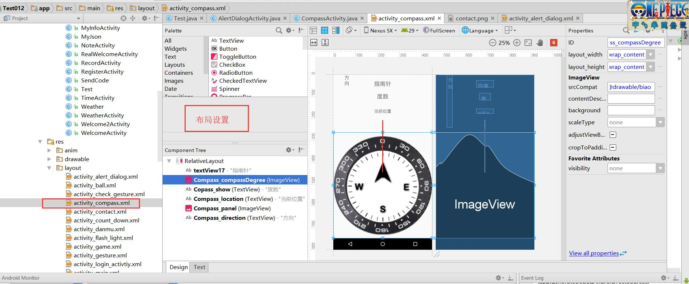

# 10指南针传感器及定位 0423


**1.指南针图片**


2  新建CompassActivity,在main主界面中添加按钮跳转到对应的界面。


3 页面布局设置



代码：

```xml
<?xml version="1.0" encoding="utf-8"?>
<RelativeLayout xmlns:android="http://schemas.android.com/apk/res/android"
    xmlns:app="http://schemas.android.com/apk/res-auto"
    xmlns:tools="http://schemas.android.com/tools"
    android:layout_width="match_parent"
    android:layout_height="match_parent"
    tools:context="com.test01.CompassActivity">

    <TextView
        android:id="@+id/textView17"
        android:layout_width="wrap_content"
        android:layout_height="wrap_content"
        android:layout_marginTop="24dp"
        android:text="指南针"
        android:textSize="24sp"
        android:layout_alignParentTop="true"
        android:layout_centerHorizontal="true" />

    <ImageView
        android:id="@+id/Compass_compassDegree"
        android:layout_width="wrap_content"
        android:layout_height="wrap_content"
        app:srcCompat="@drawable/biao"
        android:layout_marginTop="136dp"
        android:layout_below="@+id/Copass_show"
        android:layout_alignParentStart="true"
        android:layout_centerVertical="true"/>

    <TextView
        android:id="@+id/Copass_show"
        android:layout_width="wrap_content"
        android:layout_height="wrap_content"
        android:layout_marginTop="24dp"
        android:text="度数"
        android:textSize="24sp"
        android:layout_below="@+id/textView17"
        android:layout_centerHorizontal="true" />

    <TextView
        android:id="@+id/Compass_location"
        android:layout_width="wrap_content"
        android:layout_height="wrap_content"
        android:layout_below="@+id/Copass_show"
        android:layout_centerHorizontal="true"
        android:layout_marginTop="37dp"
        android:text="当前位置"
        android:textSize="18sp" />

    <ImageView
        android:id="@+id/Compass_panel"
        android:layout_width="wrap_content"
        android:layout_height="wrap_content"
        app:srcCompat="@drawable/needle"
        android:layout_below="@+id/Compass_location"
        android:layout_centerHorizontal="true"
        android:layout_marginTop="27dp" />

    <TextView
        android:id="@+id/Compass_direction"
        android:layout_width="wrap_content"
        android:layout_height="220dp"
        android:layout_alignParentStart="true"
        android:layout_marginStart="46dp"
        android:ems="1"
        android:text="方向"
        android:textSize="20sp" />

</RelativeLayout>

```

4   找id,

```java
    private ImageView CompassPanel;
    private ImageView CompassCompassDegree;
    private TextView CompassShow;
    private TextView CompassLocation;
    private TextView CompassDirection;
    
     //找控件
        CompassPanel = (ImageView) findViewById(R.id.Compass_panel);
        CompassCompassDegree = (ImageView) findViewById(R.id.Compass_compassDegree);
        CompassShow = (TextView) findViewById(R.id.Copass_show);
        CompassLocation = (TextView) findViewById(R.id.Compass_location);
        CompassDirection = (TextView) findViewById(R.id.Compass_direction);
```

新建传感器对象

```java
//传感器对象
    SensorManager sensorManager;
    SensorListener sensorListener = new SensorListener();
```

获得传感器服务，生成对象

```java
  //获得传感器对象
        sensorManager = (   SensorManager) getSystemService(Context.SENSOR_SERVICE);
        Sensor sensor =sensorManager.getDefaultSensor(Sensor.TYPE_ORIENTATION); //方向传感器

        //传感器注册监听， 监听对象名字，传感器名字，监听的内容
        sensorManager.registerListener(sensorListener,sensor,SensorManager.SENSOR_DELAY_NORMAL);
```

传感器监听方法的实现

```java
 private  class SensorListener implements SensorEventListener{

        //定义变量 记录之前的角度
        float predegree = 0;


        @Override
        public void onSensorChanged(SensorEvent event) {
            //方向传感器的值
            float degree = event.values[0];
            //显示角度
            CompassShow.setText("角度"+degree);

            //显示方向
            int d1=0; //d1表示方位
            String sd1=":";
            int d2=0; //d2表示偏角度
            d1 = (int)degree/90;
            d2 = (int) degree%90;
            String dd[]={"正北","东北","正东","东南","正南","西南","正西","西北"};
            switch (d1){
                case 0:
                    if(degree==0){
                        sd1 =sd1+dd[0];
                    }else {
                        sd1 = sd1 + dd[1] + d2;
                    }
                    break;
                case 1:
                    if(degree==90){
                        sd1 =sd1+dd[2];
                    }else {
                        sd1 = sd1 + dd[3] + (d2);
                    }
                    break;
                case 2:
                    if(degree==180){
                        sd1 =sd1+dd[4];
                    }else {
                        sd1 = sd1 + dd[5] + (d2);
                    }
                    break;
                case 3:
                    if(degree==270){
                        sd1 =sd1+dd[6];
                    }else {
                        sd1 = sd1 + dd[7] + (45-d2);
                    }
                    break;
                case 4:
                    if(degree==360){
                        sd1 =sd1+dd[0];
                    }
                    break;

            }

            CompassDirection.setText(sd1);
//动画设置
            float pivotY = 0.5f;
            //旋转动画的设置
            RotateAnimation an = new RotateAnimation(predegree,-degree,
                    Animation.RELATIVE_TO_SELF, 0.5f,
                    Animation.RELATIVE_TO_SELF,0.5f);
            //设置动画持续时间
            an.setDuration(250);
            //让imageView和动画绑定
            CompassCompassDegree.setAnimation(an);
            //CompassPanel.setAnimation(an);
            predegree=-degree;
        }

        @Override
        public void onAccuracyChanged(Sensor sensor, int accuracy) {

        }
        }
```

