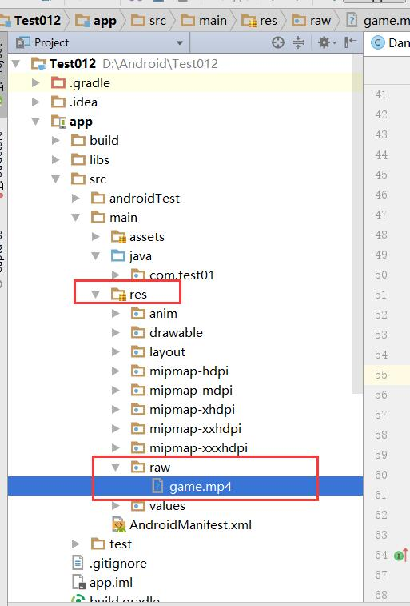
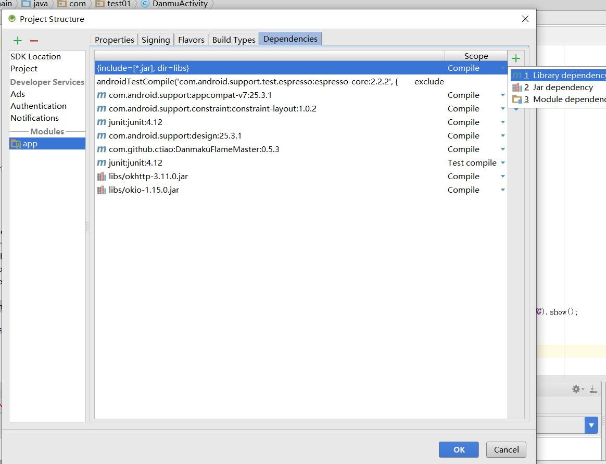
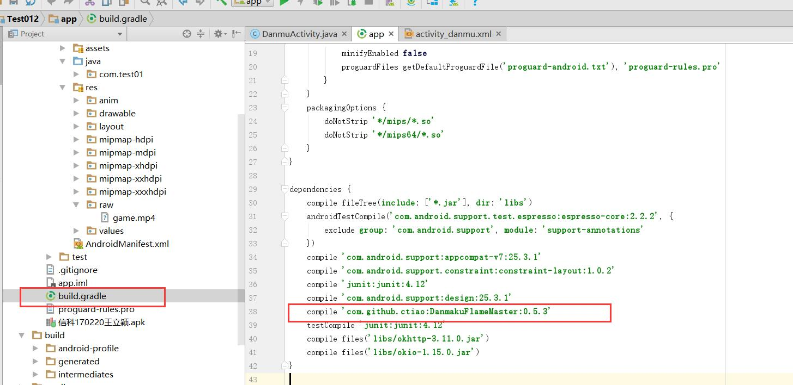
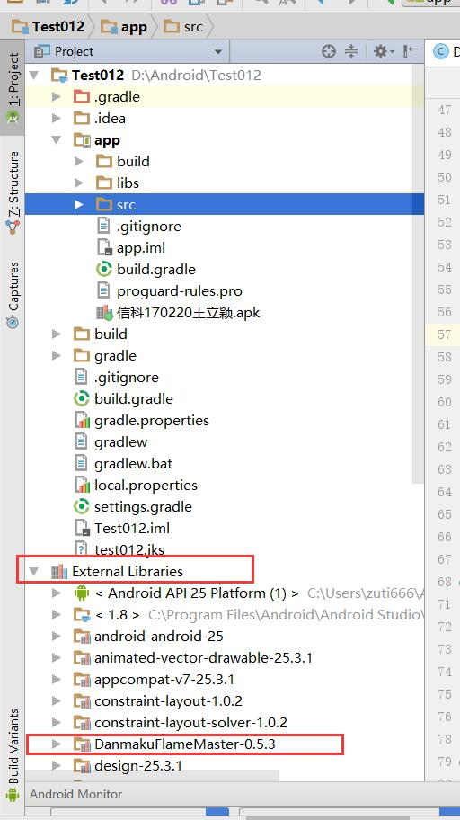
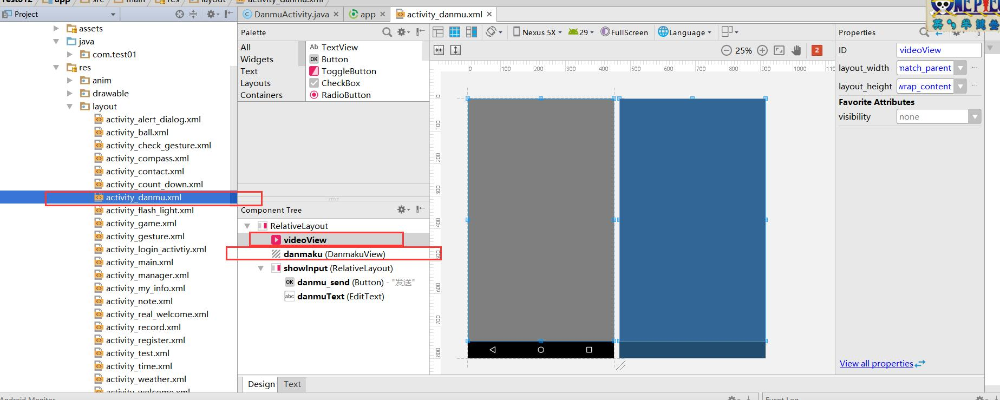
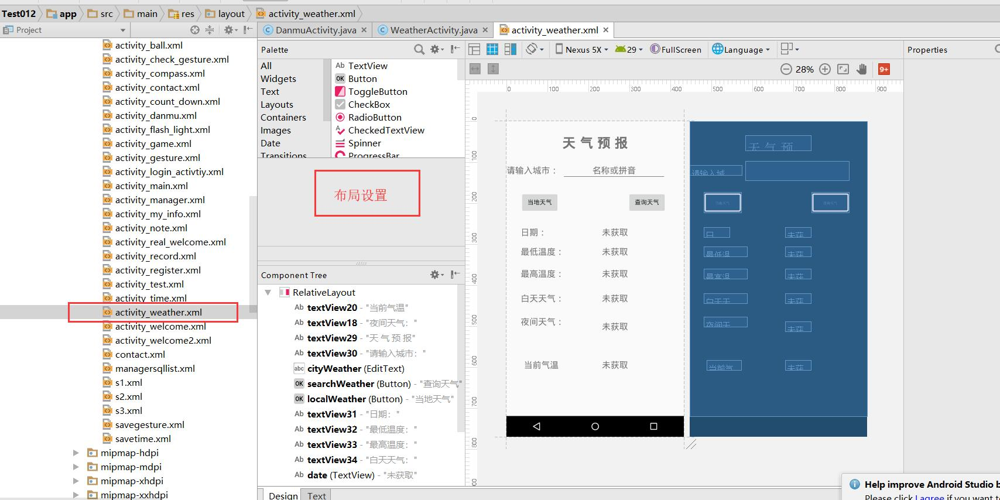

# 11 弹幕库及天气查询 0430

## 弹幕

1 有一个短视频 ，再将短视频加入资源文件夹中




2.导入包

（1）搜索添加



进行搜索

（2）直接添加




添加后



3.创建DanmukuActivity ,并在主页面添加按钮可以跳转到这个界面

4.在布局中使用

弹幕库的控件是在VideoView上面



```xml
<?xml version="1.0" encoding="utf-8"?>
<RelativeLayout xmlns:android="http://schemas.android.com/apk/res/android"
    xmlns:app="http://schemas.android.com/apk/res-auto"
    xmlns:tools="http://schemas.android.com/tools"
    android:layout_width="match_parent"
    android:layout_height="match_parent"
    tools:context="com.test01.DanmuActivity"
    android:background="#000">

    <VideoView
        android:id="@+id/videoView"
        android:layout_width="match_parent"
        android:layout_height="wrap_content"
        android:layout_alignParentStart="true"
        android:layout_alignParentTop="true" />
    <master.flame.danmaku.ui.widget.DanmakuView
        android:id="@+id/danmaku"
        android:layout_width="match_parent"
        android:layout_height="match_parent" />

    <RelativeLayout
        android:id="@+id/showInput"
        android:layout_width="match_parent"
        android:layout_height="60dp"
        android:layout_alignParentStart="true"
        android:layout_alignParentBottom="true"
        android:visibility="gone"
        android:background="@android:color/white">

        <Button
            android:id="@+id/danmu_send"
            android:layout_width="wrap_content"
            android:layout_height="wrap_content"
            android:layout_alignParentBottom="true"
            android:layout_alignParentEnd="true"
            android:text="发送"
            android:layout_alignParentTop="true" />

        <EditText
            android:id="@+id/danmuText"
            android:layout_width="wrap_content"
            android:layout_height="wrap_content"
            android:layout_alignParentBottom="true"
            android:layout_alignParentStart="true"
            android:layout_toStartOf="@+id/danmu_send"
            android:ems="10"
            android:hint="请  输  入  弹  幕"
            android:gravity="center"
            android:layout_alignParentTop="true" />
    </RelativeLayout>

</RelativeLayout>


```

5 

首先是视频播放设置VideoView设置及视频资源的添加

```java
  
//设置横屏
        setRequestedOrientation(ActivityInfo.SCREEN_ORIENTATION_LANDSCAPE);
//VideoView 设置全屏显示
        videoView = (VideoView) findViewById(R.id.videoView);
        RelativeLayout.LayoutParams layoutParams = new RelativeLayout.LayoutParams(RelativeLayout.LayoutParams.FILL_PARENT, RelativeLayout.LayoutParams.FILL_PARENT);
        layoutParams.addRule(RelativeLayout.ALIGN_PARENT_BOTTOM);
        layoutParams.addRule(RelativeLayout.ALIGN_PARENT_TOP);
        layoutParams.addRule(RelativeLayout.ALIGN_PARENT_LEFT);
        layoutParams.addRule(RelativeLayout.ALIGN_PARENT_RIGHT);
        videoView.setLayoutParams(layoutParams);


//视频资源设置
        String uri = "android.resource://"+getPackageName()+"/"+R.raw.game;
        if(uri!=null){
            videoView.setVideoURI(Uri.parse(uri));
            videoView.start();
        }else {
            videoView.getBackground().setAlpha(0);
            Toast.makeText(DanmuActivity.this,"视频资源异常，无法播放！", Toast.LENGTH_LONG).show();
        }
```

弹幕库设置

弹幕库初始化

```java
//弹幕库初始始化方法调用
        initDanmaku();
```


```java
//解析弹幕库的对象
    BaseDanmakuParser parser = new BaseDanmakuParser() {
        @Override
        protected IDanmakus parse() {
            return new Danmakus();
        }
    };
//初始化弹幕库
    private void initDanmaku(){
        danmaku.setCallback(new DrawHandler.Callback() {
            @Override
            public void prepared() {
                danmaku.start();
                randomDanmu();
            }

            @Override
            public void updateTimer(DanmakuTimer timer) {

            }

            @Override
            public void danmakuShown(BaseDanmaku danmaku) {

            }

            @Override
            public void drawingFinished() {

            }
        });
        danmakuContext = DanmakuContext.create();
        danmaku.prepare(parser,danmakuContext); //显示文本
    }
    //添加弹幕
    private void addDanmaku(String context,boolean border){
        BaseDanmaku baseDanmaku = danmakuContext.mDanmakuFactory.createDanmaku(BaseDanmaku.TYPE_SCROLL_RL);
        baseDanmaku.text = context;
        baseDanmaku.textSize = new Random().nextInt(30)+30;
        baseDanmaku.padding = 10;
        //颜色设置
        if(border) {
            baseDanmaku.textColor = Color.GREEN;
        }else{
            baseDanmaku.textColor =android.graphics.Color.argb(new Random().nextInt(255),new Random().nextInt(255),new Random().nextInt(255),new Random().nextInt(255));
        }
        //显示时间
        baseDanmaku.setTime(danmaku.getCurrentTime());
        //显示弹幕的框
        if(border){
            baseDanmaku.borderColor = Color.RED;
        }
        danmaku.addDanmaku(baseDanmaku);
    }

    private void randomDanmu(){
        new Thread(new Runnable() {
            @Override
            public void run() {
                int num = 1;
                while(num<30){
                    int show = new Random().nextInt(233);
                    String context[] = {"超神","2333","666","已经关注了","失踪人口回归","第1","UP主牛逼"
                            ,"龙妈","龙妈","龙妈","龙妈","龙妈","专业","hahahaha","哈哈哈哈哈"};
                    addDanmaku(context[new Random().nextInt(15)],false);
                    try{
                        Thread.sleep(5);
                    }catch (Exception e){
                        e.printStackTrace();
                    }
                }
            }
        }).start();
    }
}
```

发送弹幕

```java
//点击视频显示输入框
        danmaku.setOnClickListener(new View.OnClickListener() {
            @Override
            public void onClick(View view) {
                if(showInput.getVisibility()==View.GONE){
                    showInput.setVisibility(View.VISIBLE);
                }else{
                    showInput.setVisibility(View.GONE);
                }
            }
        });
//输入弹幕设置
        danmuSend.setOnClickListener(new View.OnClickListener() {
            @Override
            public void onClick(View view) {
                String context = danmuText.getText().toString();
                if(!TextUtils.isEmpty(context)){
                    addDanmaku(context,true);
                    danmuText.setText("");
                }else {
                    Toast.makeText(DanmuActivity.this,"输入弹幕不能为空",Toast.LENGTH_LONG).show();
                }
            }
        });
    }
```

整体代码

```java
package com.test01;

import android.content.pm.ActivityInfo;
import android.graphics.Color;
import android.net.Uri;
import android.support.v7.app.AppCompatActivity;
import android.os.Bundle;
import android.text.TextUtils;
import android.view.View;
import android.widget.Button;
import android.widget.EditText;
import android.widget.RelativeLayout;
import android.widget.Toast;
import android.widget.VideoView;

import java.util.Random;

import master.flame.danmaku.controller.DrawHandler;
import master.flame.danmaku.danmaku.model.BaseDanmaku;
import master.flame.danmaku.danmaku.model.DanmakuTimer;
import master.flame.danmaku.danmaku.model.IDanmakus;
import master.flame.danmaku.danmaku.model.android.DanmakuContext;
import master.flame.danmaku.danmaku.model.android.Danmakus;
import master.flame.danmaku.danmaku.parser.BaseDanmakuParser;
import master.flame.danmaku.ui.widget.DanmakuView;

public class DanmuActivity extends AppCompatActivity {
    private VideoView videoView;
    private DanmakuView danmaku;
    private DanmakuContext danmakuContext;
    private RelativeLayout showInput;
    private Button danmuSend;
    private EditText danmuText;

    @Override
    protected void onCreate(Bundle savedInstanceState) {
        super.onCreate(savedInstanceState);
        setContentView(R.layout.activity_danmu);

        danmaku = (DanmakuView) findViewById(R.id.danmaku);
        showInput = (RelativeLayout) findViewById(R.id.showInput);
        danmuSend = (Button) findViewById(R.id.danmu_send);
        danmuText = (EditText) findViewById(R.id.danmuText);

//设置横屏
        setRequestedOrientation(ActivityInfo.SCREEN_ORIENTATION_LANDSCAPE);
//VideoView 设置
        videoView = (VideoView) findViewById(R.id.videoView);
        RelativeLayout.LayoutParams layoutParams = new RelativeLayout.LayoutParams(RelativeLayout.LayoutParams.FILL_PARENT, RelativeLayout.LayoutParams.FILL_PARENT);
        layoutParams.addRule(RelativeLayout.ALIGN_PARENT_BOTTOM);
        layoutParams.addRule(RelativeLayout.ALIGN_PARENT_TOP);
        layoutParams.addRule(RelativeLayout.ALIGN_PARENT_LEFT);
        layoutParams.addRule(RelativeLayout.ALIGN_PARENT_RIGHT);
        videoView.setLayoutParams(layoutParams);


//视频资源设置
        String uri = "android.resource://"+getPackageName()+"/"+R.raw.game;
        if(uri!=null){
            videoView.setVideoURI(Uri.parse(uri));
            videoView.start();
        }else {
            videoView.getBackground().setAlpha(0);
            Toast.makeText(DanmuActivity.this,"视频资源异常，无法播放！", Toast.LENGTH_LONG).show();
        }
//弹幕库设置
        initDanmaku();

//点击视频显示输入框
        danmaku.setOnClickListener(new View.OnClickListener() {
            @Override
            public void onClick(View view) {
                if(showInput.getVisibility()==View.GONE){
                    showInput.setVisibility(View.VISIBLE);
                }else{
                    showInput.setVisibility(View.GONE);
                }
            }
        });
//输入弹幕设置
        danmuSend.setOnClickListener(new View.OnClickListener() {
            @Override
            public void onClick(View view) {
                String context = danmuText.getText().toString();
                if(!TextUtils.isEmpty(context)){
                    addDanmaku(context,true);
                    danmuText.setText("");
                }else {
                    Toast.makeText(DanmuActivity.this,"输入弹幕不能为空",Toast.LENGTH_LONG).show();
                }
            }
        });
    }

    //解析弹幕库的对象
    BaseDanmakuParser parser = new BaseDanmakuParser() {
        @Override
        protected IDanmakus parse() {
            return new Danmakus();
        }
    };
//初始化弹幕库
    private void initDanmaku(){
        danmaku.setCallback(new DrawHandler.Callback() {
            @Override
            public void prepared() {
                danmaku.start();
                randomDanmu();
            }

            @Override
            public void updateTimer(DanmakuTimer timer) {

            }

            @Override
            public void danmakuShown(BaseDanmaku danmaku) {

            }

            @Override
            public void drawingFinished() {

            }
        });
        danmakuContext = DanmakuContext.create();
        danmaku.prepare(parser,danmakuContext); //显示文本
    }
    //添加弹幕
    private void addDanmaku(String context,boolean border){
        BaseDanmaku baseDanmaku = danmakuContext.mDanmakuFactory.createDanmaku(BaseDanmaku.TYPE_SCROLL_RL);
        baseDanmaku.text = context;
        baseDanmaku.textSize = new Random().nextInt(30)+30;
        baseDanmaku.padding = 10;
        //颜色设置
        if(border) {
            baseDanmaku.textColor = Color.GREEN;
        }else{
            baseDanmaku.textColor =android.graphics.Color.argb(new Random().nextInt(255),new Random().nextInt(255),new Random().nextInt(255),new Random().nextInt(255));
        }
        //显示时间
        baseDanmaku.setTime(danmaku.getCurrentTime());
        //显示弹幕的框
        if(border){
            baseDanmaku.borderColor = Color.RED;
        }
        danmaku.addDanmaku(baseDanmaku);
    }

    private void randomDanmu(){
        new Thread(new Runnable() {
            @Override
            public void run() {
                int num = 1;
                while(num<30){
                    int show = new Random().nextInt(233);
                    String context[] = {"超神","2333","666","已经关注了","失踪人口回归","第1","UP主牛逼"
                            ,"龙妈","龙妈","龙妈","龙妈","龙妈","专业","hahahaha","哈哈哈哈哈"};
                    addDanmaku(context[new Random().nextInt(15)],false);
                    try{
                        Thread.sleep(5);
                    }catch (Exception e){
                        e.printStackTrace();
                    }
                }
            }
        }).start();
    }
}

```

## 天气预报查询

当天温度

1.新建WeatherActivity ,在主页面添加跳转按钮

2.布局设置



代码

```xml
<?xml version="1.0" encoding="utf-8"?>
<RelativeLayout xmlns:android="http://schemas.android.com/apk/res/android"
    xmlns:app="http://schemas.android.com/apk/res-auto"
    xmlns:tools="http://schemas.android.com/tools"
    android:layout_width="match_parent"
    android:layout_height="match_parent"
    tools:context="com.test01.WeatherActivity">


    <TextView
        android:id="@+id/textView20"
        android:layout_width="wrap_content"
        android:layout_height="wrap_content"
        android:layout_alignEnd="@+id/localWeather"
        android:layout_below="@+id/textView18"
        android:layout_marginTop="76dp"
        android:text="当前气温"
        android:textSize="20dp" />

    <TextView
        android:id="@+id/textView18"
        android:layout_width="wrap_content"
        android:layout_height="wrap_content"
        android:layout_alignStart="@+id/textView34"
        android:layout_below="@+id/textView34"
        android:layout_marginTop="30dp"
        android:text="夜间天气："
        android:textSize="20dp" />

    <TextView
    android:id="@+id/textView29"
    android:layout_width="wrap_content"
    android:layout_height="wrap_content"
    android:layout_marginTop="33dp"
    android:text="天 气 预 报"
    android:textSize="30dp"
    android:textStyle="bold"
    android:layout_alignParentTop="true"
    android:layout_centerHorizontal="true" />

<TextView
    android:id="@+id/textView30"
    android:layout_width="wrap_content"
    android:layout_height="wrap_content"
    android:text="请输入城市："
    android:textSize="20dp"
    android:layout_below="@+id/textView29"
    android:layout_alignParentStart="true"
    android:layout_marginTop="33dp" />

<EditText
    android:id="@+id/cityWeather"
    android:layout_width="wrap_content"
    android:layout_height="wrap_content"
    android:ems="10"
    android:inputType="textPersonName"
    android:text=""
    android:hint="名称或拼音"
    android:textSize="20dp"
    android:layout_alignBaseline="@+id/textView30"
    android:layout_alignBottom="@+id/textView30"
    android:layout_alignStart="@+id/textView29"
    android:gravity="center"/>

<Button
    android:id="@+id/searchWeather"
    android:layout_width="wrap_content"
    android:layout_height="wrap_content"
    android:layout_below="@+id/cityWeather"
    android:layout_marginTop="27dp"
    android:layout_toEndOf="@+id/textView29"
    android:text="查询天气" />

<Button
    android:id="@+id/localWeather"
    android:layout_width="wrap_content"
    android:layout_height="wrap_content"
    android:layout_alignEnd="@+id/textView30"
    android:layout_alignTop="@+id/searchWeather"
    android:text="当地天气" />

<TextView
    android:id="@+id/textView31"
    android:layout_width="wrap_content"
    android:layout_height="wrap_content"
    android:layout_alignStart="@+id/localWeather"
    android:layout_below="@+id/localWeather"
    android:layout_marginTop="34dp"
    android:text="日期："
    android:textSize="20dp"/>

<TextView
    android:id="@+id/textView32"
    android:layout_width="wrap_content"
    android:layout_height="wrap_content"
    android:layout_alignStart="@+id/textView31"
    android:layout_below="@+id/textView31"
    android:layout_marginTop="21dp"
    android:text="最低温度："
    android:textSize="20dp"/>

<TextView
    android:id="@+id/textView33"
    android:layout_width="wrap_content"
    android:layout_height="wrap_content"
    android:layout_alignEnd="@+id/textView32"
    android:layout_below="@+id/textView32"
    android:layout_marginTop="27dp"
    android:text="最高温度："
    android:textSize="20dp"/>

<TextView
    android:id="@+id/textView34"
    android:layout_width="wrap_content"
    android:layout_height="wrap_content"
    android:layout_marginTop="33dp"
    android:text="白天天气："
    android:textSize="20dp"
    android:layout_below="@+id/textView33"
    android:layout_alignStart="@+id/textView33" />

    <TextView
    android:id="@+id/date"
    android:layout_width="wrap_content"
    android:layout_height="wrap_content"
        android:text="未获取"
    android:textSize="20dp"
        android:layout_above="@+id/textView32"
        android:layout_alignStart="@+id/low" />

<TextView
    android:id="@+id/low"
    android:layout_width="wrap_content"
    android:layout_height="wrap_content"
    android:text="未获取"
    android:textSize="20dp"
    android:layout_alignBaseline="@+id/textView32"
    android:layout_alignBottom="@+id/textView32"
    android:layout_alignStart="@+id/high" />

<TextView
    android:id="@+id/high"
    android:layout_width="wrap_content"
    android:layout_height="wrap_content"
    android:text="未获取"
    android:textSize="20dp"
    android:layout_alignBaseline="@+id/textView33"
    android:layout_alignBottom="@+id/textView33"
    android:layout_alignStart="@+id/text_day" />

    <TextView
        android:id="@+id/text_day"
        android:layout_width="wrap_content"
        android:layout_height="wrap_content"
        android:text="未获取"
        android:textSize="20dp"
        android:layout_alignBaseline="@+id/textView34"
        android:layout_alignBottom="@+id/textView34"
        android:layout_alignStart="@+id/text_night" />

    <TextView
        android:id="@+id/text_night"
        android:layout_width="wrap_content"
        android:layout_height="wrap_content"
        android:layout_alignTop="@+id/textView18"
        android:layout_marginTop="11dp"
        android:layout_toStartOf="@+id/searchWeather"
        android:text="未获取"
        android:textSize="20dp" />

    <TextView
        android:id="@+id/temperature"
        android:layout_width="wrap_content"
        android:layout_height="wrap_content"
        android:layout_alignBaseline="@+id/textView20"
        android:layout_alignBottom="@+id/textView20"
        android:layout_alignStart="@+id/high"
        android:text="未获取"
        android:textSize="20dp" />

</RelativeLayout>

```

3.json语句的解析


4.查询天气


## 知识点

1 VideoView

2 Danmaku控件

3 json语句的解析

