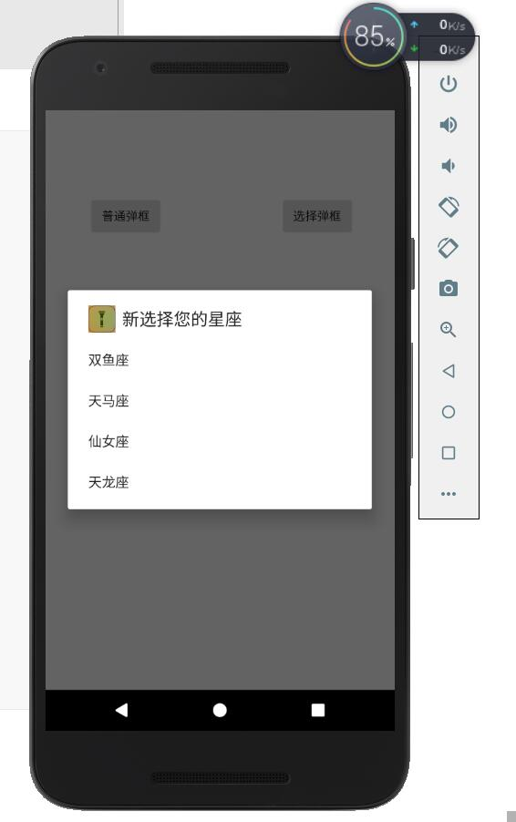

# 秒表功能和弹框

## 秒表

1.新建TimeActivity,修改xml布局为relative布局,在mainActivity中建立按钮和点击事件到新建立的界面。

2.activity_time.xml布局


```xml
<?xml version="1.0" encoding="utf-8"?>
<RelativeLayout xmlns:android="http://schemas.android.com/apk/res/android"
    xmlns:app="http://schemas.android.com/apk/res-auto"
    xmlns:tools="http://schemas.android.com/tools"
    android:layout_width="match_parent"
    android:layout_height="match_parent"
    tools:context="com.test01.LoginActivity"
    android:id="@+id/time">


    <Chronometer
        android:id="@+id/chronometer2"
        android:layout_width="wrap_content"
        android:layout_height="wrap_content"

        android:layout_marginTop="109dp"
        android:textSize="60sp"
        android:layout_alignParentTop="true"
        android:layout_centerHorizontal="true" />

    <Button
        android:id="@+id/start"
        android:layout_width="wrap_content"
        android:layout_height="wrap_content"
        android:layout_alignParentStart="true"
        android:layout_below="@+id/chronometer2"
        android:layout_marginTop="121dp"
        android:text="开始" />

    <Button
        android:id="@+id/pause"
        android:layout_width="wrap_content"
        android:layout_height="wrap_content"
        android:layout_alignTop="@+id/start"
        android:layout_centerHorizontal="true"
        android:enabled="false"
        android:text="暂停" />

    <Button
        android:id="@+id/reset"
        android:layout_width="wrap_content"
        android:layout_height="wrap_content"
        android:layout_alignBottom="@+id/pause"
        android:layout_alignParentEnd="true"
        android:layout_marginEnd="16dp"
        android:enabled="false"
        android:text="重置" />
</RelativeLayout>


```

3.逻辑处理

开始，暂停，重置之间的逻辑关系。

​	（1）.进入界面，只能按开始，

​	（2）开始后，按键文字变为继续，只能按暂停

​	（3）暂停后可以重置，继续

​     （4）重置后，计时器时间归零，相当于进入界面，参照操作1，按钮文字变为开始

4.计时器控件

```java
 private Chronometer chronometer2;
 chronometer2 = (Chronometer) findViewById(R.id.chronometer2);
 chronometer2.setOnChronometerTickListener(new Chronometer.OnChronometerTickListener() {
            @Override
            public void onChronometerTick(Chronometer chronometer) {
                String time = chronometer2.getText().toString();
                int newTime = Integer.parseInt(time.substring(0,time.indexOf(":")))*60
                        +Integer.parseInt(time.substring(time.length()-2));
                if(newTime%10 == 0 && newTime!=0){
                    //震动5秒
                    //vv.vibrate(5000);
                    //long[] pattern = {0,500};
                    //vv.vibrate(pattern,1);//震动模式
                    vv.vibrate(new long[]{0,500},-1);
                }


            }
        });
```

整个代码

```java
package com.test01;

import android.content.Intent;
import android.support.v7.app.AppCompatActivity;
import android.os.Bundle;
import android.text.Layout;
import android.view.View;
import android.widget.RelativeLayout;
import android.widget.TextView;

import java.util.Timer;
import java.util.TimerTask;

public class WelcomeActivity extends AppCompatActivity {
    private TextView timeover;
    Timer timer = new Timer();
    int num =6; //想看到五，就从六开始
    RelativeLayout adL;

    @Override
    protected void onCreate(Bundle savedInstanceState) {
        super.onCreate(savedInstanceState);
        setContentView(R.layout.activity_welcome);

        //多线程
        timeover = (TextView) findViewById(R.id.timeover);
        adL=(RelativeLayout)findViewById(R.id.adLayout);//Welcome.xml中的layout的id

        TimerTask task =new TimerTask() {

            @Override
            public void run() {
                runOnUiThread(new Runnable() {
                    @Override
                    public void run() {
                        num--;
                        timeover.setText("-"+num+"秒 -\n跳过");
                        if(num<=1){
                            timer.cancel();//关闭计时器线程
                            Intent intent = new Intent();
                            intent.setClass(WelcomeActivity.this,LoginActivity.class);
                            startActivity(intent);
                            WelcomeActivity.this.finish(); //关闭这个界面，从登录界面就不会返回到广告界面
                        }
                    }
                });
            }

        };
        timer.schedule(task,1000,1000);
        //点击跳转，跳过广告
        timeover.setOnClickListener(new View.OnClickListener() {
            @Override
            public void onClick(View v) {
                timer.cancel();//关闭计时器线程
                Intent intent = new Intent();
                intent.setClass(WelcomeActivity.this,LoginActivity.class);
                startActivity(intent);
                WelcomeActivity.this.finish(); //关闭这个界面，从登录界面就不会返回到广告界面
            }
        });

        //点广告其他位置跳转其他页面
       adL.setOnClickListener(new View.OnClickListener() {
           @Override
           public void onClick(View v) {
               timer.cancel();//关闭计时器线程
               Intent intent = new Intent();
               intent.setClass(WelcomeActivity.this,MainActivity.class);
               startActivity(intent);
               WelcomeActivity.this.finish(); //关闭这个界面，从登录界面就不会返回到广告界面
           }
       });


    }
}

```

## 提高

保存记录

在计时过程中可以进行保存


# 弹窗

1.新建AlertDialoActivity,修改xml布局为relative布局,在mainActivity中建立按钮和点击事件到新建立的界面。

## 1.普通弹框

1.在activity_AlertDialo.xml布局中添加按钮


2.在AlertDialoActivity中获取框体Button。弹出弹框

```java
buttonTest = (Button) findViewById(R.id.buttonTest);
        buttonTest.setOnClickListener(new View.OnClickListener() {
            @Override
            public void onClick(View v) {
                AlertDialog.Builder ab = new AlertDialog.Builder(AlertDialogActivity.this);
                ab.setIcon(R.drawable.off);          //弹框图片
                ab.setTitle("警告");                //弹框标题
                ab.setMessage("您是否要退出");    //弹框内容
                ab.create().show();                 //创建对象并显示出来
            }
        });
```

效果


## 2.选择弹框，是否

1.在activity_AlertDialo.xml布局中添加按钮


2.在AlertDialoActivity中获取框体Button。弹出弹框

```java
//选择弹框
        buttonTest2 = (Button) findViewById(R.id.buttonTest2);
        buttonTest2.setOnClickListener(new View.OnClickListener() {
            @Override
            public void onClick(View v) {
                AlertDialog.Builder ab = new AlertDialog.Builder(AlertDialogActivity.this);
                ab.setIcon(R.drawable.off);          //弹框图片
                ab.setTitle("警告");                //弹框标题
                ab.setMessage("您是否要退出");    //弹框内容
                //选项，及对应的点击监听
                ab.setPositiveButton("是", new DialogInterface.OnClickListener() {
                    @Override
                    public void onClick(DialogInterface dialog, int which) {
                        //退出的几种方法
                        finish(); //退出当前界面，返回上一界面
                        //System.exit(0);  
                        android.os.Process.killProcess(android.os.Process.myPid()); //杀死进程
                    }
                });
                ab.setNegativeButton("否",null);

                ab.create().show();                 //创建对象并显示出来
            }
        });
```

效果


注意到，是和否与我们习惯的左边是右边否相反。

## 3.单选框 选择星座

1.在activity_AlertDialo.xml布局中添加按钮


2.在AlertDialoActivity中获取框体Button。弹出弹框，并将选择结果显示在TextView中

```java
 String star[]={"双鱼座","天马座","仙女座","天龙座"}; //数组用来保存选型内容
 //选择星座
        selectStar = (TextView) findViewById(R.id.selectStar);
        buttonTest3 = (Button) findViewById(R.id.buttonTest3);
        buttonTest3.setOnClickListener(new View.OnClickListener() {
            @Override
            public void onClick(View v) {
                AlertDialog.Builder ab = new AlertDialog.Builder(AlertDialogActivity.this);
                ab.setIcon(R.drawable.off);          //弹框图片
                ab.setTitle("新选择您的星座");                //弹框标题
                //选项
                ab.setItems(star, new DialogInterface.OnClickListener() {
                    @Override
                    public void onClick(DialogInterface dialog, int which) {
                            selectStar.setText(star[which]);

                    }
                });
                ab.create().show();                 //创建对象并显示出来
            }
        });
```

3.效果





## 4  带选择框的单选框

1.在activity_AlertDialo.xml布局中添加按钮


2.在AlertDialoActivity中获取框体Button。弹出弹框，并将选择结果显示在TextView中

```java
String xingzuo;
//带选择的单选
        //选择星座

        selectStar = (TextView) findViewById(R.id.selectStar);
        buttonTest4 = (Button) findViewById(R.id.buttonTest4);
        buttonTest4.setOnClickListener(new View.OnClickListener() {
            @Override
            public void onClick(View v) {
                AlertDialog.Builder ab = new AlertDialog.Builder(AlertDialogActivity.this);
                ab.setIcon(R.drawable.off);          //弹框图片
                ab.setTitle("新选择您的星座");      //弹框标题
                //单选
                ab.setSingleChoiceItems(star, -1, new DialogInterface.OnClickListener() {
                    @Override
                    public void onClick(DialogInterface dialog, int which) {
                            xingzuo=star[which];

                    }
                });
                ab.setPositiveButton("取消",null);
                ab.setNegativeButton("确定", new DialogInterface.OnClickListener() {
                    @Override
                    public void onClick(DialogInterface dialog, int which) {
                            selectStar.setText(xingzuo);
                    }
                });


                ab.create().show();                 //创建对象并显示出来
            }
        });
```

3.效果


## 5.多选框 选择爱好

1.在activity_AlertDialo.xml布局中添加按钮


2.在AlertDialoActivity中获取框体Button。弹出弹框，并将选择结果显示在TextView中

```java
    //定义全局变量
    String hobby[]={"美食鉴赏","电子竞技","思考人生","其他"};//数组用来保存选型内容
    boolean hobbyChoice[] = {false,false,false,false};
    
    //多选 爱好
        selectHobby = (TextView) findViewById(R.id.selectHobby);
        buttonTest5 = (Button) findViewById(R.id.buttonTest5);
        buttonTest5.setOnClickListener(new View.OnClickListener() {
            @Override
            public void onClick(View v) {
                AlertDialog.Builder ab = new AlertDialog.Builder(AlertDialogActivity.this);
                ab.setIcon(R.drawable.off);          //弹框图片
                ab.setTitle("选择爱好");                //弹框标题
                ab.setMultiChoiceItems(hobby,hobbyChoice , new DialogInterface.OnMultiChoiceClickListener() {
                    @Override
                    public void onClick(DialogInterface dialog, int which, boolean isChecked) {
                        hobbyChoice[which]=isChecked;

                    }
                });

                ab.setPositiveButton("取消",null);
                ab.setNegativeButton("确定", new DialogInterface.OnClickListener() {
                    @Override
                    public void onClick(DialogInterface dialog, int which) {
                        String h = "";
                        for(int i=0;i<hobbyChoice.length;i++){
                            if(hobbyChoice[i]){
                                h+=hobby[i]+" ,";
                            }
                        }
                        selectHobby.setText(h);
                    }
                });

                ab.create().show();                 //创建对象并显示出来
            }
        });
```

3.效果


作业：

1.