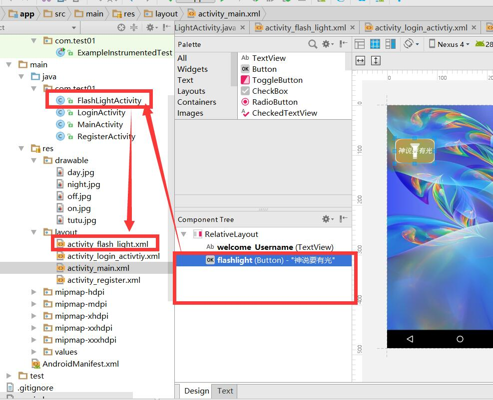
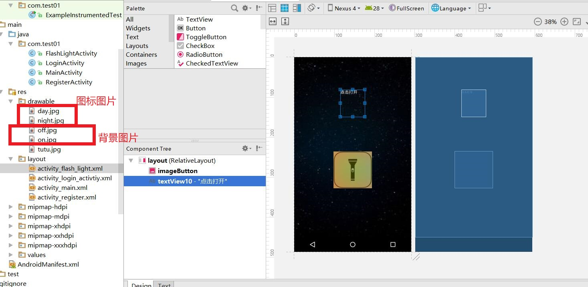
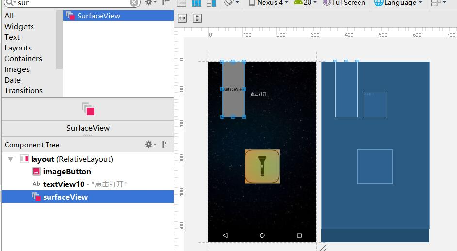

# 登录界面

## 1.在第二个界面出现用户名 

需要将登录页面输入的用户名传到第二个界面

在登录页面LoginActivity,将需要传递的内容通过intent以键值对的形式发送出去

```java
//设置intent传递的内容，键值对的形式 put方法，在后面获取值时要通过键值对的名来获取
                            intent.putExtra("Username",username1);
```

在mainActivity页面通过Intent获得内容，并将内容显示在控件TextView上

```java
TextView welName;
//通过控件的id找到控件
        welName =  (TextView )findViewById(R.id.welcome_Username);
       //从Intent获取对象
       Intent intent = getIntent();

        //设置空间显示的内容
        welName.setText("欢迎您，"+intent.getStringExtra("Username")); //设置框中显示的文字
```

## 2.验证码

### 1. 在登录界面加入控件


### 2. 创立验证码生成方法

```java
public  String yzm(){
        String str = "1,2,3,4,5,6,7,8,9,0,a,b,c,d,e,f,g,h,i,j,k,l,m,n,o,p,q,r,s,t,u,v,w,x,y,z";
        String str2[]=str.split(",");
        Random rand = new Random();
        int index=0;
        String randStr="";
        for(int i=0;i<4;i++){
            index = rand.nextInt(str2.length-1);
            randStr+=str2[index];
        }

       return randStr;
    }
```

### 3. 验证码初始化显示及点击切换

```java
 showCode.setText(yzm());
 showCode.setOnClickListener(new View.OnClickListener() {
            @Override
            public void onClick(View v) {
                showCode.setText(yzm());

            }
        });
```

### 4.验证验证码是否正确

```java
login.setOnClickListener(new View.OnClickListener(){
            @Override
            public void onClick(View v) {
                String username1 = username.getText().toString();//从输入框获得数据
                String password1 = pwd.getText().toString();
                String inputCode1= inputCode.getText().toString();
                if(username1.equals("admin")){
                    if(password1.equals("123")  ){
                        if(inputCode1.equals(showCode.getText())){
                            Toast.makeText(LoginActivity.this,"登录成功", Toast.LENGTH_SHORT).show();
                            Intent intent = new Intent();
                            //设置intent传递的内容，键值对的形式 put方法，在后面获取值时要通过键值对的名来获取
                            intent.putExtra("Username",username1);
                            
                            intent.setClass(LoginActivity.this,MainActivity.class);//第一个是当前Activity，第二个是要跳转的Activity
                            startActivity(intent);
                            LoginActivity.this.finish();
                        }else{
                            Toast.makeText(LoginActivity.this,"验证码错误", Toast.LENGTH_SHORT).show();
                        }
                    }
                    else{
                        Toast.makeText(LoginActivity.this,"密码错误", Toast.LENGTH_SHORT).show();
                    }

                }else{
                    Toast.makeText(LoginActivity.this,"用户名错误", Toast.LENGTH_SHORT).show();
                }

            }
        });
```

# 更改界面背影为图片

## 1.将图片添加到drawable资源文件夹中

## 2.在activity_main.xml文件中修改background属性

```java
android:background="@drawable/tutu" //背景设置为图片
android:background="@android:color/background_dark" //设置背景颜色为黑
```

# 更改起始页面

在AndroidManifest.xml文件中将

```java
<intent-filter>
            <action android:name="android.intent.action.MAIN" />

            <category android:name="android.intent.category.LAUNCHER" />
</intent-filter>
```

复制到对应的activity下。


# 手电筒功能实现

## 1.建立一个Button,对应的Activity



## 2.点击按钮，背景图片，文字的切换

1. activity_flash.xml中布局设置。

   按钮设为imageButton并设置图片，选取两张不同的图片放在drawable资源文件夹中，作为点击效果，图标的变化。

   ```java
   <!--功能图标ImageButton-->
   <ImageButton
           android:id="@+id/imageButton"
           android:layout_width="126dp"
           android:layout_height="121dp"
           tools:layout_editor_absoluteX="120dp"
           tools:layout_editor_absoluteY="145dp"
           android:layout_marginTop="113dp"
           android:layout_below="@+id/textView10"
           android:layout_centerHorizontal="true"
           android:background="@drawable/off"/>
    <!--显示的文本框TextView-->
       <TextView
           android:id="@+id/textView10"
           android:layout_width="81dp"
           android:layout_height="90dp"
           tools:layout_editor_absoluteY="349dp"
           tools:layout_editor_absoluteX="152dp"
           android:layout_marginTop="107dp"
           android:layout_alignParentTop="true"
           android:layout_centerHorizontal="true"
           android:text="点击打开"
           android:textColor="@android:color/white"/>
   </RelativeLayout>
   ```

   

2. 给layout一个id，方便查找。并设置背景图片，找两张精美图片，设置点击效果，作为背景变化。

   ```
   <?xml version="1.0" encoding="utf-8"?>
   <RelativeLayout xmlns:android="http://schemas.android.com/apk/res/android"
       xmlns:app="http://schemas.android.com/apk/res-auto"
       xmlns:tools="http://schemas.android.com/tools"
       android:layout_width="match_parent"
       android:layout_height="match_parent"
       tools:context="com.test01.LoginActivity"
       android:id="@+id/layout"
       android:background="@drawable/night">
       <!--设置layout的背景和id-->
       ...
   </RelativeLayout>
   ```

   效果图：

   

3. 通过flag来执行

   ```java
   showinfo = (TextView) findViewById(R.id.textView10);
   flashLightBtn = (ImageButton)findViewById(R.id.imageButton);
   flashbg = (RelativeLayout)findViewById(R.id.layout) ;
   
   flashLightBtn.setOnClickListener(new View.OnClickListener(){
   @Override
   public void onClick(View v) {
         try {
                if (isflag == false) {
                    showinfo.setText("点击打开"); //显示文字内容
                    showinfo.setTextColor(Color.WHITE);//文字颜色
                    flashbg.setBackgroundResource(R.drawable.night);//背景更换
                         			flashLightBtn.setImageDrawable(getResources().getDrawable(R.drawable.off));//更换图标
   
                    isflag = true;//改变flag
                 }else{
                    showinfo.setText("点击关闭");
                    showinfo.setTextColor(Color.BLACK);
                     flashbg.setBackgroundResource(R.drawable.day);//背景
                           flashLightBtn.setImageDrawable(getResources().getDrawable(R.drawable.on));
   
                      isflag = false;
   
                  }
   
              } catch (Exception e) {
                 e.printStackTrace();
   
                }
   }
   });
   ```

   ## 3.闪光灯权限的开启

   #### 1.权限在AndroidManifest3.xml文件中配置

   一般会放在application的外面

   ```
   <!--相机权限-->
      <uses-permission android:name="android.permission.CAMERA"/>
   ```

   #### 2.动态申请权限

   ```java
    //声明数组，用来保存所有需要动态开启的权限
       private static String[] PERMISSION_STORGE={
               Manifest.permission.CAMERA
       };
       //权限的请求编码
       private  static  int REQUEST_PERMISSION_CODE = 1;
   ```

   安卓5.0（棒棒糖）以后，6.0(棉花糖)开始，权限授予发上了变化

   ```java
    //判断版本
           //如果版本大于5.0
           if(Build.VERSION.SDK_INT > Build.VERSION_CODES.LOLLIPOP){
               //如果没有被授权
               if(ActivityCompat.checkSelfPermission(this,Manifest.permission.CAMERA)!= PackageManager.PERMISSION_GRANTED){
                   //在当前界面，请求数组的所有权限 --应该逐个请求
                       ActivityCompat.requestPermissions(this,PERMISSION_STORGE,REQUEST_PERMISSION_CODE);
               }
   
   
           }
   ```

   ## 4.功能实现

   1.在xml中添加surfaceView预览界面，窗口，由于实现的是闪光灯功能，可以将相机预览界面大小设置为1dp

   

   ```java
   //获取预览界面
   sv = (SurfaceView)findViewById(R.id.surfaceView);
   ```

   2.由于使用摄像头为硬件

   ```java
   Camera cc; //注意这边应该是硬件Camera
   Camera.Parameters pp;
   SurfaceView sv; //窗口
   SurfaceHolder sh;//窗口对应的内容
   ```

   3.在进入功能之前，预先开启相机预览界面

   ```java
   //开启照相机
           cc= Camera.open();
           pp=cc.getParameters();
           sh=sv.getHolder();
           sh.addCallback(new SurfaceHolder.Callback(){
   
   
                              @Override
                              public void surfaceCreated(SurfaceHolder holder) {
                                  try {
                                      cc.setPreviewDisplay(sh);
                                  } catch (IOException e) {
                                      e.printStackTrace();
                                      cc.release();
                                  }
                                  cc.startPreview();//开启预览
   
                              }
   
                              @Override
                              public void surfaceChanged(SurfaceHolder holder, int format, int width, int height) {
   
                              }
   
                              @Override
                              public void surfaceDestroyed(SurfaceHolder holder) {
   
                              }
                          }
   
   
   
   
   
           );
   ```

   4.在点击事件中开启与关闭闪光灯

   ```
    //闪光灯关闭
    pp.setFlashMode(Camera.Parameters.FLASH_MODE_OFF);
                         cc.setParameters(pp);
    //闪光灯常亮
    pp.setFlashMode(Camera.Parameters.FLASH_MODE_TORCH);//闪光灯常亮
                           cc.setParameters(pp);
   ```

   ## 5.总代码 FlashLightActivity

   ```
   package com.test01;
   
   import android.Manifest;
   import android.content.pm.ActivityInfo;
   import android.content.pm.PackageManager;
   import android.graphics.Color;
   import android.hardware.Camera;
   import android.os.Build;
   import android.support.v4.app.ActivityCompat;
   import android.support.v7.app.AppCompatActivity;
   import android.os.Bundle;
   import android.view.Surface;
   import android.view.SurfaceHolder;
   import android.view.SurfaceView;
   import android.view.View;
   import android.widget.ImageButton;
   import android.widget.RelativeLayout;
   import android.widget.TextView;
   import android.widget.Toast;
   
   import java.io.IOException;
   
   import static android.view.SurfaceHolder.*;
   
   public class FlashLightActivity extends AppCompatActivity {
       TextView showinfo; //用来显示信息
       ImageButton flashLightBtn;
       Boolean isflag=true;
       RelativeLayout flashbg;
   
       Camera cc;
       Camera.Parameters pp;
       SurfaceView sv; //窗口
       SurfaceHolder sh;//窗口对应的内容
   
       //声明数组，用来保存所有需要动态开启的权限
       private static String[] PERMISSION_STORGE={
               Manifest.permission.CAMERA
       };
       //权限的请求编码
       //常量 1
       private  static  int REQUEST_PERMISSION_CODE = 1;
   
   
   
   
       @Override
       protected void onCreate(Bundle savedInstanceState) {
           super.onCreate(savedInstanceState);
           setContentView(R.layout.activity_flash_light);
   
           setRequestedOrientation(ActivityInfo.SCREEN_ORIENTATION_LOCKED);
           //判断版本
           //如果版本大于5.0
           if(Build.VERSION.SDK_INT > Build.VERSION_CODES.LOLLIPOP){
               //如果没有被授权
               if(ActivityCompat.checkSelfPermission(this,Manifest.permission.CAMERA)!= PackageManager.PERMISSION_GRANTED){
                   //在当前界面，请求数组的所有权限 --应该逐个请求
                       ActivityCompat.requestPermissions(this,PERMISSION_STORGE,REQUEST_PERMISSION_CODE);//参数，请求的页面，请求的编码
   
               }
   
   
           }
   
           showinfo = (TextView) findViewById(R.id.textView10);
           flashLightBtn = (ImageButton)findViewById(R.id.imageButton);
           flashbg = (RelativeLayout)findViewById(R.id.layout) ;
   
           sv = (SurfaceView)findViewById(R.id.surfaceView);
   
          //开启照相机
           cc= Camera.open();
           pp=cc.getParameters();
           sh=sv.getHolder();
           sh.addCallback(new SurfaceHolder.Callback(){
   
   
                              @Override
                              public void surfaceCreated(SurfaceHolder holder) {
                                  try {
                                      cc.setPreviewDisplay(sh);
                                  } catch (IOException e) {
                                      e.printStackTrace();
                                      cc.release();
                                  }
                                  cc.startPreview();//开启预览
   
                              }
   
                              @Override
                              public void surfaceChanged(SurfaceHolder holder, int format, int width, int height) {
   
                              }
   
                              @Override
                              public void surfaceDestroyed(SurfaceHolder holder) {
   
                              }
                          }
   
   
   
   
   
           );
           flashLightBtn.setOnClickListener(new View.OnClickListener(){
               @Override
               public void onClick(View v) {
                   try {
                       if (isflag == false) {
   
                         pp.setFlashMode(Camera.Parameters.FLASH_MODE_OFF);
                         cc.setParameters(pp);
                           showinfo.setText("点击打开"); //显示文字内容
                           showinfo.setTextColor(Color.WHITE);//文字颜色
                          flashbg.setBackgroundResource(R.drawable.night);//背景
                           flashLightBtn.setImageDrawable(getResources().getDrawable(R.drawable.off));//更换图标
   
                           isflag = true;//改变flag
                       } else {
   
                           pp.setFlashMode(Camera.Parameters.FLASH_MODE_TORCH);//闪光灯常亮
                           cc.setParameters(pp);
   
                           showinfo.setText("点击关闭");
                           showinfo.setTextColor(Color.BLACK);
                           flashbg.setBackgroundResource(R.drawable.day);//背景
                           flashLightBtn.setImageDrawable(getResources().getDrawable(R.drawable.on));
   
                           isflag = false;
   
                       }
   
                   } catch (Exception e) {
                       e.printStackTrace();
                       Toast.makeText(FlashLightActivity.this,"发生未知错误",Toast.LENGTH_SHORT).show();
   
                   }
               }
           });
   
   
           }
   }
   
   ```

   