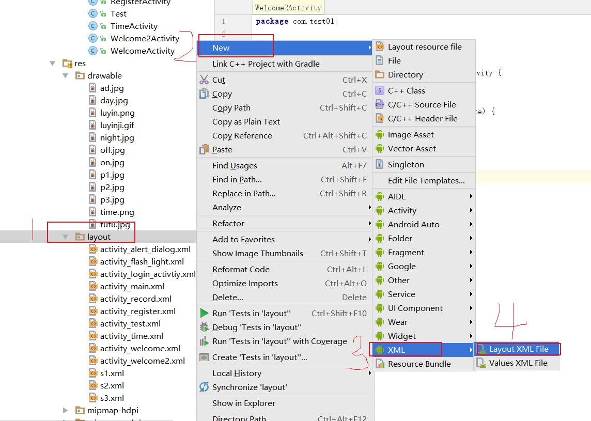
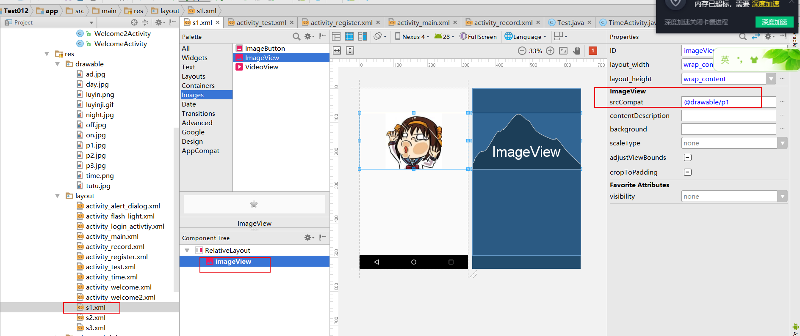
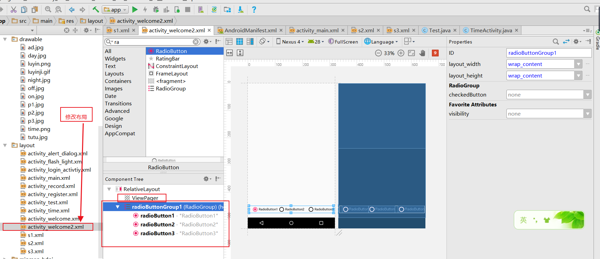
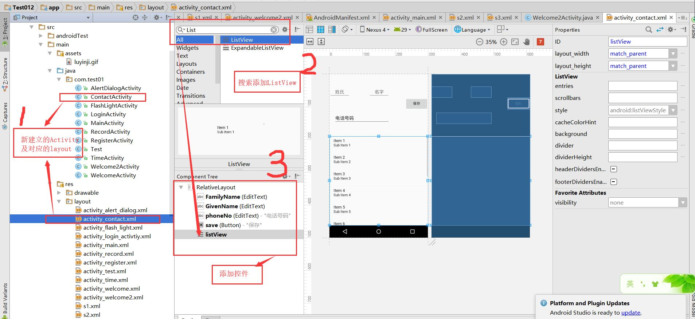
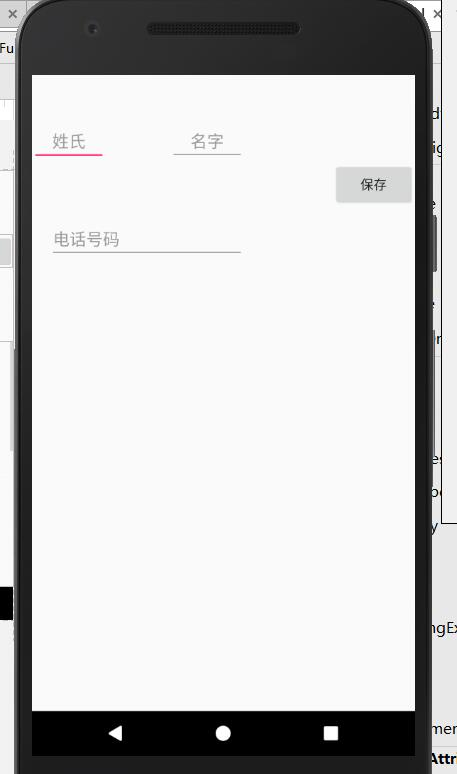
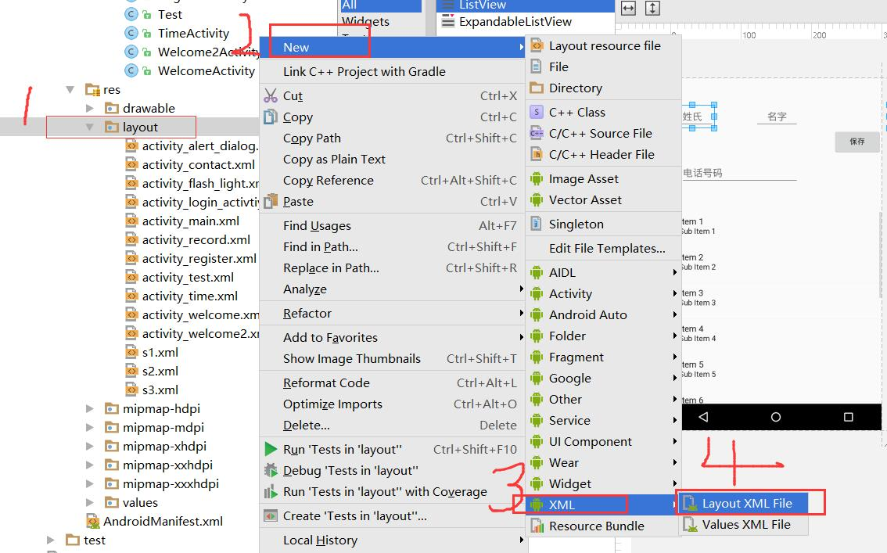
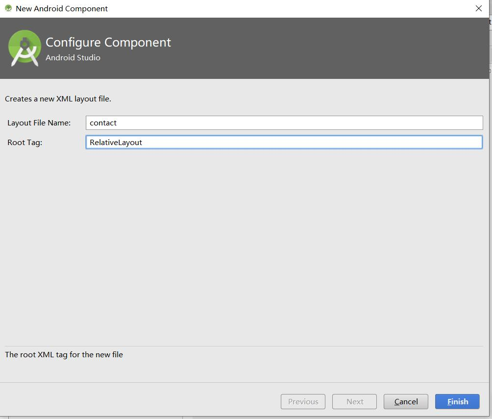
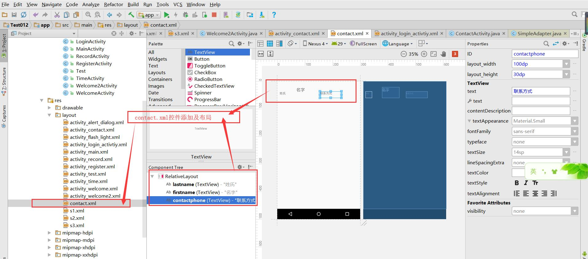
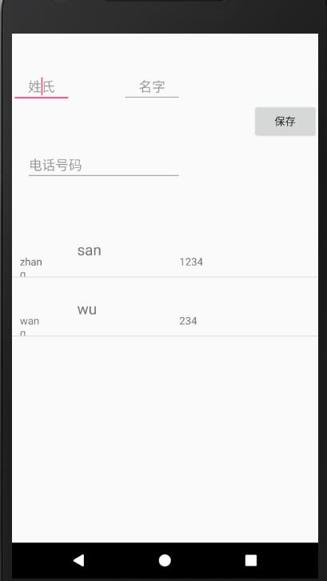

# 点击两次退出，及滑动图片 ，联系人

## 1.android实现点击两次返回键实现退出功能

```java
//按两次退出,重写 onKeyDown方法
    long firstTime= 0;
    @Override
    public boolean onKeyDown(int keyCode,KeyEvent keyEvent){

        long secondTime = System.currentTimeMillis(); //空闲时间
        if(keyCode==KeyEvent.KEYCODE_BACK && keyEvent.getRepeatCount()== 0){
            if(secondTime- firstTime < 2000){
                finish();
                System.exit(0);
            }else{
                Toast.makeText(MainActivity.this,"再按一次，程序退出",Toast.LENGTH_SHORT).show();
                firstTime= System.currentTimeMillis();
            }
            return true;
        }

        return super.onKeyDown(keyCode,keyEvent);
    }
```

上述程序在执行时，首先由于secondTime- firstTime >2000会执行else部分对firstTime进行初始化。等第二次单击时会进行判断


**Android KeyEvent event.getRepeatCount**

一些按键(Media Key Back Key)在系统分发时，做了特殊处理： 
当按下时，发送Message去调用KeyEvent.changeTimeRepeat 

这样长按时，会发多次KeyEvent.ACTION_DOWN，

第一次event.getRepeatCount()返回0; 
		第二次event.getRepeatCount()返回1; 
		……

避免长按多次调用onKeyDown之类的处理，常添加repeatCount == 0判断

if (keyCode == KeyEvent.KEYCODE_BACK && event.getRepeatCount() == 0) {
　　return true;
}
return super.onKeyDown(keyCode, event);

 **System.currentTimeMillis()**

 System.currentTimeMillis()在java中是最常用的获取系统时间的方法，它返回的是1970年1月1日0点到现在经过的毫秒数。 

## 2.滑动图片

### 1.素材准备 新建三个layout，用于滑动切换的视图

**找三张精美图片**


**2.为每一个图片创建一个xml布局**





**3.将图片作为ImageView 放在xml中**



### 2 Welcome2Activity.xml布局

1.创建Welcome2Activity,设置为启动页，并修改页面布局为熟悉的相对布局。

2.控件ViewPager控件，用来存放xml。如果没法查找，可以手动添加

```xml
<android.support.v4.view.ViewPager

    //划线，高，宽
        android:layout_width="404dp"
        android:layout_height="540dp"

        tools:layout_editor_absoluteX="-14dp"
        tools:layout_editor_absoluteY="16dp">


    </android.support.v4.view.ViewPager>
```

==一个控件最基本的东西要有宽和高==

3.添加控件RadioButtonGruop,在里面添加3个radioButton 并修改布局




```xml
<?xml version="1.0" encoding="utf-8"?>
<RelativeLayout xmlns:android="http://schemas.android.com/apk/res/android"
    xmlns:app="http://schemas.android.com/apk/res-auto"
    xmlns:tools="http://schemas.android.com/tools"
    android:layout_width="match_parent"
    android:layout_height="match_parent"
    tools:context="com.test01.Welcome2Activity"
    >

    <android.support.v4.view.ViewPager

        android:id="@+id/viewPager"
        android:layout_width="404dp"
        android:layout_height="400dp"
        android:layout_alignParentTop="true"
        android:visibility="visible"
        >


    </android.support.v4.view.ViewPager>

    <TextView
        android:id="@+id/textView5"
        android:layout_width="wrap_content"
        android:layout_height="wrap_content"
        android:layout_alignBottom="@+id/radioButtonGroup1"
        android:layout_alignParentEnd="true"
        android:layout_alignTop="@+id/radioButtonGroup1"
        android:text="点击进入主界面"
        android:visibility="gone" />

    <RadioGroup
        android:id="@+id/radioButtonGroup1"
        android:layout_width="wrap_content"
        android:layout_height="wrap_content"
        android:layout_alignParentBottom="true"
        android:orientation="horizontal"
        android:layout_centerHorizontal="true"
        android:layout_marginBottom="18dp">


        <RadioButton
            android:id="@+id/radioButton1"
            android:layout_width="wrap_content"
            android:layout_height="wrap_content"
            android:layout_weight="1"
            android:text=""
            android:layout_alignParentBottom="true"
            android:layout_toEndOf="@+id/radioButton3"
            android:layout_marginStart="12dp"
            android:checked="true"/>

        <RadioButton
            android:id="@+id/radioButton2"
            android:layout_width="wrap_content"
            android:layout_height="wrap_content"
            android:layout_weight="1"
            android:text=""
            android:layout_alignParentBottom="true"
            android:layout_alignParentEnd="true"
            android:layout_marginEnd="13dp" />

        <RadioButton
            android:id="@+id/radioButton3"
            android:layout_width="wrap_content"
            android:layout_height="wrap_content"
            android:layout_weight="1"
            android:text=""
            android:layout_toEndOf="@+id/radioButtonGroup1"
            android:layout_alignBottom="@+id/radioButtonGroup1" />
    </RadioGroup>


</RelativeLayout>

```


### 3.功能实现

1.首先通过FindViewByMe,得到Welcome2Activity.xml布局中的控件

```java
private ViewPager viewPager;
private TextView textView5;
private RadioGroup radioButtonGroup1;
private RadioButton radioButton1;
private RadioButton radioButton2;
private RadioButton radioButton3;

viewPager = (ViewPager) findViewById(R.id.viewPager);
textView5 = (TextView) findViewById(R.id.textView5);
radioButtonGroup1 = (RadioGroup) findViewById(R.id.radioButtonGroup1);
radioButton1 = (RadioButton) findViewById(R.id.radioButton1);
radioButton2 = (RadioButton) findViewById(R.id.radioButton2);
radioButton3 = (RadioButton) findViewById(R.id.radioButton3);

```

2.当滑到最后一页时，textView显示提示文字“点击进入主界面”。跳转功能的实现

```java
textView5.setOnClickListener(new View.OnClickListener() {
            @Override
            public void onClick(View v) {
                Intent intent = new Intent();
                intent.setClass(Welcome2Activity.this,MainActivity.class);
                startActivity(intent);
                Welcome2Activity.this.finish();
            }
        });
```

3.设置适配器，页面的填充布局

```java
ArrayList<View> vpList;//全局变量
//适配器，设置某一个界面的填充布局
        LayoutInflater layoutInflater = LayoutInflater.from(this);
        View v1 = layoutInflater.inflate(R.layout.s1,null);
        View v2 = layoutInflater.inflate(R.layout.s2,null);
        View v3 = layoutInflater.inflate(R.layout.s3,null);
        vpList = new ArrayList<View>();
        vpList.add(v1);
        vpList.add(v2);
        vpList.add(v3);
        //适配器 ，adapter
        PagerAdapter pagerAdapter = new PagerAdapter() {
            @Override
            //数量
            public int getCount() {

                return vpList.size();
            }

            @Override
            //判断是否是有对象生成的界面
            public boolean isViewFromObject(View view, Object object) {

                return view==object;
            }

            //获取当前界面的位置
            public Object instantiateItem(ViewGroup viewGroup,int position){
                viewGroup.addView(vpList.get(position));

                return vpList.get(position);

            }

            //销毁上一个显示界面
            public  void destroyItem(ViewGroup viewGroup,int position,Object object){
                viewGroup.removeView(vpList.get(position));
            }

        };


        viewPager.setAdapter(pagerAdapter);
        viewPager.setOnPageChangeListener(new ViewPager.OnPageChangeListener() {
            @Override
            public void onPageScrolled(int position, float positionOffset, int positionOffsetPixels) {

            }
            //当界面被选中时
            @Override
            public void onPageSelected(int position) {
                switch (position){
                    case 0:
                        radioButton1.setChecked(true);
                        textView5.setVisibility(View.GONE);
                        break;
                    case 1:
                        radioButton2.setChecked(true);
                        textView5.setVisibility(View.GONE);
                        break;
                    case 2:
                        radioButton3.setChecked(true);
                        textView5.setVisibility(View.VISIBLE);
                        break;


                }

            }

            @Override
            public void onPageScrollStateChanged(int state) {

            }
        });
```

4.实现button和滑动的图片相对应

```java
//按钮 选中内容变化
        radioButtonGroup1.setOnCheckedChangeListener(new RadioGroup.OnCheckedChangeListener() {
            @Override
            public void onCheckedChanged(RadioGroup group, @IdRes int checkedId) {
                if( radioButton1.getId()==checkedId){
                    viewPager.setCurrentItem(0);
                }else if(radioButton2.getId()==checkedId){
                    viewPager.setCurrentItem(1);
                }else{
                    viewPager.setCurrentItem(2);

                }
            }
        });

```

## 为viewpager添加单击事件实现界面跳转


> 练习： 点击每张图片，实现网页跳转
>
> 对view设置，即v1,v2,v3
>
> ```java
>  //作业 每一个视图都可以点击打开网页
>         v1.setOnClickListener(new View.OnClickListener()
>         { @Override public void onClick(View view) {
>             Uri uri = Uri.parse("https://www.baidu.com");
>             Intent intent = new Intent(Intent.ACTION_VIEW, uri);
>             startActivity(intent);
>         }
>         });
>         v2.setOnClickListener(new View.OnClickListener()
>         { @Override public void onClick(View view) {
>             Uri uri = Uri.parse("https://www.taobao.com");
>             Intent intent = new Intent(Intent.ACTION_VIEW, uri);
>             startActivity(intent);
>         }
>         });
>         v3.setOnClickListener(new View.OnClickListener()
>         { @Override public void onClick(View view) {
>             Uri uri = Uri.parse("https://m.jd.com");
>             Intent intent = new Intent(Intent.ACTION_VIEW, uri);
>             startActivity(intent);
>         }
>         });
> ```
>
> 

## 3.联系人 ListView 

### 1.新建ContactActivity,修改布局为RealtiveLayout ,在主界面添加按钮，并设置点击事件

### 2.ContactActivity.xml布局



```xml
<?xml version="1.0" encoding="utf-8"?>
<RelativeLayout xmlns:android="http://schemas.android.com/apk/res/android"
    xmlns:app="http://schemas.android.com/apk/res-auto"
    xmlns:tools="http://schemas.android.com/tools"
    android:layout_width="match_parent"
    android:layout_height="match_parent"
    tools:context="com.test01.ContactActivity">

    <EditText
        android:id="@+id/FamilyName"
        android:layout_width="80dp"
        android:layout_height="wrap_content"
        android:layout_alignParentTop="true"
        android:layout_marginTop="49dp"
        android:ems="10"
        android:inputType="textPersonName"
        android:text=""
        android:hint="姓氏"
        android:gravity="center"
        android:layout_alignParentStart="true" />

    <EditText
        android:id="@+id/GivenName"
        android:layout_width="80dp"
        android:layout_height="wrap_content"
        android:ems="10"
        android:gravity="center"
        android:hint="名字"
        android:inputType="textPersonName"
        android:text=""
        android:layout_above="@+id/phoneNo"
        android:layout_alignEnd="@+id/phoneNo" />

    <EditText
        android:id="@+id/phoneNo"
        android:layout_width="wrap_content"
        android:layout_height="wrap_content"
        android:layout_alignParentStart="true"
        android:layout_below="@+id/FamilyName"
        android:layout_marginStart="19dp"
        android:layout_marginTop="60dp"
        android:ems="10"
        android:inputType="phone"
        android:text="电话号码" />

    <Button
        android:id="@+id/save"
        android:layout_width="wrap_content"
        android:layout_height="wrap_content"
        android:layout_alignParentEnd="true"
        android:layout_below="@+id/GivenName"
        android:text="保存" />

    <ListView
        android:id="@+id/listView"
        android:layout_width="match_parent"
        android:layout_height="match_parent"
        android:layout_alignParentStart="true"
        android:layout_below="@+id/phoneNo"
        android:layout_marginTop="49dp" />
</RelativeLayout>

```

运行看一下效果



### 3.创建填充页面，对应的联系人视图

创建layout,contact.xml





这里的layout代表联系人页面，每个联系人显示的内容，名字姓氏手机号码




```xml
<?xml version="1.0" encoding="utf-8"?>
<RelativeLayout xmlns:android="http://schemas.android.com/apk/res/android"
    android:layout_width="match_parent"
    android:layout_height="match_parent">

    <TextView
        android:id="@+id/lastname"
        android:layout_width="30dp"
        android:layout_height="30dp"
        android:layout_alignParentStart="true"
        android:layout_alignParentTop="true"
        android:layout_marginStart="11dp"
        android:layout_marginTop="48dp"
        android:text="姓氏" />

    <TextView
        android:id="@+id/firstname"
        android:layout_width="80dp"
        android:layout_height="50dp"
        android:layout_alignBottom="@+id/lastname"
        android:layout_marginStart="47dp"
        android:layout_toEndOf="@+id/lastname"
        android:text="名字"
        android:textSize="20sp" />

    <TextView
        android:id="@+id/contactphone"
        android:layout_width="100dp"
        android:layout_height="30dp"
        android:layout_alignParentEnd="true"
        android:layout_alignTop="@+id/lastname"
        android:layout_marginEnd="86dp"
        android:text="联系方式" />
</RelativeLayout>

```

### 4.ContactActivity ListView内容的填充

首先通过findViewByMe,在activity_contact.xm中找到控件。

当点击保存时，会将内容保存，或者提示为空。

​		将内容保存到数组之中，以键值对的形式保存。并将填充内容清空。


```java
package com.test01;

import android.support.v7.app.AppCompatActivity;
import android.os.Bundle;
import android.view.View;
import android.widget.Button;
import android.widget.EditText;
import android.widget.ListView;
import android.widget.SimpleAdapter;
import android.widget.TextView;
import android.widget.Toast;

import java.util.ArrayList;
import java.util.HashMap;
import java.util.List;
import java.util.Map;
import java.util.Objects;

public class ContactActivity extends AppCompatActivity {
    private EditText FamilyName;
    private EditText GivenName;
    private EditText PhoneNo;
    private Button save;
    private ListView listView;

    List<Map<String,Object>> list = new ArrayList<Map<String,Object>>();


    @Override
    protected void onCreate(Bundle savedInstanceState) {
        super.onCreate(savedInstanceState);
        setContentView(R.layout.activity_contact);


        FamilyName = (EditText) findViewById(R.id.FamilyName);
        GivenName = (EditText) findViewById(R.id.GivenName);
        PhoneNo = (EditText) findViewById(R.id.phoneNo);
        save = (Button) findViewById(R.id.save);
        listView = (ListView) findViewById(R.id.listView);

        save.setOnClickListener(new View.OnClickListener() {
            @Override
            public void onClick(View v) {
                //当内容不为空时保存，当为空时提示保存失败
                //获取空间中填的内容
                String familyName = FamilyName.getText().toString().trim();
                String givenName = GivenName.getText().toString().trim();
                String phoneNo =  PhoneNo.getText().toString().trim();
                
                if(!familyName.equals("") && !givenName.equals("") &&  !phoneNo.equals("")  ){
                    //所有不为空才保存
                    Map<String,Object> map = new HashMap<String,Object>();
                    //list中的每一个对象是一个map,以键值对的形式存放
                    map.put("fName",familyName);
                    map.put("gName",givenName);
                    map.put("phoneNo",phoneNo);
                    list.add(map);
                    //adapter
                    SimpleAdapter simpleAdapter= new SimpleAdapter(
                            ContactActivity.this,
                            list,
                            R.layout.contact,             //layout界面 contact.xml文件
                            new String[]{"fName","gName","phoneNo"}, //键值对的键
                            new int[]{R.id.lastname,R.id.firstname,R.id.contactphone} //layout contact.xml文件中控件的id
                    );
                    listView.setAdapter(simpleAdapter); //把适配器放进
                    //提示添加成功,并将填充框重置为空
                    Toast.makeText(ContactActivity.this,"添加成功",Toast.LENGTH_SHORT).show();
                    FamilyName.setText("");
                    GivenName.setText("");
                    PhoneNo.setText("");
                }else{ 
                    Toast.makeText(ContactActivity.this,"数据不能为空",Toast.LENGTH_SHORT).show();
                }

            }
        });


    }
}

```

效果



> 练习，长按是弹窗，询问是否删除，是的话删除 ,删除：从ListView中remove掉这条记录，再重新加入适配器
>
> ```
>  //练习，长按是弹窗，询问是否删除，是的话删除 ,删除：从ListView中remove掉这条记录，再重新加入适配器
>         listView.setOnItemLongClickListener(new AdapterView.OnItemLongClickListener() {
>             @Override
>             public boolean onItemLongClick(AdapterView<?> parent, View view, final int position, long id) {
>                 AlertDialog.Builder ab = new AlertDialog.Builder(ContactActivity.this);
>                 ab.setIcon(R.drawable.off);          //弹框图片
>                 ab.setTitle("警告");                //弹框标题
>                 ab.setMessage("您是否要删除");    //弹框内容
>                 //选项，及对应的点击监听
>                 ab.setPositiveButton("是", new DialogInterface.OnClickListener() {
>                     @Override
>                     public void onClick(DialogInterface dialog, int which) {
>                         //进行删除操作 删除：从ListView中remove掉这条记录，再重新加入适配器
>                         //listView.removeView(listView.getChildAt(position)); //从ListView中remove掉这条记录
>                         list.remove(position);
>                         SimpleAdapter simpleAdapter= new SimpleAdapter(
>                                 ContactActivity.this,
>                                 list,
>                                 R.layout.contact,             //layout界面 contact.xml文件
>                                 new String[]{"fName","gName","phoneNo"}, //键值对的键
>                                 new int[]{R.id.lastname,R.id.firstname,R.id.contactphone} //layout contact.xml文件中控件的id
>                         );
>                         listView.setAdapter(simpleAdapter); //把适配器放进
> 
> 
> 
> 
>                     }
>                 });
>                 ab.setNegativeButton("否", new DialogInterface.OnClickListener() {
>                     @Override
>                     public void onClick(DialogInterface dialog, int which) {
>                         Toast.makeText(ContactActivity.this,"明智的选择",Toast.LENGTH_LONG).show();
>                     }
>                 });
> 
>                 ab.create().show();                 //创建对象并显示出来
> 
>                 return true;
>             }
>         });
> ```
>
> 