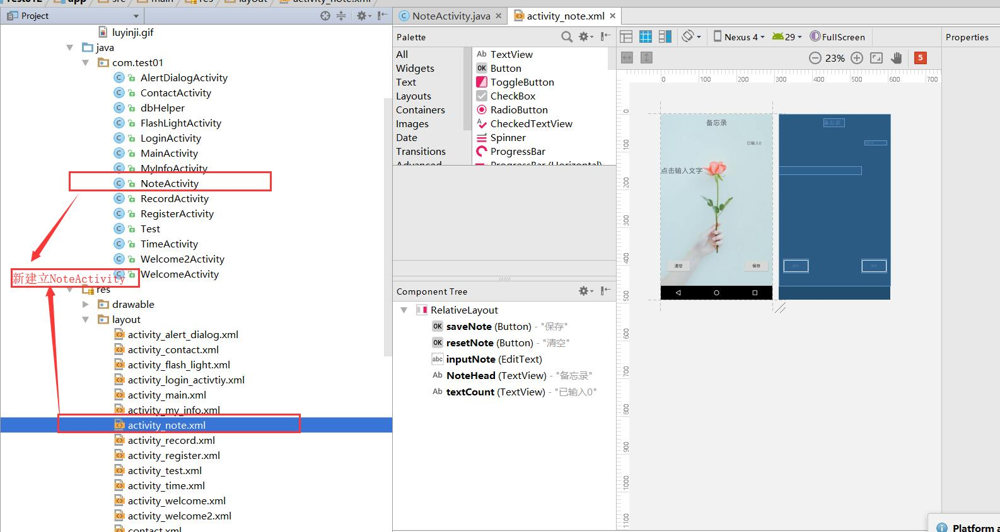
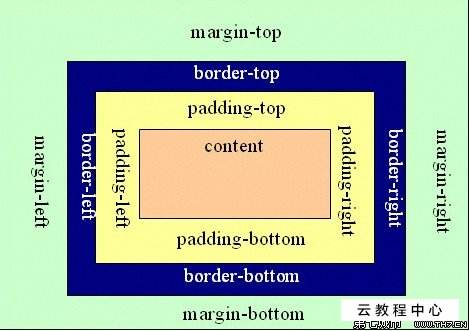
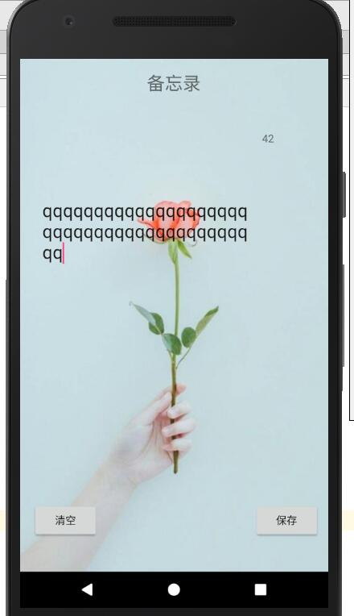
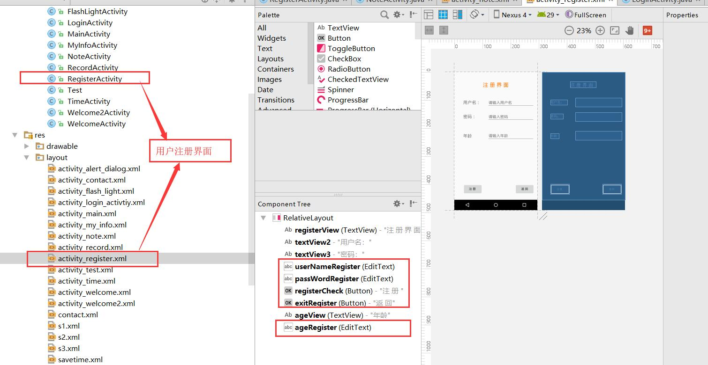

# 备忘录及用户注册界面

### 存储的几种方式

1 文件存储

2 SharedPreference存储 

3 SQLite数据库存储

向文件内存储及添加删除都是 input

## 备忘录

1.问题程序卸载后文件还在吗？ 会被清除

### 1.新建NoteActivity 并在MianActivity添加相应的按钮及点击事件

```java
note  = (Button) findViewById(R.id.note);
note.setOnClickListener(new View.OnClickListener() {
     @Override
      public void onClick(View v) {
          Intent intent = new Intent();
          intent.setClass(MainActivity.this,NoteActivity.class);
          startActivity(intent);
            }
        });
```

### 2.activity_note.xml界面设置



```xml
<?xml version="1.0" encoding="utf-8"?>
<RelativeLayout xmlns:android="http://schemas.android.com/apk/res/android"
    xmlns:app="http://schemas.android.com/apk/res-auto"
    xmlns:tools="http://schemas.android.com/tools"
    android:layout_width="match_parent"
    android:layout_height="match_parent"
    android:background="@drawable/notebackground"
    tools:context="com.test01.NoteActivity">

    <Button
        android:id="@+id/saveNote"
        android:layout_width="wrap_content"
        android:layout_height="wrap_content"
        android:layout_alignParentBottom="true"
        android:layout_alignParentEnd="true"
        android:layout_marginBottom="44dp"
        android:layout_marginEnd="11dp"
        android:text="保存"
        tools:layout_editor_absoluteX="16dp"
        tools:layout_editor_absoluteY="481dp" />

    <Button
        android:id="@+id/resetNote"
        android:layout_width="wrap_content"
        android:layout_height="wrap_content"
        android:layout_marginStart="17dp"
        android:text="清空"
        tools:layout_editor_absoluteX="243dp"
        tools:layout_editor_absoluteY="481dp"
        android:layout_alignBaseline="@+id/saveNote"
        android:layout_alignBottom="@+id/saveNote"
        android:layout_alignParentStart="true" />

    <EditText
        android:id="@+id/inputNote"
        android:layout_width="wrap_content"
        android:layout_height="wrap_content"
        android:layout_alignParentStart="true"
        android:layout_below="@+id/NoteHead"
        android:layout_marginTop="137dp"
        android:background="@null"
        android:ems="10"
        android:hint="点击输入文字"
        android:inputType="textMultiLine"
        android:maxLines="23"
        android:textSize="24sp"
        tools:layout_editor_absoluteX="28dp"
        tools:layout_editor_absoluteY="114dp" />

    <TextView
        android:id="@+id/NoteHead"
        android:layout_width="wrap_content"
        android:layout_height="wrap_content"
        android:text="备忘录"
        android:textSize="24sp"
        tools:layout_editor_absoluteX="139dp"
        tools:layout_editor_absoluteY="16dp"
        android:layout_alignParentTop="true"
        android:layout_centerHorizontal="true"
        android:layout_marginTop="16dp" />

    <TextView
        android:id="@+id/textCount"
        android:layout_width="wrap_content"
        android:layout_height="wrap_content"
        android:layout_alignEnd="@+id/saveNote"
        android:layout_alignStart="@+id/saveNote"
        android:layout_below="@+id/NoteHead"
        android:layout_marginStart="11dp"
        android:layout_marginTop="48dp"
        android:text="已输入0" />
</RelativeLayout>
```

#### 左右距离边界一段距离

```xml
android:layout_marginTop="137dp"
android:layout_marginLeft="30dp"
 android:layout_marginRight="30dp"
```

 android:layout_marginTop,

 android:layout_marginLeft

 android:layout_marginRight



#### 输入内容为多行文本框，限制行数

```xml
android:inputType="textMultiLine" //
android:maxLines="23" 
android:textSize="24sp"
```

#### 去掉红颜色的线

```
 android:background="@null"
```

#### 光标显示

点击文本框输入文字时显示光标

```java
inputNote = (EditText) findViewById(R.id.inputNote);
inputNote.setOnClickListener(new View.OnClickListener() {
            @Override
            public void onClick(View view) {
                inputNote.setCursorVisible(true);//设置光标的显示
            }
        });
```

#### 右上角记录输入的文字数量


#### 效果




### 3.保存文本

```java
saveNote = (Button) findViewById(R.id.saveNote);
saveNote.setOnClickListener(new View.OnClickListener() {
            @Override
            public void onClick(View v) {
                //1.输出流的对象
                FileOutputStream fileOutputStream =null;
                try {
                    //2.文字添加保存方式，1追加，2覆盖
                    //在原有内容上追加
                    //fileOutputStream=openFileOutput("txt", Context.MODE_APPEND);
                    //覆盖原有内容
                    fileOutputStream=openFileOutput("txt",Context.MODE_PRIVATE);//保存到文件之中
                    String text = inputNote.getText().toString(); //得到输入文本框中的内容
                    fileOutputStream.write(text.getBytes());//写入到流当中

                }catch (FileNotFoundException e){
                    e.printStackTrace();

                }catch (IOException e){
                    e.printStackTrace();
                }finally {
                    try {
                        if(fileOutputStream!=null) {
                            fileOutputStream.flush(); //将缓存区的数据强制冲刷
                            Toast.makeText(NoteActivity.this,"保存成功",Toast.LENGTH_SHORT).show();//提示保存成功
                            fileOutputStream.close();//关闭流
                        }
                    }catch (IOException e){
                        e.printStackTrace();
                    }
                }
            }
        });
```

### 4.打开备忘录时，读取文件内容

```java
//打开备忘录，读取文件并显示
    public  void onLoad(){
        //创建输入流
        FileInputStream fileInputStream=null;
        try{
            //打开文件
            fileInputStream =openFileInput("txt");
            //判断内容是否为空
            if(fileInputStream.available()==0){
                return;
            }else {
                //byte数组读取文件内容
                byte[] con = new byte[fileInputStream.available()];
                //将byte字节转为String
                while (fileInputStream.read(con) != -1) {
                }
                //将字符显示在文本框中
                inputNote.setText(new String(con));
                //打开备忘录，有文字时，不显示光标
                inputNote.setCursorVisible(false);
                textCount.setText(inputNote.getText().length()+"");
            }
        }catch (IOException e){
            e.printStackTrace();
        }
    }
```

### 5.清空文本

```java
resetNote.setOnClickListener(new View.OnClickListener() {
            @Override
            public void onClick(View v) {
                FileOutputStream fileOutputStream=null;
                try{
                    //将空字符覆盖保存到文件中，即清空保存的文档
                    fileOutputStream = openFileOutput("txt",Context.MODE_PRIVATE);
                    String text="";
                    //将空字符串存入
                    fileOutputStream.write(text.getBytes());
                    inputNote.setText("");
                }
                catch(FileNotFoundException e){
                    e.printStackTrace();
                }catch (IOException e){
                    e.printStackTrace();
                }finally {
                    try {
                        if(fileOutputStream!=null) {
                            fileOutputStream.flush();
                            Toast.makeText(NoteActivity.this,"清空成功",Toast.LENGTH_SHORT).show();
                            fileOutputStream.close();
                        }
                    }catch (IOException e){
                        e.printStackTrace();
                    }
                }

             }
        });
```


### 5.显示输入的文字的数量

```java
//当文本变换时的监听，记录输入文字的数量
inputNote.addTextChangedListener(new TextWatcher() {
     @Override
     public void beforeTextChanged(CharSequence s, int start, int count, int after) {

            }

     @Override
     public void onTextChanged(CharSequence s, int start, int before, int count) {

            }

     public void afterTextChanged(Editable s) {
                textCount.setText(inputNote.getText().length()+"");
            }
        });
```

## 完整代码

```java
package com.test01;

import android.content.Context;
import android.support.v7.app.AppCompatActivity;
import android.os.Bundle;
import android.text.Editable;
import android.text.TextWatcher;
import android.view.View;
import android.widget.Button;
import android.widget.EditText;
import android.widget.TextView;
import android.widget.Toast;

import java.io.FileInputStream;
import java.io.FileNotFoundException;
import java.io.FileOutputStream;
import java.io.IOException;

public class NoteActivity extends AppCompatActivity {
    private Button saveNote;
    private Button resetNote;
    private EditText inputNote;

    private TextView textCount;


    @Override
    protected void onCreate(Bundle savedInstanceState) {
        super.onCreate(savedInstanceState);
        setContentView(R.layout.activity_note);


        saveNote = (Button) findViewById(R.id.saveNote);
        resetNote = (Button) findViewById(R.id.resetNote);
        inputNote = (EditText) findViewById(R.id.inputNote);
        textCount = (TextView) findViewById(R.id.textCount);
        onLoad();
        inputNote.setOnClickListener(new View.OnClickListener() {
            @Override
            public void onClick(View view) {
                inputNote.setCursorVisible(true);
            }
        });
        saveNote.setOnClickListener(new View.OnClickListener() {
            @Override
            public void onClick(View v) {
                //1.输出流的对象
                FileOutputStream fileOutputStream =null;
                try {
                    //2.文字添加保存方式，1追加，2覆盖
                    //在原有内容上追加
                    //fileOutputStream=openFileOutput("txt", Context.MODE_APPEND);
                    //覆盖原有内容
                    fileOutputStream=openFileOutput("txt",Context.MODE_PRIVATE);//保存到文件之中
                    String text = inputNote.getText().toString(); //得到输入文本框中的内容
                    fileOutputStream.write(text.getBytes());//写入到流当中

                }catch (FileNotFoundException e){
                    e.printStackTrace();

                }catch (IOException e){
                    e.printStackTrace();
                }finally {
                    try {
                        if(fileOutputStream!=null) {
                            fileOutputStream.flush(); //将缓存区的数据强制冲刷
                            Toast.makeText(NoteActivity.this,"保存成功",Toast.LENGTH_SHORT).show();//提示保存成功
                            fileOutputStream.close();//关闭流
                        }
                    }catch (IOException e){
                        e.printStackTrace();
                    }
                }
            }
        });

        resetNote.setOnClickListener(new View.OnClickListener() {
            @Override
            public void onClick(View v) {
                FileOutputStream fileOutputStream=null;
                try{
                    //将空字符覆盖保存到文件中，即清空保存的文档
                    fileOutputStream = openFileOutput("txt",Context.MODE_PRIVATE);
                    String text="";
                    fileOutputStream.write(text.getBytes());
                    //将文本框显示的内容设置为空
                    inputNote.setText("");
                }
                catch(FileNotFoundException e){
                    e.printStackTrace();
                }catch (IOException e){
                    e.printStackTrace();
                }finally {
                    try {
                        if(fileOutputStream!=null) {
                            fileOutputStream.flush();
                            Toast.makeText(NoteActivity.this,"清空成功",Toast.LENGTH_SHORT).show();
                            fileOutputStream.close();
                        }
                    }catch (IOException e){
                        e.printStackTrace();
                    }
                }

             }
        });
        //当文本变换时的监听
        inputNote.addTextChangedListener(new TextWatcher() {
            @Override
            public void beforeTextChanged(CharSequence s, int start, int count, int after) {

            }

            @Override
            public void onTextChanged(CharSequence s, int start, int before, int count) {

            }

            @Override
            public void afterTextChanged(Editable s) {
                textCount.setText(inputNote.getText().length()+"");
            }
        });


    }
    //打开备忘录，读取文件并显示
    public  void onLoad(){
        //创建输入流
        FileInputStream fileInputStream=null;
        try{
            //打开文件
            fileInputStream =openFileInput("txt");
            //判断内容是否为空
            if(fileInputStream.available()==0){
                return;
            }else {
                //byte数组读取文件内容
                byte[] con = new byte[fileInputStream.available()];
                //将byte转为String
                while (fileInputStream.read(con) != -1) {
                }
                //将字符显示在文本框中
                inputNote.setText(new String(con));
                inputNote.setCursorVisible(false);
                textCount.setText(inputNote.getText().length()+"");
            }
        }catch (IOException e){
            e.printStackTrace();
        }
    }
}

```


## 用户注册界面

### 问题程序卸载后，用户信息是否还存在

程序删除后，数据库会删除，用户信息不再存在

### Sqlite数据库 是关系型数据库

### DML  

DML(Data Manipulation Language)数据操纵语言：

适用范围：对数据库中的数据进行一些简单操作，如insert,delete,update,select等.

### DDL

DDL(Data Definition Language)数据定义语言：

适用范围：对数据库中的某些对象(例如，database,table)进行管理，如Create,Alter和Drop.

### 1,注册页面，RegisterActivity



```xml
<?xml version="1.0" encoding="utf-8"?>
<RelativeLayout xmlns:android="http://schemas.android.com/apk/res/android"
    xmlns:app="http://schemas.android.com/apk/res-auto"
    xmlns:tools="http://schemas.android.com/tools"
    android:layout_width="match_parent"
    android:layout_height="match_parent"
    tools:context="com.test01.LoginActivity"
    >

    <TextView
        android:id="@+id/registerView"
        android:layout_width="wrap_content"
        android:layout_height="wrap_content"
        android:layout_alignParentTop="true"
        android:layout_centerHorizontal="true"
        android:layout_marginTop="45dp"
        android:text="注 册 界 面"
        android:gravity="center"
        android:textColor="#FF7300"
        android:textSize="25dp" />

    <TextView
        android:id="@+id/textView2"
        android:layout_width="wrap_content"
        android:layout_height="wrap_content"
        android:layout_alignBaseline="@+id/userNameRegister"
        android:layout_alignBottom="@+id/userNameRegister"
        android:layout_marginEnd="11dp"
        android:layout_toStartOf="@+id/registerView"
        android:text="用户名："
        android:textSize="20dp" />

    <TextView
        android:id="@+id/textView3"
        android:layout_width="wrap_content"
        android:layout_height="wrap_content"
        android:layout_alignBaseline="@+id/passWordRegister"
        android:layout_alignBottom="@+id/passWordRegister"
        android:layout_alignStart="@+id/textView2"
        android:text="密码："
        android:textSize="20dp" />

    <EditText
        android:id="@+id/userNameRegister"
        android:layout_width="wrap_content"
        android:layout_height="wrap_content"
        android:layout_below="@+id/registerView"
        android:layout_marginStart="22dp"
        android:layout_marginTop="46dp"
        android:layout_toEndOf="@+id/textView2"
        android:ems="10"
        android:hint="请输入用户名"
        android:inputType="textPersonName" />

    <EditText
        android:id="@+id/passWordRegister"
        android:layout_width="wrap_content"
        android:layout_height="wrap_content"
        android:layout_alignStart="@+id/userNameRegister"
        android:layout_below="@+id/userNameRegister"
        android:layout_marginTop="23dp"
        android:ems="10"
        android:hint="请输入密码"
        android:inputType="textPassword" />

    <Button
        android:id="@+id/registerCheck"
        android:layout_width="wrap_content"
        android:layout_height="wrap_content"
        android:layout_alignParentBottom="true"
        android:layout_alignStart="@+id/textView3"
        android:layout_marginBottom="26dp"
        android:text="注 册 " />

    <Button
        android:id="@+id/exitRegister"
        android:layout_width="wrap_content"
        android:layout_height="wrap_content"
        android:layout_alignBottom="@+id/registerCheck"
        android:layout_alignEnd="@+id/passWordRegister"
        android:text="返 回" />

    <TextView
        android:id="@+id/ageView"
        android:layout_width="wrap_content"
        android:layout_height="wrap_content"
        android:layout_alignStart="@+id/textView3"
        android:layout_centerVertical="true"
        android:text="年龄"
        android:textSize="20sp" />

    <EditText
        android:id="@+id/ageRegister"
        android:layout_width="wrap_content"
        android:layout_height="wrap_content"
        android:layout_alignEnd="@+id/passWordRegister"
        android:layout_centerVertical="true"
        android:ems="10"
        android:inputType="textPersonName"
        android:hint="请输入年龄" />

</RelativeLayout>


```

### 2.创建dbHelper extends SQLiteOpenHelper

```java
package com.test01;


import android.content.Context;
import android.database.sqlite.SQLiteDatabase;
import android.database.sqlite.SQLiteOpenHelper;

/**
 * Created by zuti666 on 2020/3/26.
 */

public class dbHelper extends SQLiteOpenHelper {
    //用户表， 表名 useinfo
   String TB_Name="userinfo";

    public dbHelper(Context context, String name, SQLiteDatabase.CursorFactory factory, int version) {
        super(context, name, factory, version);
    }

    @Override
    public void onCreate(SQLiteDatabase db) {
        db.execSQL("create table if not exists "+TB_Name
                +"(uid integer primary key autoincrement,"
                +"uname varchar,"
                +"pwd varchar,"
                +"age integer"
                +")"
        );
    }

    @Override
    public void onUpgrade(SQLiteDatabase db, int oldVersion, int newVersion) {
        db.execSQL("drop table if exits "+TB_Name);
        onCreate(db);
    }
}

```

### 3. 注册 数据库

```java

        //创建连接，打开数据库
        //构造方法，创建对象
        dbHelper = new dbHelper(this,DB_Name,null,1);//当前界面，数据库名字，内容工场，版本
        //数据库，打开，可以写入
        db = dbHelper.getWritableDatabase();
        //注册，向数据库中添加内容，还需要查询看是否已经存在，即使用到了数据库中的添加和查询
        registerCheck.setOnClickListener(new View.OnClickListener() {
            @Override
            public void onClick(View v) {
                //插入内容，contentValues
                ContentValues values = new ContentValues();
                //游标遍历，查询内容
                //数据库查询语句，包装成了一个方法，参数：表名,排序
                cursor = db.query(dbHelper.TB_Name,null,null,null,null,null,"uid ASC");
                cursor.moveToFirst();//结果集的第一个
                while(!cursor.isAfterLast()){//循环条件，不是最后一个
                    //如果用户名和表中的第二列uname相同，falg赋值为false 即用户已经存在
                    if(userNameRegister.getText().toString().trim().equals(cursor.getString(1))){
                        flag=false;
                    }
                    cursor.moveToNext();
                }
                //当flag为true时，可以注册
                if(flag){
                    //   ContentValues values 内容为键值对形式
                    values.put("uname",userNameRegister.getText().toString().trim());
                    values.put("pwd",passWordRegister.getText().toString().trim());
                    values.put("age",ageRegister.getText().toString().trim());
                    
                    //  insert方法添加数据 参数为 表名，，values集合
                    long rowId = db.insert(dbHelper.TB_Name,null,values);
                    if(rowId==-1){ //返回值为-1 ，表示失败，提示
                        Toast.makeText(RegisterActivity.this,"发生未知错误",Toast.LENGTH_SHORT).show();
                    }else{
                        //插入成功，提示注册成功
                        Toast.makeText(RegisterActivity.this,"注册成功",Toast.LENGTH_SHORT).show();
                        //跳转到登录界面
                        Intent intent = new Intent();
                        intent.setClass(RegisterActivity.this,LoginActivity.class);
                        startActivity(intent);
                    }
                }else{
                    //flag为false提示出错
                    Toast.makeText(RegisterActivity.this,"用户名已存在"+userNameRegister.getText().toString().trim(),Toast.LENGTH_SHORT).show();
                    flag=true;
                }
            }
        });


```

## 完整代码

```java
package com.test01;

import android.content.ContentValues;
import android.content.Intent;
import android.database.Cursor;
import android.database.sqlite.SQLiteDatabase;
import android.support.v7.app.AppCompatActivity;
import android.os.Bundle;
import android.view.View;
import android.widget.Button;
import android.widget.EditText;
import android.widget.Toast;

public class RegisterActivity extends AppCompatActivity {

    private EditText userNameRegister;
    private EditText passWordRegister;
    private EditText ageRegister;
    private Button registerCheck;
    private Button exitRegister;


    dbHelper dbHelper;
    String DB_Name="myDB";
    SQLiteDatabase db;
    Cursor cursor;//游标

    boolean flag=true;

    @Override
    protected void onCreate(Bundle savedInstanceState) {
        super.onCreate(savedInstanceState);
        setContentView(R.layout.activity_register);

        userNameRegister = (EditText) findViewById(R.id.userNameRegister);
        passWordRegister = (EditText) findViewById(R.id.passWordRegister);
        ageRegister = (EditText) findViewById(R.id.ageRegister);
        registerCheck = (Button) findViewById(R.id.registerCheck);
        exitRegister = (Button) findViewById(R.id.exitRegister);
       //注册页面返回键
        exitRegister.setOnClickListener(new View.OnClickListener() {
            @Override
            public void onClick(View v) {
                RegisterActivity.this.finish();
                Intent intent = new Intent();
                intent.setClass(RegisterActivity.this,LoginActivity.class);
                startActivity(intent);
            }
        });

        //创建连接，打开数据库
        //构造方法，创建对象
        dbHelper = new dbHelper(this,DB_Name,null,1);//当前界面，数据库名字，内容工场，版本
        //数据库，打开，可以写入
        db = dbHelper.getWritableDatabase();
        //注册，向数据库中添加内容，还需要查询看是否已经存在，即使用到了数据库中的添加和查询
        registerCheck.setOnClickListener(new View.OnClickListener() {
            @Override
            public void onClick(View v) {
                //插入内容，contentValues
                ContentValues values = new ContentValues();
                //游标遍历，查询内容
                //数据库查询语句，包装成了一个方法，参数：表名,排序
                cursor = db.query(dbHelper.TB_Name,null,null,null,null,null,"uid ASC");
                cursor.moveToFirst();//结果集的第一个
                while(!cursor.isAfterLast()){//循环条件，不是最后一个
                    //如果用户名和表中的第二列uname相同，falg赋值为false 即用户已经存在
                    if(userNameRegister.getText().toString().trim().equals(cursor.getString(1))){
                        flag=false;
                    }
                    cursor.moveToNext();
                }
                //当flag为true时，可以注册
                if(flag){
                    //   ContentValues values 内容为键值对形式
                    values.put("uname",userNameRegister.getText().toString().trim());
                    values.put("pwd",passWordRegister.getText().toString().trim());
                    values.put("age",ageRegister.getText().toString().trim());

                    //  insert方法添加数据 参数为 表名，，values集合
                    long rowId = db.insert(dbHelper.TB_Name,null,values);
                    if(rowId==-1){ //返回值为-1 ，表示失败，提示
                        Toast.makeText(RegisterActivity.this,"发生未知错误",Toast.LENGTH_SHORT).show();
                    }else{
                        //插入成功，提示注册成功
                        Toast.makeText(RegisterActivity.this,"注册成功",Toast.LENGTH_SHORT).show();
                        //跳转到登录界面
                        Intent intent = new Intent();
                        intent.setClass(RegisterActivity.this,LoginActivity.class);
                        startActivity(intent);
                    }
                }else{
                    //flag为false提示出错
                    Toast.makeText(RegisterActivity.this,"用户名已存在"+userNameRegister.getText().toString().trim(),Toast.LENGTH_SHORT).show();
                    flag=true;
                }
            }
        });


    }
}

```

## 作业

备忘录

a.将清空按钮改为获取按钮，打开程序时，不会主动读取文件中的内容，只有点击按钮才显示文字

b.当获取内容为空时，提示“无内容”

c.在程序的左上角显示打开程序的时间

```

```


登录界面

a 设置超级管理员用户，admin,123登录，会进入ManagerActivity

b 注册时，不能使用admin为用户名

c 在main界面添加按钮（MyInfo),点击跳转到MyInfoActivity ，该界面可以显示用户的注册信息

```

```

