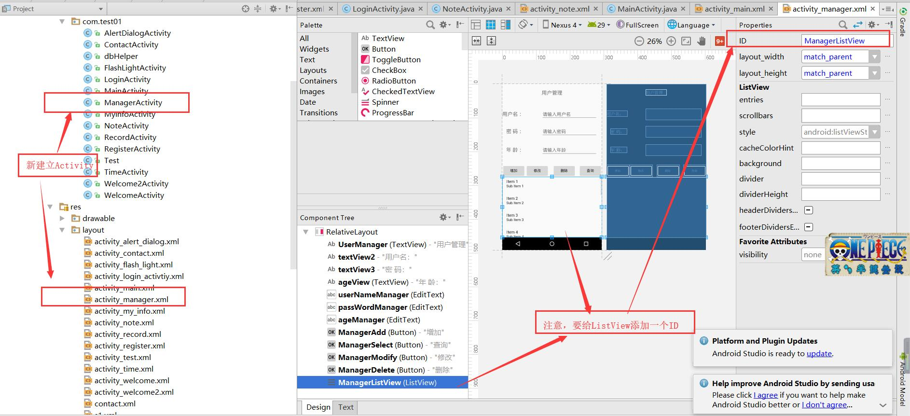
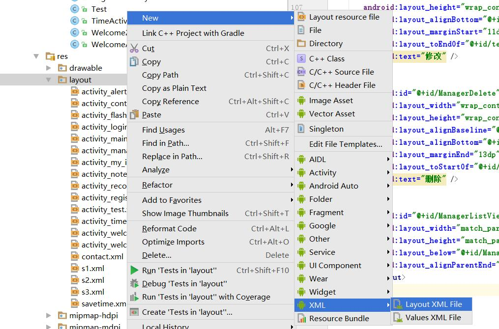
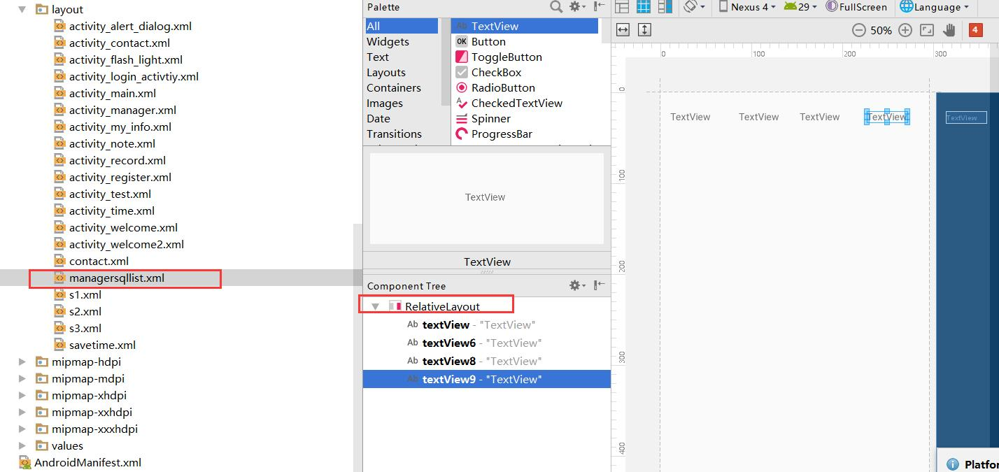
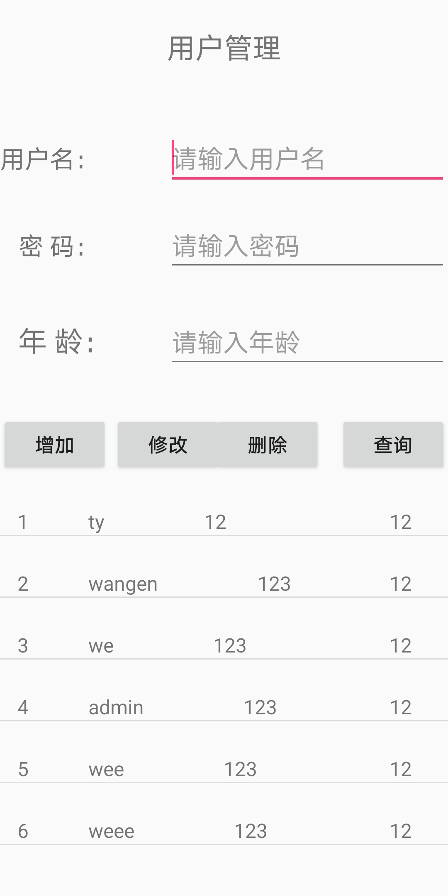
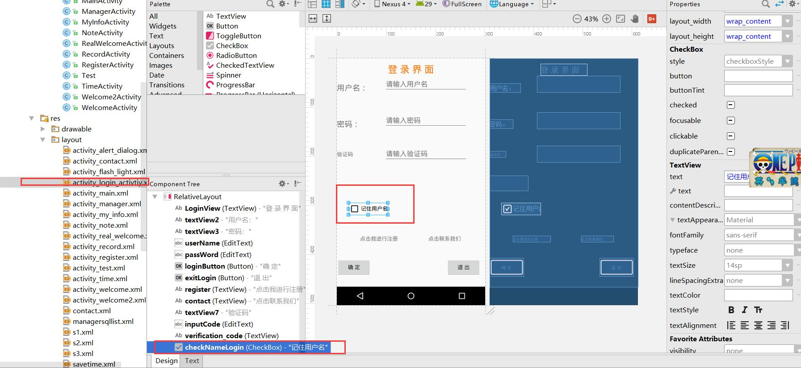

# 7 ManagerActivity

1.新建ManagerActivity用来管理用户数据

页面布局,主要有4个按钮 ，一个ListView



```xml
<?xml version="1.0" encoding="utf-8"?>
<RelativeLayout xmlns:android="http://schemas.android.com/apk/res/android"
    xmlns:app="http://schemas.android.com/apk/res-auto"
    xmlns:tools="http://schemas.android.com/tools"
    android:layout_width="match_parent"
    android:layout_height="match_parent"
    tools:context="com.test01.ManagerActivity">

    <TextView
        android:id="@+id/UserManager"
        android:layout_width="wrap_content"
        android:layout_height="wrap_content"
        android:layout_marginTop="22dp"
        android:text="用户管理"
        android:textSize="20sp"
        android:layout_alignParentTop="true"
        android:layout_centerHorizontal="true" />
    <TextView
        android:id="@+id/textView2"
        android:layout_width="wrap_content"
        android:layout_height="wrap_content"
        android:text="用户名："
        android:textSize="20dp"
        android:layout_alignBaseline="@+id/userNameManager"
        android:layout_alignBottom="@+id/userNameManager"
        android:layout_alignParentStart="true" />

    <TextView
        android:id="@+id/textView3"
        android:layout_width="wrap_content"
        android:layout_height="wrap_content"
        android:layout_alignEnd="@+id/textView2"
        android:layout_below="@+id/userNameManager"
        android:layout_marginTop="32dp"
        android:text="密 码："
        android:textSize="20dp" />


    <TextView
        android:id="@+id/ageView"
        android:layout_width="wrap_content"
        android:layout_height="wrap_content"
        android:layout_alignBaseline="@+id/ageManager"
        android:layout_alignBottom="@+id/ageManager"
        android:layout_alignStart="@+id/textView3"
        android:text="年 龄："
        android:textSize="20sp" />

    <EditText
        android:id="@+id/userNameManager"
        android:layout_width="wrap_content"
        android:layout_height="wrap_content"
        android:ems="10"
        android:hint="请输入用户名"
        android:inputType="textPersonName"
        android:layout_below="@+id/UserManager"
        android:layout_alignStart="@+id/UserManager"
        android:layout_marginTop="50dp" />

    <EditText
        android:id="@+id/passWordManager"
        android:layout_width="wrap_content"
        android:layout_height="wrap_content"
        android:ems="10"
        android:hint="请输入密码"
        android:inputType="textPassword"
        android:layout_alignBaseline="@+id/textView3"
        android:layout_alignBottom="@+id/textView3"
        android:layout_alignStart="@+id/userNameManager" />

    <EditText
        android:id="@+id/ageManager"
        android:layout_width="wrap_content"
        android:layout_height="wrap_content"
        android:ems="10"
        android:inputType="number"
        android:hint="请输入年龄"
        android:layout_below="@+id/passWordManager"
        android:layout_alignStart="@+id/passWordManager"
        android:layout_marginTop="29dp" />

    <Button
        android:id="@+id/ManagerAdd"
        android:layout_width="wrap_content"
        android:layout_height="wrap_content"
        android:layout_alignParentStart="true"
        android:layout_below="@+id/ageManager"
        android:layout_marginTop="34dp"
        android:text="增加" />

    <Button
        android:id="@+id/ManagerSelect"
        android:layout_width="wrap_content"
        android:layout_height="wrap_content"
        android:layout_alignBaseline="@+id/ManagerModify"
        android:layout_alignBottom="@+id/ManagerModify"
        android:layout_alignParentEnd="true"
        android:text="查询" />


    <Button
        android:id="@+id/ManagerModify"
        android:layout_width="wrap_content"
        android:layout_height="wrap_content"
        android:layout_alignBottom="@+id/ManagerAdd"
        android:layout_marginStart="11dp"
        android:layout_toEndOf="@+id/textView2"
        android:text="修改" />

    <Button
        android:id="@+id/ManagerDelete"
        android:layout_width="wrap_content"
        android:layout_height="wrap_content"
        android:layout_alignBaseline="@+id/ManagerSelect"
        android:layout_alignBottom="@+id/ManagerSelect"
        android:layout_marginEnd="13dp"
        android:layout_toStartOf="@+id/ManagerSelect"
        android:text="删除" />

    <ListView
        android:id="@+id/ManagerListView"
        android:layout_width="match_parent"
        android:layout_height="match_parent"
        android:layout_below="@+id/ManagerModify"
        android:layout_alignParentEnd="true" />
</RelativeLayout>

```


2.ListView页面设置

新建xml



布局设置




## 功能1.进入用户界面，显示所有用户信息



功能实现：

>1.执行查询语句
>
>2.将每条数据作为一个Map,所有Map保存在泛型List中
>
>3.将ListView通过泛型和List绑定数据

```java

	private ListView ManagerListView;

    //数据库相关
    dbHelper dbHelper;
    String DB_Name="myDB";
    SQLiteDatabase db;
    Cursor cursor;//游标
    ContentValues contentValues;

    //listView相关
    private  List<Map<String,Object>> data;
    private  Map<String,Object> item;
    //适配器
    private SimpleAdapter simpleAdapter;
    View view;

		@Override
    protected void onCreate(Bundle savedInstanceState) {
        super.onCreate(savedInstanceState);
        setContentView(R.layout.activity_manager);
		//ListView控件的获取
        ManagerListView = (ListView) findViewById(R.id.ManagerListView);

        //创建连接，打开数据库
        dbHelper = new dbHelper(this,DB_Name,null,1);
        db = dbHelper.getWritableDatabase();

        //data实例化
        data=new ArrayList<Map<String, Object>>();

        dbFindAll();

    }

    private  void  dbFindAll(){
  //1.数据库查询
        cursor = db.query(dbHelper.TB_Name,null,null,null,null,null,null);
        cursor.moveToFirst();
        while(!cursor.isAfterLast()){
 //2.数据的保存
            String uid = cursor.getString(0);
            String uname = cursor.getString(1);
            String pwd = cursor.getString(2);
            String age = cursor.getString(3);
            //保存到Map中
            item= new HashMap<String, Object>();
            //key必须和列名相同
            item.put("uid",uid);
            item.put("uname",uname);
            item.put("pwd",pwd);
            item.put("age",age);
            //保存到泛型中
            data.add(item);
            //游标下移
            cursor.moveToNext();
        }
        showList();

    }

  //3.适配器的载入
    private void showList(){
        simpleAdapter = new SimpleAdapter(this,
                data,
                R.layout.managersqllist,
                new String[]{"uid","uname","pwd","age"},
                new int[]{R.id.textView,R.id.textView6,R.id.textView8,R.id.textView9}
        ) ;
        ManagerListView.setAdapter(simpleAdapter);

    }
```

## 功能2 增加用户信息

功能实现

> 点击添加按钮，调用添加函数，调用完，数据添加到数据库中，下面ListView显示所有员工信息（包括添加的），输入的文本框清空
>
> 1.点击事件的监听
>
> 2.添加函数
>
> ​	（1）从输入文本框获得信息，使用sql语句进行添加
>
> ​	（2） 判断输入的数据是否为空，用户名是否存在
>
> 3. ListView显示用户信息（包括添加的用户），即为再次查询全部信息
> 4. 输入文本框清空

```java
//添加按钮1.事件的监听
        ManagerAdd.setOnClickListener(new View.OnClickListener() {
            @Override
            public void onClick(View v) {
                //2数据添加
                dbAdd();
                //3数据查询，
                data.clear();//再次查询前清空数据，避免数据重复
                dbFindAll();
                //4输入文本框清空
                userNameManager.setText("");
                passWordManager.setText("");
                ageManager.setText("");
            }
        });

//增加
    private void dbAdd(){
        Boolean flag=true;

        //查询数据是否存在
        cursor = db.query(dbHelper.TB_Name,null,null,null,null,null,"uid ASC");
        cursor.moveToFirst();//结果集的第一个
        while(!cursor.isAfterLast()){//循环条件，不是最后一个
            //如果用户名和表中的第二列uname相同，falg赋值为false 即用户已经存在
            if(userNameManager.getText().toString().trim().equals(cursor.getString(1))){
                flag=false;
            }
            cursor.moveToNext();
        }
        //1，判断数据是否为空
        if(userNameManager.getText().toString().trim().equals("")||passWordManager.getText().toString().trim().equals("")){
            Toast.makeText(ManagerActivity.this,"用户名或密码为空",Toast.LENGTH_SHORT).show();
        }else {
         //2.判断数据是否存在
            if (flag) {
                //数据库增加数据
                contentValues = new ContentValues();
                contentValues.put("uname", userNameManager.getText().toString().trim());
                contentValues.put("pwd", passWordManager.getText().toString().trim());
                contentValues.put("age", ageManager.getText().toString().trim());
                //  insert方法添加数据 参数为 表名，，values集合
                long rowId = db.insert(dbHelper.TB_Name, null, contentValues);
                if (rowId == -1) { //返回值为-1 ，表示失败，提示
                    Toast.makeText(ManagerActivity.this, "发生未知错误", Toast.LENGTH_SHORT).show();
                } else {
                    //插入成功，提示注册成功
                    Toast.makeText(ManagerActivity.this, "添加成功", Toast.LENGTH_SHORT).show();

                }
            } else {
                //flag为false提示出错
                Toast.makeText(ManagerActivity.this, "用户名错误" + userNameManager.getText().toString().trim(), Toast.LENGTH_SHORT).show();
                flag = true;
            }
        }

    }
```

## 功能3 删除用户

> 点击记录，内容显示在文本框中，然后点击删除，对所选记录进行删除
>
> 1.点击记录，内容显示在文本框中，注意，在未选择记录时，修改和删除按钮应该是不可见的，
>
> 2.删除记录，应该注意删除时where条件应该是什么
>
> 3.删除后，ListVies的显示，文本框的清空，删除和修改按钮设为不可见

```java

//1.点击记录，内容显示在文本框中
        ManagerListView.setOnItemClickListener(new AdapterView.OnItemClickListener() {
            @Override
            public void onItemClick(AdapterView<?> parent, View view, int position, long id) {
                //使删除，修改，按钮变为可见
                ManagerDelete.setEnabled(true);
                ManagerModify.setEnabled(true);

                Map<String,Object> itemMap = (Map<String,Object>)ManagerListView.getItemAtPosition(position);
                //将内容显示在文本框
                userNameManager.setText((String)itemMap.get("uname"));
                passWordManager.setText((String)itemMap.get("pwd"));
                ageManager.setText((String)itemMap.get("age"));
                //
                selID=(String)itemMap.get("uid");


            }
        });
//2.点击删除按钮对内容进行删除
ManagerDelete.setOnClickListener(new View.OnClickListener() {
            @Override
            public void onClick(View v) {
                //1.删除
                dbDelete();
                //2.数据的再次查询及显示
                data.clear();//为避免数据重复，进行删除
                dbFindAll();
                //3.输入文本框清空
                userNameManager.setText("");
                passWordManager.setText("");
                ageManager.setText("");

            }
        });
//3.数据库删除函数
    private  void dbDelete(){
        //删除条件，根据主键
        String whereID="uid=?";
        //删除的值
        String[] whereArgs = {String.valueOf(selID)};
        //删除语句
        db.delete(dbHelper.TB_Name,whereID,whereArgs);

    }
```

## 功能4 修改用户信息

> 点击记录，内容显示在文本框中，然后点击修改，对所选记录进行修改，
>
> 1.点击记录，内容显示在文本框中，注意，在未选择记录时，修改和删除按钮应该是不可见的，
>
> 2.修改记录，应该注意修改时where条件应该是什么，
>
> ​		如果认为用户名是不可以修改的，就不用关心查询修改后的用户名是否存在的问题
>
> 3.修改后，ListVies的显示，文本框的清空，删除和修改按钮设为不可见

```java

//1.点击记录，内容显示在文本框中,与上面一致
       
//2.修改按钮
        ManagerModify.setOnClickListener(new View.OnClickListener() {
            @Override
            public void onClick(View v) {
                //1.修改
                dbModify();
                //2.数据的再次查询及显示
                data.clear();//为避免数据重复，进行删除
                dbFindAll();

                //3.输入文本框清空,删除和修改按钮设为不可见
                userNameManager.setText("");
                passWordManager.setText("");
                ageManager.setText("");
                userNameManager.setEnabled(true);
                ManagerDelete.setEnabled(false);
                ManagerModify.setEnabled(false);
            }
        });
/3./修改函数
    private  void dbModify(){
        contentValues = new ContentValues();
       // contentValues.put("uname", userNameManager.getText().toString().trim());
        contentValues.put("pwd", passWordManager.getText().toString().trim());
        contentValues.put("age", ageManager.getText().toString().trim());
        //更新条件，根据主键
        String whereID="uid=?";
        //更新条件的值
        String[] whereArgs = {String.valueOf(selID)};
       //更新的方法
        db.update(dbHelper.TB_Name,contentValues,whereID,whereArgs);
    }

```

## 			功能5 序号连续显示

> 序号连贯
>
> 只需要修改适配器的内容即可，可以添加新的属性（连续的序号），在LIstView中显示新的属性
>
> 见代码第16行和35行

```java
//查询所有
    private  void  dbFindAll(){
        //data.clear();
        Integer LianID=1;
        cursor = db.query(dbHelper.TB_Name,null,null,null,null,null,null);
        cursor.moveToFirst();
        while(!cursor.isAfterLast()){

            String uid = cursor.getString(0);
            String uname = cursor.getString(1);
            String pwd = cursor.getString(2);
            String age = cursor.getString(3);
            //保存到Map中
            item= new HashMap<String, Object>();
            //key必须和列名相同
  item.put("LianID",LianID); //添加新一行数据，使序号连续显示
            item.put("uid",uid);
            item.put("uname",uname);
            item.put("pwd",pwd);
            item.put("age",age);
            //保存到泛型中
            data.add(item);
            //游标下移
            cursor.moveToNext();
            LianID=LianID+1;
        }
        showList();

    }
    //适配器的载入
    private void showList(){
        simpleAdapter = new SimpleAdapter(this,
                data,
                R.layout.managersqllist,
                new String[]{"LianID","uname","pwd","age"}, //修改适配器内容的显示
                new int[]{R.id.textView,R.id.textView6,R.id.textView8,R.id.textView9}
        ) ;
        ManagerListView.setAdapter(simpleAdapter);

    }
```

## 功能5 查询 根据用户名，或年龄查询

```java
private  void  dbFindBy(){
        //密码为空，提示错误
        if(!(passWordManager.getText().toString().equals(""))){
            Toast.makeText(ManagerActivity.this,"查询条件应为用户名，年龄",Toast.LENGTH_SHORT).show();
        }
        //1.如果名字不为空，年龄不为空,并且密码为空
        if( (!(userNameManager.getText().toString().equals("")))&&(!(ageManager.getText().toString().equals("")))&&(passWordManager.getText().toString().equals(""))){
            String []  whereArgs = {String.valueOf(userNameManager.getText().toString()),String.valueOf(ageManager.getText().toString())};
            String whereUName="uname=? and age=?";
            cursor = db.query(dbHelper.TB_Name,null,whereUName,whereArgs,null,null,null);
            cursor.moveToFirst();
            while(!cursor.isAfterLast()){

                String uid = cursor.getString(0);
                String uname = cursor.getString(1);
                String pwd = cursor.getString(2);
                String age = cursor.getString(3);
                //保存到Map中
                item= new HashMap<String, Object>();
                //key必须和列名相同
                item.put("uid",uid);
                item.put("uname",uname);
                item.put("pwd",pwd);
                item.put("age",age);
                //保存到泛型中
                data.add(item);
                //游标下移
                cursor.moveToNext();

            }
            showList();

        }
       //2.姓名不为空，年龄为空 ，密码为空
        if((!(userNameManager.getText().toString().equals("")))&&(ageManager.getText().toString().equals("")&&(passWordManager.getText().toString().equals("")))){
            String []  whereArgs = {String.valueOf(userNameManager.getText().toString())};
            String whereUName="uname=?";
            cursor = db.query(dbHelper.TB_Name,null,whereUName,whereArgs,null,null,null);
            cursor.moveToFirst();
            while(!cursor.isAfterLast()){

                String uid = cursor.getString(0);
                String uname = cursor.getString(1);
                String pwd = cursor.getString(2);
                String age = cursor.getString(3);
                //保存到Map中
                item= new HashMap<String, Object>();
                //key必须和列名相同
                item.put("uid",uid);
                item.put("uname",uname);
                item.put("pwd",pwd);
                item.put("age",age);
                //保存到泛型中
                data.add(item);
                //游标下移
                cursor.moveToNext();

            }
            showList();

        }
//3.姓名为空，年龄不为空 ，密码为空
        if((userNameManager.getText().toString().equals(""))&&(!(ageManager.getText().toString().equals("")))&&(passWordManager.getText().toString().equals(""))){
            String []  whereArgs = {String.valueOf(ageManager.getText().toString())};
            String whereUName="age=?";
            cursor = db.query(dbHelper.TB_Name,null,whereUName,whereArgs,null,null,null);
            cursor.moveToFirst();
            while(!cursor.isAfterLast()){

                String uid = cursor.getString(0);
                String uname = cursor.getString(1);
                String pwd = cursor.getString(2);
                String age = cursor.getString(3);
                //保存到Map中
                item= new HashMap<String, Object>();
                //key必须和列名相同
                item.put("uid",uid);
                item.put("uname",uname);
                item.put("pwd",pwd);
                item.put("age",age);
                //保存到泛型中
                data.add(item);
                //游标下移
                cursor.moveToNext();
            }
            showList();

        }
 //4.姓名不为空，年龄不为空，密码为空，查询所有
        if((userNameManager.getText().toString().equals(""))&&(ageManager.getText().toString().equals(""))&&(passWordManager.getText().toString().equals(""))) {
                dbFindAll();
        }
    }
```


# 第三种记住数据的方式 SharedPreferences


## 

## 功能1 安装第一次进入程序Welcone2界面，以后是Welcome界面

1.新建RealWeicomeActivity，布局不做修改

2.完整代码


```java
package com.test01;

import android.content.Intent;
import android.content.SharedPreferences;
import android.support.v7.app.AppCompatActivity;
import android.os.Bundle;

public class RealWelcomeActivity extends AppCompatActivity {

    Boolean isFirst;
    @Override
    protected void onCreate(Bundle savedInstanceState) {
        super.onCreate(savedInstanceState);
        setContentView(R.layout.activity_real_welcome);

        //读取数据
        SharedPreferences sharedPreferences = getSharedPreferences("isFirst",MODE_PRIVATE);
        isFirst = sharedPreferences.getBoolean("isFirst",true);//找不到isFirst就赋值为true
        //如果用户第一次登入，进入到滑动界面Welcome2Activity,否则进入倒计时Welcome界面
        if(isFirst){
            startActivity( new Intent(RealWelcomeActivity.this,Welcome2Activity.class));
        }else{
            startActivity( new Intent(RealWelcomeActivity.this,WelcomeActivity.class));
        }
        //关闭当前页面
        finish();
        //实例化编辑器
        SharedPreferences.Editor editor=sharedPreferences.edit();
        //存入数据
        editor.putBoolean("isFirst",false);
        //提交修改
        editor.commit();

    }
}

```

## 2 记住用户名 ，密码

> 1.在Login登录界面添加checkbox控件
>
> 2.如果曾保存过用户名，则将其显示在输入框
>
> 3.在登录时，验证checkbox是否勾选,若勾选，则进行保存，否则不保存

1.添加控件



2.如果曾保存过用户名，则将其显示在输入框

```java
  //如果没有得到东西，显示空值；否则显示保存的用户名
        sName=sharedPreferences.getString("sName","");
        if(sharedPreferences!=null&&(!sName.equals(""))){
            username.setText(sharedPreferences.getString("sName",""));
            checkNameLogin.setChecked(true);
        }
```

3.在登录时，验证checkbox是否勾选,若勾选，则进行保存，否则不保存

```java
if(checkNameLogin.isChecked()){
                                    
             sName=username1;
             SharedPreferences.Editor editor = sharedPreferences.edit();
             editor.putString("sName",sName);
             editor.commit();
                                }
else{
             SharedPreferences.Editor editor = sharedPreferences.edit();
             //editor.putString("sName","");
   			 editor.clear();
             editor.commit();
                                }
```

> 作业 保存密码
>
> 1.在Login登录界面添加checkbox控件
>
> 2.如果曾保存过密码，则将其显示在输入框
>
> 3.在登录时，验证checkbox是否勾选,若勾选，则进行保存，否则不保存


