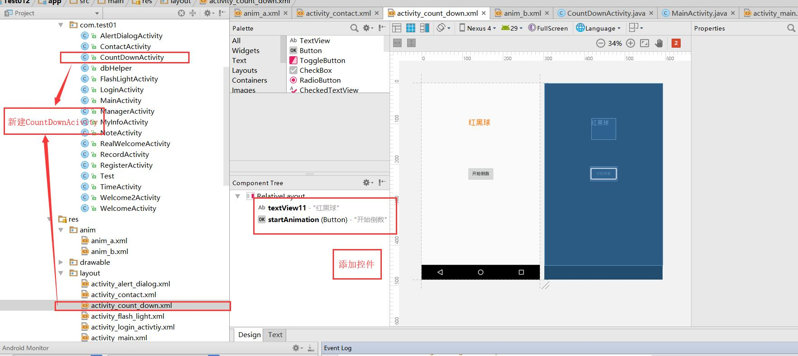

# 8 动画

### 消息机制

类似线程

## 需求一 点击按钮，textview显示倒计时动画（数字放大动画），再次点击，数字缩小

1.新建CountDownActivity,进行布局设置



2.新建anim文件夹，在里面添加动画的xml文件


3.在xml文件里添加动画效果，补间动画

translate 平移

rotate  旋转

alpha 透明度变化

scale 放大缩小

```xml
<alpha
        android:fromAlpha="0.0"
        android:toAlpha="1.0"
        android:duration="1000"
        />

    <scale
        android:duration="1000"
        android:fromXScale="1.0"
        android:fromYScale="1.0"
        android:toXScale="2"
        android:toYScale="2"
        android:pivotY="50%"
        android:pivotX="50%"
        />
    <rotate
        android:duration="1000"
        android:fromDegrees="0"
        android:toDegrees="360"
        android:pivotX="50%"
        android:pivotY="50%"

        />
```

4. 在CountDownAcivity中设置对应的点击事件

   > 点击事件可以单独设置一个方法来实现，当空间很多时可以这样设置

当点击时，使用handle对象的消息处理机制，触发对应的动画效果

1.‘我们想要显示倒计时，需要有数字的倒数，可以写一个getCount函数,得到数字

```java
//这count设置为了全局变量
public  int getCount(){
        count--;
        if (count<0|| count>10){
            count=10;
        }
        return  count;
    }
```

2.我们要使用Animation 来实现动画

```java
private TextView textView11;
    private Button startAnimation;

    Animation animation,animation2; //动画对象关联xml文件
    int count = 4;
    int num=0;

    @Override
    protected void onCreate(Bundle savedInstanceState) {
        super.onCreate(savedInstanceState);
        setContentView(R.layout.activity_count_down);

        //每一套动画效果，是一个对象,不同的效果是多个对象

        textView11 = (TextView) findViewById(R.id.textView11);
        startAnimation = (Button) findViewById(R.id.startAnimation);
        //动画效果 异步消息处理机制
        //载入动画效果
        animation = AnimationUtils.loadAnimation(this,R.anim.anim_a);
       
        animation2 = AnimationUtils.loadAnimation(this,R.anim.anim_b);
        //监听方法，单独写一个Onclick方法
        startAnimation.setOnClickListener(this);

    }
```

3.监听事件的设置

```java
/实现方法，判断监听的对象
    @Override
    public void onClick(View v) {

        switch (num){
            case 0:
               num=1;
                handler.removeMessages(0);
                handler.removeMessages(1);
                handler.sendEmptyMessageDelayed(0,1000);//0 为msg.what里面的值
                break;
            case 1:
                handler.removeMessages(0);
                handler.sendEmptyMessageDelayed(1,1000);
                num=0;
                break;
        }

    }
```

4. hander 的实现

```java
 Handler handler = new Handler(){
        @Override
        public void handleMessage(Message msg) {
            super.handleMessage(msg);
           
            if(msg.what==0){
                // msg即 handler.sendEmptyMessageDelayed(0,1000)的第一个数字，会根据这个数字来选择动画效果
               textView11.setText(""+getCountSub());
               handler.sendEmptyMessageDelayed(0,1000);
               textView11.startAnimation(animation);//animation是数字放大的动画

            }else { 
                textView11.setText(""+getCountSub());
                handler.sendEmptyMessageDelayed(1,1000);
                textView11.startAnimation(animation2);//animation2是数字缩小的动画
            }


        }
    };
```

动画效果


## 需求二 点击按钮显示三秒倒计时，然后跳转页面

只需修改点击事件，和handler的消息处理

1.点击事件，点击就调用handler

```java
//实现方法，判断监听的对象
    @Override
    public void onClick(View v) {

        switch (num){
            case 0:
                //Toast.makeText(CountDownActivity.this,"点击次数为奇数",Toast.LENGTH_SHORT).show();
               // num=1;
                //handler.removeMessages(0);
               // handler.removeMessages(1);
                handler.sendEmptyMessageDelayed(0,1000);//0 为msg.what里面的值
                break;
            /*case 1:
                //Toast.makeText(CountDownActivity.this,"点击次数为偶数",Toast.LENGTH_SHORT).show();
                handler.removeMessages(0);
                handler.sendEmptyMessageDelayed(1,1000);
                num=0;
                break;*/
        }

    }
```

2.handler设置

```java
Handler handler = new Handler(){
        @Override
        public void handleMessage(Message msg) {
            super.handleMessage(msg);
            //
            if(msg.what==0){

                if(count<=1){
                    //当倒数结束，传递的消息值为1，跳转对应的处理。也就是
                    textView11.setText("游戏开始");
                    handler.sendEmptyMessageDelayed(1,0);
                }else {
                    textView11.setText(""+getCountSub());
                    handler.sendEmptyMessageDelayed(0,1000);
                    textView11.startAnimation(animation);
                }
                /*textView11.setText(""+getCountSub());
                handler.sendEmptyMessageDelayed(0,1000);
                textView11.startAnimation(animation);*/

            }else {
                Intent intent =  new Intent();
                intent.setClass(CountDownActivity.this,MainActivity.class);
                startActivity(intent);
                CountDownActivity.this.finish();
                /*
                textView11.setText(""+getCountAdd());
                handler.sendEmptyMessageDelayed(1,1000);
                textView11.startAnimation(animation2);*/
            }


        }
    };
```

## 需求三 击球游戏


1.新建BallAcitvity,

2.xml布局设置，添加一张画纸，创建class类文件


3.球的运动相当于不断刷新这个球，及球的坐标随着点击屏幕而变化


