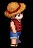
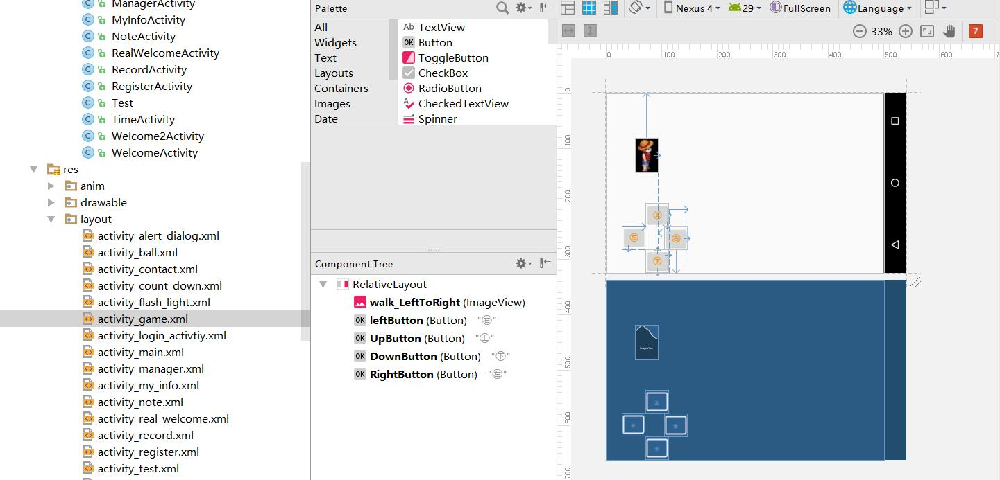

# 9手势绘图人物动画

# 人物动画

动画使用的是帧动画

## 1素材准备

1.选取精美图片4张,添加到drawable中

!

2.新建立GameActivity,在MianActivity中添对应的按钮和跳转

3.新建立 anim_walk_left.xml在drawable文件夹下

```xml
<?xml version="1.0" encoding="utf-8"?>
<animation-list xmlns:android="http://schemas.android.com/apk/res/android">

    <item android:drawable="@drawable/l1" android:duration="250"/>
    <item android:drawable="@drawable/l2" android:duration="250"/>
    <item android:drawable="@drawable/l3" android:duration="250"/>
    <item android:drawable="@drawable/l4" android:duration="250"/>
</animation-list>
```

4.GameAcivity.xml改动 

 1 横屏显示，添加ImageView显示，添加Button




```xml
<?xml version="1.0" encoding="utf-8"?>
<RelativeLayout xmlns:android="http://schemas.android.com/apk/res/android"
    xmlns:app="http://schemas.android.com/apk/res-auto"
    xmlns:tools="http://schemas.android.com/tools"
    android:layout_width="match_parent"
    android:layout_height="match_parent"
    tools:context="com.test01.GameActivity">

    <ImageView
        android:id="@+id/walk_LeftToRight"
        android:layout_width="100px"
        android:layout_height="150px"
        android:layout_marginStart="62dp"
        android:layout_marginTop="96dp"
        android:background="@drawable/anim_walk_left"
        android:layout_alignParentTop="true"
        android:layout_alignParentStart="true" />

    <Button
        android:id="@+id/leftButton"
        android:layout_width="50dp"
        android:layout_height="50dp"
        android:layout_alignParentBottom="true"
        android:layout_marginBottom="48dp"
        android:layout_marginStart="13dp"
        android:layout_toEndOf="@+id/walk_LeftToRight"
        android:text="㊨"
        android:textColor="@android:color/holo_orange_dark"
        android:textSize="18sp" />

    <Button
        android:id="@+id/UpButton"
        android:layout_width="50dp"
        android:layout_height="50dp"
        android:layout_above="@+id/leftButton"
        android:layout_alignEnd="@+id/leftButton"
        android:layout_marginEnd="40dp"
        android:text="㊤"
        android:textColor="@android:color/holo_orange_dark"
        android:textSize="18sp" />

    <Button
        android:id="@+id/DownButton"
        android:layout_width="50dp"
        android:layout_height="50dp"
        android:layout_alignEnd="@+id/UpButton"
        android:layout_alignParentBottom="true"
        android:text="㊦"
        android:textColor="@android:color/holo_orange_dark"
        android:textSize="18sp" />

    <Button
        android:id="@+id/RightButton"
        android:layout_width="50dp"
        android:layout_height="50dp"
        android:layout_above="@+id/DownButton"
        android:layout_toStartOf="@+id/UpButton"
        android:elevation="0dp"
        android:text="㊧"
        android:textColor="@android:color/holo_orange_dark"
        android:textSize="18sp" />
</RelativeLayout>

```

## 2动画添加

图像变化 位置变化 背景变化

强制横屏

```java
//强制横屏
        setRequestedOrientation(ActivityInfo.SCREEN_ORIENTATION_LANDSCAPE);

```

变量声明

```java
 AnimationDrawable animationDrawable; //图像变化
 ObjectAnimator objectAnimator; //图像位置变化
```

变量设置

```java
walkLeftToRight = (ImageView) findViewById(R.id.walk_LeftToRight);
animationDrawable=(AnimationDrawable) walkLeftToRight.getBackground();

objectAnimator = ObjectAnimator.ofFloat(walkLeftToRight,"translationX",0,1500);
objectAnimator.setDuration(6000);
objectAnimator.setRepeatMode(ObjectAnimator.RESTART);

```


监听事件

```java
 //设置监听事件 触碰touch
        leftButton.setOnTouchListener(new View.OnTouchListener() {
            @Override
            public boolean onTouch(View v, MotionEvent event) {
                if(event.getAction()== event.ACTION_DOWN){
                    //当触摸按钮时，人物的动画变化

                    animationDrawable.start();
                    objectAnimator.start();
                    leftButton.setBackgroundColor(Color.YELLOW);

                }else if(event.getAction()==event.ACTION_UP){
                    animationDrawable.stop();
                    leftButton.setBackgroundColor(Color.WHITE);

                }

                return false;
            }

        });
```

# 手势验证

1.保存

1.权限 写入内存 ，读取权限，

2.弹框，布局形式的框，创建XML 布局设置

3.新建立GestureActivity 

4.手势控件  保存手势


1创建验证的CheckGestureActivity


