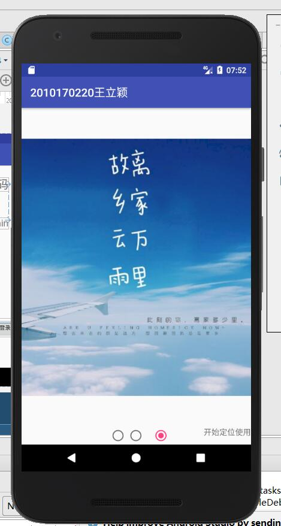

# 期末作业——天气预报系统

# 信科170220王立颖 2010170220


[TOC]


## 作业要求

结课项目

1.项目选择

个人理财管理系统

天气预报系统

学生选课管理系统

个人信息备忘系统

2.素材收集

3.初次安装运行，有引导页，再次打开有广告页

4.登录界面，有记住用户密码功能，忘记密码

（输入的用户名时，出现之前登录成功过的用户名作为候选）

5.注册页面

（头像上传，可以拍摄或者从相册中选择 教材P293与P423）

6.项目主要部门

**天气预报系统**

不同天气情况，显示不同的图标

可以左右滑动显示不同城市的天气情况（第一页为当前城市，后2页为已保存的城市，显示3个即可）

天气界面，可以显示当前天气，以及近几天天气情况（线形图显示）

# 整体结构


页面及填充


#  要求一  初次安装运行，有引导页，再次打开有广告页

## 1 功能实现思想 

有着两个欢迎界面，分别为引导界面Welcome2Activity 和 广告页WelcomeActivity 

有一个判断界面 RealWelcomeActivity ,在判断界面通过SharedPreferences数据库里的isFirstDownload属性来进行判断是否是初次安装。

**广告界面WelcomeActivity** 

1使用 多线程计时器进行倒计时控制，

2点击广告 跳转到浏览器界面，

3点击跳过 跳过广告

**引导界面 Welcome2Activity**

1 动态申请权限

2 使用ViewPager和 RadioGroup，RadioButton添加三张滑动的页面

3 点击开始使用 跳转到登录界面

**判断界面 RealWelcomeActivity**

1 通过SharedPreferences数据库里的isFirstDownload属性来进行判断是否是初次安装并进行相应跳转

## 2 核心代码展示

Activity


### （1）判断页面 RealWelcomeActivity核心代码，判断是否第一次登陆

```java
//读取数据
        SharedPreferences sharedPreferences = getSharedPreferences("isFirstDownload",MODE_PRIVATE);
        isFirst = sharedPreferences.getBoolean("isFirstDownload",true);//找不到isFirst就赋值为true
        //如果用户第一次登入，进入到滑动界面Welcome2Activity,否则进入倒计时Welcome界面
        if(isFirst){
            startActivity( new Intent(RealWelcomeActivity.this,Welcome2Activity.class));
        }else{
            startActivity( new Intent(RealWelcomeActivity.this,WelcomeActivity.class));
        }
        //关闭当前页面
        finish();
        //实例化编辑器
        SharedPreferences.Editor editor=sharedPreferences.edit();
        //存入数据
        editor.putBoolean("isFirstDownload",false);
        //提交修改
        editor.commit();
```

### （2）引导页面 Welcome2Activity  listView内容的加载


View的加载

```xml
 //适配器，设置某一个界面的填充布局
        LayoutInflater layoutInflater = LayoutInflater.from(this);
        View v1 = layoutInflater.inflate(R.layout.s1,null);
        View v2 = layoutInflater.inflate(R.layout.s2,null);
        View v3 = layoutInflater.inflate(R.layout.s3,null);
        vpList = new ArrayList<View>();
        vpList.add(v1);
        vpList.add(v2);
        vpList.add(v3);
        //适配器 ，adapter
        PagerAdapter pagerAdapter = new PagerAdapter() {
            @Override
            //数量
            public int getCount() {

                return vpList.size();
            }

            @Override
            //判断是否是有对象生成的界面
            public boolean isViewFromObject(View view, Object object) {

                return view==object;
            }

            //获取当前界面的位置
            public Object instantiateItem(ViewGroup viewGroup, int position){
                viewGroup.addView(vpList.get(position));

                return vpList.get(position);

            }

            //销毁上一个显示界面
            public  void destroyItem(ViewGroup viewGroup,int position,Object object){
                viewGroup.removeView(vpList.get(position));
            }

        };

        viewPager.setAdapter(pagerAdapter);
```

### （3）广告界面 倒计时的实现

```java
timeover = (TextView) findViewById(R.id.timeover);
        TimerTask task =new TimerTask() {

            @Override
            public void run() {
                runOnUiThread(new Runnable() {
                    @Override
                    public void run() {
                        num--;
                        timeover.setText("-"+num+"秒 -\n跳过");
                        if( num<=1 ){
                            timer.cancel();//关闭计时器线程
                            Intent intent = new Intent();
                            intent.setClass(WelcomeActivity.this,LoginActivity.class);
                            startActivity(intent);
                            WelcomeActivity.this.finish(); //关闭这个界面，从登录界面就不会返回到广告界面
                        }
                    }
                });
            }

        };
        timer.schedule(task,1000,1000);
```

## 3 效果演示




# 要求二 登录界面，有记住用户密码功能，忘记密码（输入的用户名时，出现之前登录成功过的用户名作为候选）

# 一 忘记密码功能

## （1）功能实现思想

 由于云之讯短信平台不能通过个人认证短信服务没法使用，另外老师没有明确要求使用手机验证码，所以找回密码直接显示之前注册的密码。
		 新建ForgetPasswordActivity,从login页面通过intent将用户名传递过去，点击忘记密码进行数据库查询，通过用户名查询密码，将密码显示出来。

## （2）核心代码展示

```java
  //从Intent 中获得用户名
        final String userNameF = getIntent().getStringExtra("fUserName");
        fUserName.setText(userNameF);

        //点击找回密码按钮，显示注册时密码
        findPwd.setOnClickListener(new View.OnClickListener() {
            @Override
            public void onClick(View view) {

                //从数据库中查询密码
                String password = dbHelper.queryPasswordByName(userNameF);
                fPwd .setText(password);
                //显示出来
            }
        });
```

## （3）效果展示


# 二 输入的用户名时，出现之前登录成功过的用户名作为候选

## （1） 功能实现思想 

在输入用户名右侧添加imageButton 点击展示输入的用户名历史,点击输入的用户名自动填充输入框，点击删除删掉输入记录。

使用popupWindow，popupWindow的填充内容设置为listView,对输入的用户名进行保存。

listView重写Adapter方法实现点击填充和删除输入记录。

为了记录用户是否登陆过，在数据库中添加isSaved栏来保存用户的登录状态。

## （2） 核心代码展示

imageButton点击事件，显示popupWindow

```java
dropdownButton.setOnClickListener(new View.OnClickListener() {
            @Override
            public void onClick(View view) {
                if (popupWindow != null) {
                    if (!popupWindow.isShowing()) {
                        popupWindow.showAsDropDown(username);
                    } else {
                        popupWindow.dismiss();
                    }
                } else {
                    int length = dbHelper.queryAllNameByIsSaver().length;
                    if ( length> 0) {
                        initPopView(dbHelper.queryAllNameByIsSaver());
                        if (! popupWindow.isShowing()) {
                            popupWindow.showAsDropDown(username);
                        } else {
                            popupWindow.dismiss();
                        }
                    } else {
                        Toast.makeText(LoginActivity.this, "无记录", Toast.LENGTH_LONG).show();

                    }

                }
            }

        });
```

popupWindow的初始化，内容设置

```java
 public void initPopView(String[] strings) {
     // Toast.makeText(LoginActivity.this, "initPopView初始化开始 strings.length="+strings.length, Toast.LENGTH_SHORT).show();
        for(int i=0;i<strings.length;i++) {//循环条件，不是最后一个
            //如果用户名和表中的第二列uname相同，falg赋值为true即用户已经存在
            HashMap<String, Object> map = new HashMap<String, Object>();
            map.put("uName", strings[i]);
            map.put("drawable", R.drawable.xicon);
            userList.add(map);

        }
            //adapter
        MyAdapter myAdapter = new  MyAdapter(
                    LoginActivity.this,
                   userList,
                  R.layout.dropdown_item,             //layout界面 contact.xml文件
                  new String[]{"uName","drawable"}, //键值对的键
                   new int[]{R.id.userListItem,R.id.delete} //layout contact.xml文件中控件的id
           );
           listView.setAdapter( myAdapter); //把适配器放进

        // 定义popupWindow
        popupWindow = new PopupWindow(LoginActivity.this);
        // 设置宽度
        popupWindow.setWidth(username.getWidth());
        // 设置popupWindow的高度
        popupWindow.setHeight(200);
        // 为popupWindow填充内容
        popupWindow.setContentView(listView);
        // 点击popupWindow以外的区域，自动关闭popupWindow
        popupWindow.setOutsideTouchable(true);
        // 设置弹出窗口，显示的位置
        popupWindow.showAsDropDown(username, 0, 0);
        popupWindow.setFocusable(true);
       Toast.makeText(LoginActivity.this, "initPopView初始化结束成功,请再次点击", Toast.LENGTH_LONG).show();

    }
```

重写Adapter方法

```java
//重写SimpleAdapter
   class MyAdapter extends SimpleAdapter {
        private List<HashMap<String, Object>> data;

       public MyAdapter(Context context, List<HashMap<String, Object>> data,
                         int resource, String[] from, int[] to) {
          super(context, data, resource, from, to);
           this.data = data;
       }
        @Override
       public int getCount() {
           return data.size();
       }
       @Override
       public  View getView(final int position, View convertView,
                            ViewGroup parent){
           System.out.println(position);
           LoginActivity.ViewHolder holder;
           if (convertView == null) {
               holder = new LoginActivity.ViewHolder();
               convertView = LayoutInflater.from(LoginActivity.this).inflate(
                       R.layout.dropdown_item, null);
               holder.btn = (ImageButton) convertView
                       .findViewById(R.id.delete);
               holder.tv = (TextView) convertView.findViewById(R.id.userListItem);
               convertView.setTag(holder);
           } else {
               holder = (LoginActivity.ViewHolder) convertView.getTag();
           }
           holder.tv.setText(data.get(position).get("uName").toString());
           holder.tv.setOnClickListener(new View.OnClickListener() {

               @Override
               public void onClick(View v) {
                   String[] usernames = dbHelper.queryAllNameByIsSaver();
                   username.setText(usernames[position]);
                   pwd.setText(dbHelper
                           .queryPasswordByName(usernames[position]));
                   popupWindow.dismiss();
               }
           });
           holder.btn.setOnClickListener(new View.OnClickListener() {
               @Override
               public void onClick(View v) {
                   String[] usernames = dbHelper.queryAllNameByIsSaver();
                   if (usernames.length > 0) {
                      // dbHelper.delete(usernames[position]);
                       String password = dbHelper.queryPasswordByName(usernames[position]);
                       dbHelper.update(usernames[position],password,0);
//                       userList.remove(position);
                   }
                   String[] newusernames = dbHelper.queryAllNameByIsSaver();
                   if (newusernames.length > 0) {
                       initPopView(newusernames);
                       popupWindow.showAsDropDown(username);
                   } else {
                       popupWindow.dismiss();
                       popupWindow = null;
                   }
               }
           });
           return convertView;
       }


   }
    class ViewHolder {
        public TextView tv;
        public ImageButton btn;
    }

```


## （3）效果演示


# 三 记住密码功能

## （1） 功能实现思想 

登录页面 添加checkBox控件 通过checkBox .isCheck判断状态

## （2） 核心代码展示

```java
 int checkFlag = dbHelper.queryIsSavedByName(tempName);
            if (checkFlag == 0) {
                checkPwdLogin.setChecked(false);
            } else if (checkFlag == 1) {
                checkPwdLogin.setChecked(true);
            }
            if(checkPwdLogin.isChecked()) {
                pwd.setText(tempPwd);
            }
```

## （3）效果演示


（3）效果演示


# 要求三 注册页面（头像上传，可以拍摄或者从相册中选择

## （1） 功能实现思想 

 在注册界面添加Button addImageButton（添加头像），点击后弹框带选择框的单选框AlertDialog ，选择从相机中添加或者从本地图片添加。

相机添加，拍照，保存的图片名称中蕴含当前时间戳防止照片重复。

本地图片添加，从本机中选择图片。

数据库中添加imgurl栏保存图片路径，获得照片的路径保存到对应注册账户的数据库记录中。

注册成功后跳转到登录界面，登录成功后显示用户名和头像。

## （2） 核心代码展示

点击按钮，弹框，弹框选择照片添加方式，进行添加图片

```java
addImageButton.setOnClickListener(new View.OnClickListener() {
            @Override
            public void onClick(View view) {

                AlertDialog.Builder ab = new AlertDialog.Builder(RegisterActivity.this);
                ab.setIcon(R.drawable.choice);          //弹框图片
                ab.setTitle("请选择您添加方式");      //弹框标题
                //单选
                ab.setSingleChoiceItems(choices, -1, new DialogInterface.OnClickListener() {
                    @Override
                    public void onClick(DialogInterface dialog, int which) {
                        choose =choices[which];
                    }
                });
                ab.setPositiveButton("取消",null);
                ab.setNegativeButton("确定", new DialogInterface.OnClickListener() {
                    @Override
                    public void onClick(DialogInterface dialog, int which) {
                        chooseFlag=true;

                        if(chooseFlag && choose.equals("相机")&& choose!="" && choose!=null){
                            //创建Flie对象，用于存储拍照后的图片
//                            SimpleDateFormat simpleDateFormat = new SimpleDateFormat("yyyy-MM-dd HH:mm:ss");// HH:mm:ss
                            //获取当前时间
                            Date date = new Date(System.currentTimeMillis());
                            String dateString = date.toString();

                            File outputImage = new File(    getExternalCacheDir(),
                                    "output_image"+dateString+".jpg");
                            try{
                                if(outputImage.exists()){
                                    outputImage.delete();
                                }
                                outputImage.createNewFile();

                            }catch (IOException e){
                                e.printStackTrace();
                            }

                            if(Build.VERSION.SDK_INT>=24){
                                imageUri = FileProvider.getUriForFile(RegisterActivity.this,"com.myapplication.view.RegisterActivity.fileprovider",outputImage);

                            }else{
                                imageUri = Uri.fromFile(outputImage);
                            }
                            //启动相机程序
                            Intent intent = new Intent("android.media.action.IMAGE_CAPTURE");
                            intent.putExtra(MediaStore.EXTRA_OUTPUT,imageUri);
                            startActivityForResult(intent,TAKE_PHOTO);
                            choose="";
                            chooseFlag=false;
                            //获得图片的路径
                            imgUrLString=outputImage.getAbsolutePath();

                        }else if(chooseFlag && choose.equals("本地图片")&& choose!="" && choose!=null){
                            //openAlbum();
                            Intent intent = new Intent("android.intent.action.GET_CONTENT");
                            intent.setType("image/*");
                            startActivityForResult(intent,CHOOSE_PHOTO);
                            choose="";
                            chooseFlag=false;
                        }
                    }
                });
                ab.create().show();                 //创建对象并显示出来


            }

        });
```

相机图片的存储，添加时间戳防止重复

```java
 Date date = new Date(System.currentTimeMillis());
                            String dateString = date.toString();
                            File outputImage = new File(    getExternalCacheDir(),
                                    "output_image"+dateString+".jpg");
```

添加后显示图片

```java
@Override
    protected void onActivityResult(int requestCode,int resultCode,Intent data){
        switch (requestCode){
            case TAKE_PHOTO:
                if(resultCode == RESULT_OK){
                    try{
                        //将拍摄的照片显示出来
                        Bitmap bitmap = BitmapFactory.decodeStream(getContentResolver().openInputStream(imageUri));
                        userImage.setImageBitmap(bitmap);
                    }catch (FileNotFoundException e){
                        e.printStackTrace();
                    }

                }
                break;
            case CHOOSE_PHOTO:
                if(resultCode == RESULT_OK){
                    //判断手机系统版本号
                    if(Build.VERSION.SDK_INT >= 19){
                        //4.4系统及以上使用这个方法处理图片
                        handleImageOnKitKat(data);
                    }else{
                        //4.4系统及以下使用这个方法处理图片
                        handleImageBeforeKitKat(data);
                    }

                }
                break;
            default:
                break;
        }
```

注册账户，图片地址的添加

```java
//数据库，打开，可以写入
        //注册，向数据库中添加内容，还需要查询看是否已经存在，即使用到了数据库中的添加和查询
        registerCheck.setOnClickListener(new View.OnClickListener() {
            @Override
            public void onClick(View v) {

                //数据库查询语句，包装成了一个方法
                String[] usernames = dbHelper.queryAllUserName();
                for(int i=0 ;i<usernames.length;i++) {
                    //如果用户名和表中的第二列uname相同，falg赋值为false 即用户已经存在
                    if (userNameRegister.getText().toString().trim().equals(usernames[i])) {
                        flag = false;
                        Toast.makeText(RegisterActivity.this,"用户名已经存在"+userNameRegister.getText().toString().trim(),Toast.LENGTH_SHORT).show();
                    }
                }
                if(userNameRegister.getText().toString().trim().equals("")||passWordRegister.getText().toString().trim().equals("")){
                    flag=false;
                    Toast.makeText(RegisterActivity.this,"用户名或密码为空",Toast.LENGTH_SHORT).show();

                }
                if( imgUrLString==null || imgUrLString==""){
                    flag=false;
                    Toast.makeText(RegisterActivity.this,"头像不能为空",Toast.LENGTH_SHORT).show();
                }
                
                //当flag为true时，可以注册
                if(flag) {
                    //  insert方法添加数据 参数为 表名，，values集合
                    //Toast.makeText(RegisterActivity.this,"图片路径 imgUrl="+imgUrLString,Toast.LENGTH_SHORT).show();
                    long result = dbHelper.insertOrUpdateImgUrl(userNameRegister.getText().toString().trim(), passWordRegister.getText().toString().trim(),imgUrLString,0);
                    //dbHelper.cleanup();
                    if(result==-1)
                        {
                        Toast.makeText(RegisterActivity.this, "注册失败 db != null", Toast.LENGTH_SHORT).show();
                    }else if(result==-2){
                        Toast.makeText(RegisterActivity.this, "注册失败 db == null", Toast.LENGTH_SHORT).show();
                    }else{
                      //  插入成功，提示注册成功
                        Toast.makeText(RegisterActivity.this, "注册成功", Toast.LENGTH_SHORT).show();
                        //跳转到登录界面
                        Intent intent = new Intent();
                        intent.setClass(RegisterActivity.this, LoginActivity.class);
                        startActivity(intent);
                    }
                }

            }
        });
```

## （3）效果演示

点击添加及方式的选择


添加图片后的效果


# 要求四 **天气预报系统**

## 要求4.1 不同天气情况，显示不同的图标

## （1） 功能实现思想 

从json解析语句中通过code_day和code_night获取白天和夜间的天气状态代码，根据代码来选择图标。

## （2） 核心代码展示

图像的选择

```java
public Object switchImageFunction( String codeday1) {
        Integer codeInt = Integer.valueOf(codeday1);
        switch (codeInt){
            case 0:
                return R.drawable.w0;

            case 1:
                return  R.drawable.w1;

            case 2:
                return  R.drawable.w2;

            case 3:
                return R.drawable.w3;

            case 4:
                return R.drawable.w4;

            case 5:
                return R.drawable.w5;

            case 6:
                return R.drawable.w6;

            case 7:
                return R.drawable.w7;

            case 8:
                return R.drawable.w8;

            case 9:
                return R.drawable.w9;

            case 10:
                return R.drawable.w10;

            case 11:
                return R.drawable.w11;

            case 12:
                return R.drawable.w12;

            case 13:
                return R.drawable.w13;

            case 14:
                return R.drawable.w14;

            case 15:
                return R.drawable.w15;

            case 16:
                return R.drawable.w16;

            case 17:
                return R.drawable.w17;

            case 18:
                return R.drawable.w18;

            case 19:
                return R.drawable.w19;

            case 20:
                return R.drawable.w20;

            case 21:
                return R.drawable.w21;

            case 22:
                return R.drawable.w22;

            case 23:
                return R.drawable.w23;

            case 24:
                return R.drawable.w24;

            case 25:
                return R.drawable.w25;

            case 26:
                return R.drawable.w26;

            case 27:
                return R.drawable.w27;

            case 28:
                return R.drawable.w28;

            case 29:
                return R.drawable.w29;

            case 30:
                return R.drawable.w30;

            case 31:
                return R.drawable.w31;

            case 32:
                return R.drawable.w32;

            case 33:
                return R.drawable.w33;

            case 38:
                return R.drawable.w38;

            case 99:
                return R.drawable.w99;

            default:
                return R.drawable.w99;

        }


    }
```

## （3）效果演示


## 要求4.2 可以左右滑动显示不同城市的天气情况（第一页为当前城市，后2页为已保存的城市，显示3个即可）

# 1 定位当前城市

## （1） 功能实现思想 

第一次进入就进行定位，定位当前城市。

在城市列表中添加当前城市。

并将当地城市添加到本地数据库SharedPreferences中的"localcity"中

## （2） 核心代码展示

```java
//第一次进入进行定位
        
        //如果用户没有定位过，进行定位
        if (localCity.equals("") || localCity == null) {

            //获得当前城市位置
            if (lc != null) {
                localCity = getAddress(lc);
                localCityView.setText(localCity);
            }

        } else {
            localCityView.setText(localCity);

        }
        //实例化编辑器
        SharedPreferences.Editor editor = sharedPreferences.edit();
        //存入数据
        editor.putString("localCity", localCity);
        //提交修改
        editor.commit();
        editor.clear();

        //将定位所在城市添加到List
        Map<String,Object> map = new HashMap<String,Object>();
        map.put("cityName",localCity);
        list.add(map);
        //adapter
        SimpleAdapter simpleAdapter= new SimpleAdapter(
                MainActivity.this,
                list,
                R.layout.citylayout,             //layout界面 contact.xml文件
                new String[]{"cityName"}, //键值对的键
                new int[]{R.id.cityName} //layout contact.xml文件中控件的id
        );
        cityList.setAdapter(simpleAdapter); //把适配器放进
private boolean isGPSAble(LocationManager locationManager) {
        return locationManager.isProviderEnabled(LocationManager.GPS_PROVIDER) ? true : false;
    }

    //查询当前城市
    public String getAddress(Location lc) {
        String local;
        if (lc != null) {

            //lc = locationManger.getLastKnownLocation(LocationManager.NETWORK_PROVIDER);
            DecimalFormat df = new DecimalFormat(".00");
            Geocoder gc = new Geocoder(MainActivity.this);
            List<Address> addList = null;
            try {
                //sb.append("当前城市"+gc.getFromLocation(lc.getLatitude(),lc.getLongitude(),1).get(0))
                addList = gc.getFromLocation(lc.getLatitude(), lc.getLongitude(), 1);

            } catch (Exception e) {
                e.printStackTrace();
            }
            Address ad = addList.get(0);
            local = ad.getLocality();
        } else {
            local = "";
        }
        return local;
    }
```

## （3）效果演示


# 2 添加城市（最多三个） 删除城市

## （1） 功能实现思想 

城市列表保存在本地数据库SharedPreferences中，在listView中显示城市。

**添加城市**

点击添加城市按钮 ，弹框AlertDiago输入添加的城市。最多添加三个城市。

将添加的城市保存到本地数据库SharedPreferences中的"city2"中。

将添加的城市添加到城市列表中。

**删除城市**

长按listView ,弹框AlertDiago询问是否删除，点击确认，删除城市 

将删除的城市保存到本地数据库SharedPreferences中的"city2"键值对应的内容置空。

将删除的城市从城市列表中删除。

## （2） 核心代码展示

添加城市

```java
addCityButton.setOnClickListener(new View.OnClickListener() {
            @Override
            public void onClick(View view) {
                customDialog();
            }

        });
public void customDialog() {
        AlertDialog.Builder builder = new AlertDialog.Builder(MainActivity.this);
        final AlertDialog dialog = builder.create();
        View dialogView = View.inflate(MainActivity.this, R.layout.addcitylayout, null);
        dialog.setView(dialogView);
        dialog.show();


        final EditText et_name = dialogView.findViewById(R.id.et_name); //搜索输入的文字
        final Button btn_login = dialogView.findViewById(R.id.btn_login);
        final Button btn_cancel = dialogView.findViewById(R.id.btn_cancel);
//点击进行添加

        btn_login.setOnClickListener(new View.OnClickListener() {
            @Override
            public void onClick(View view) {
                String name = et_name.getText().toString();

                if (TextUtils.isEmpty(name)) {
                    Toast.makeText(MainActivity.this, "搜索关键字不能为空", Toast.LENGTH_SHORT).show();
                    return;
                } else {
                    cityView.setText(name);
                    //保存到list中
                    Map<String, Object> map = new HashMap<String, Object>();
                    map.put("cityName", name);
                    if (list.size() < 3) {
                        list.add(map);
                        //添加到数据库中
                        if(list.size()==2){
                            SharedPreferences sharedPreferences = getSharedPreferences("locationCity", MODE_MULTI_PROCESS);
                            SharedPreferences.Editor editor = sharedPreferences.edit();
                            //存入数据
                            editor.putString("cityL2", name);
                            //提交修改
                            editor.commit();
                            editor.clear();
                        }
                        if(list.size()==3){
                            SharedPreferences sharedPreferences = getSharedPreferences("locationCity", MODE_MULTI_PROCESS);
                            SharedPreferences.Editor editor = sharedPreferences.edit();
                            //存入数据
                            editor.putString("cityL3", name);
                            //提交修改
                            editor.commit();
                            editor.clear();
                        }

                        //adapter
                        SimpleAdapter simpleAdapter = new SimpleAdapter(
                                MainActivity.this,
                                list,
                                R.layout.citylayout,             //layout界面 contact.xml文件
                                new String[]{"cityName"}, //键值对的键
                                new int[]{R.id.cityName} //layout contact.xml文件中控件的id
                        );
                        cityList.setAdapter(simpleAdapter); //把适配器放进

                    }
                }

                dialog.dismiss();
            }
        });

        btn_cancel.setOnClickListener(new View.OnClickListener() {
            @Override
            public void onClick(View view) {
                dialog.dismiss();
            }
        });
    }        
```

长按删除城市

```java
 //练习，长按是弹窗，询问是否删除，是的话删除 ,删除：从ListView中remove掉这条记录，再重新加入适配器
        cityList.setOnItemLongClickListener(new AdapterView.OnItemLongClickListener() {
            @Override
            public boolean onItemLongClick(AdapterView<?> parent, View view, final int position, long id) {
                AlertDialog.Builder ab = new AlertDialog.Builder(MainActivity.this);
                ab.setIcon(R.drawable.attention);          //弹框图片
                ab.setTitle("警告");                //弹框标题
                ab.setMessage("您是否要删除");    //弹框内容
                //选项，及对应的点击监听
                ab.setPositiveButton("是", new DialogInterface.OnClickListener() {
                    @Override
                    public void onClick(DialogInterface dialog, int which) {
                        //进行删除操作 删除：从ListView中remove掉这条记录，再重新加入适配器
                        //listView.removeView(listView.getChildAt(position)); //从ListView中remove掉这条记录
                        list.remove(position);
                        //从数据库中移除
                        if(list.size()==1){
                            SharedPreferences sharedPreferences = getSharedPreferences("locationCity", MODE_MULTI_PROCESS);
                            SharedPreferences.Editor editor = sharedPreferences.edit();
                            //存入数据
                            editor.putString("cityL2", "");
                            //提交修改
                            editor.commit();
                            editor.clear();
                        }
                        if(list.size()==2){
                            SharedPreferences sharedPreferences = getSharedPreferences("locationCity", MODE_MULTI_PROCESS);
                            SharedPreferences.Editor editor = sharedPreferences.edit();
                            //存入数据
                            editor.putString("cityL3", "");
                            //提交修改
                            editor.commit();
                            editor.clear();
                        }
                        SimpleAdapter simpleAdapter= new SimpleAdapter(
                                MainActivity.this,
                                list,
                                R.layout.citylayout,             //layout界面 contact.xml文件
                                new String[]{"cityName"}, //键值对的键
                                new int[]{R.id.cityName} //layout contact.xml文件中控件的id
                        );
                        cityList.setAdapter(simpleAdapter); //把适配器放进


                    }
                });
                ab.setNegativeButton("否", new DialogInterface.OnClickListener() {
                    @Override
                    public void onClick(DialogInterface dialog, int which) {
                        Toast.makeText(MainActivity.this,"明智的选择",Toast.LENGTH_LONG).show();
                    }
                });

                ab.create().show();                 //创建对象并显示出来

                return true;
            }
        });
```

## （3）效果演示

添加城市，弹框输入


添加后效果


长按删除


# 3  左右滑动

## （1） 功能实现思想 

根据添加的城市，传递到天气界面显示天气。

使用private ViewPager viewPager和ArrayList<View> vpList，添加不同城市的天气。

添加天气，每一个城市对应一个view,每一个view由一个线程添加内容。


## （2） 核心代码展示

```java
if(city2!=null &&city2!="") {

            new Thread() {
                public void run() {
                    try {
                        //输入的城市
                        final ArrayList<Weather> arrayList2;
                        String path = "https://api.seniverse.com/v3/weather/daily.json?key=SZRF79U_WCU9O3B-c&location=" + city2
                                + "&language=zh-Hans&unit=c&start=0&days=3";
                        URL url = new URL(path);
                        HttpURLConnection conn = (HttpURLConnection) url.openConnection();
                        conn.setReadTimeout(5000);
                        conn.setRequestMethod("GET");
                        if (conn.getResponseCode() == 200) {
                            InputStream inputStream = conn.getInputStream();
                            String str = "";
                            int len = 0;
                            byte[] bytes = new byte[1024];
                            while ((len = inputStream.read(bytes)) > 20) {
                                str += new String(bytes);

                            }
                            //查询结果
                            arrayList2 = MyJson.getWeather(str);
                            runOnUiThread(new Runnable() {
                                @Override
                                public void run() {
                                    //添加到tempatureView
                                    //保存到list中
                                    //listView//数据值的点
                                    List<Map<String, Object>> list = new ArrayList<Map<String, Object>>();
                                    List<PointValue> pointValues = new ArrayList<PointValue>();
                                    List<PointValue> pointValues1 = new ArrayList<PointValue>();
                                    List<AxisValue> axisValues = new ArrayList<AxisValue>();
                                    ListView weatherListView = (ListView) v2.findViewById(R.id.weatherListView);
                                    for (int i = 0; i < 3; i++) {
                                        Map<String, Object> map = new HashMap<String, Object>();
                                        map.put("city", city2);
                                        map.put("date", arrayList2.get(i).getDate());
                                        map.put("low", arrayList2.get(i).getLow());
                                        map.put("high", arrayList2.get(i).getHigh());
                                        map.put("text_day", arrayList2.get(i).getText_day());
                                        map.put("text_night", arrayList2.get(i).getText_night());
                                        map.put("code_day", arrayList2.get(i).getCode_day());
                                        map.put("code_night", arrayList2.get(i).getCode_night());

                                        String codeDay = arrayList2.get(i).getCode_day();
                                        String codeNight = arrayList2.get(i).getCode_night();
                                        Object oDay = switchImageFunction(codeDay);
                                        Object oNight = switchImageFunction(codeNight);
                                        map.put("imageDay",oDay);
                                        map.put("imageNight",oNight);

                                        map.put("wind_direction", arrayList2.get(i).getWind_direction());
                                        map.put("wind_scale", arrayList2.get(i).getWind_scale());
                                        list.add(map);
                                        //设置页面里的内容
                                        //封装到函数中
                                        if (i == 0) {
                                            addItem(map, v2);
                                        }
                                        //最高气温变化图，获得气温
                                        temperatureHigh[i] = Integer.parseInt(arrayList2.get(i).getHigh());
                                        temperatureLow[i] = Integer.parseInt(arrayList2.get(i).getLow());
                                        //
                                        SimpleAdapter simpleAdapter = new SimpleAdapter(
                                                AddWeatherActivity.this,
                                                list,
                                                R.layout.weatherlayout,             //layout界面 contact.xml文件
                                                new String[]{"city", "date", "text_day", "text_night", "high", "low","imageDay","imageNight"}, //键值对的键
                                                new int[]{R.id.cityWLayout, R.id.dateWLayout, R.id.daywWLayout, R.id.nightwWLyout, R.id.highWLyout, R.id.lowWLyout,R.id.imageWLD,R.id.imageWLN} //layout contact.xml文件中控件的id
                                        );
                                        weatherListView.setAdapter(simpleAdapter); //把适配器放进

                                    }
                                    LineChartView lineChartView = (LineChartView) v2.findViewById(R.id.lineview);
                                    //设置x轴
                                    setAxisLables(axisValues);
                                    //设置数值坐标点
                                    setAxisPoints(pointValues, temperatureHigh);
                                    setAxisPoints(pointValues1, temperatureLow);
                                    //线的设置
                                    initLineChart(lineChartView, pointValues, pointValues1, axisValues);


                                }
                            });
                        } else {
                            show();

                        }

                    } catch (Exception e) {
                        e.printStackTrace();
                        show1();
                    }
                }
            }.start();

            vpList.add(v2);
        }
```

## （3）效果演示

主体界面， 


添加内容 每个城市的天气情况


未来三天的天气的填充界面


## 要求4.3天气界面，可以显示当前天气，以及近几天天气情况（线形图显示）

# 1 当前天气

## （1） 功能实现思想 

MyJson类解析查询结果返回的json数据

实体类Weather类存储信息

AddWeather类查询不同城市的天气并显示


## （2） 核心代码展示

实体类MyWeather类的定义

```java
public class Weather {

    //城市 日期
    private String city;
    private String date;
    //白天天气 夜间天气 及代码
    private String text_day;
    private String text_night;
    private String code_day;
    private String code_night;
    //最高温度，最低温度
    private String low;
    private String high;
    //风向 风级
    private  String wind_direction;
    private  String wind_scale;
    //降雨概率 降雨量
    private  String precip;
    private  String rainfall;

    public String getWind_direction() {
        return wind_direction;
    }

    public void setWind_direction(String wind_direction) {
        this.wind_direction = wind_direction;
    }

    public String getWind_scale() {
        return wind_scale;
    }

    public void setWind_scale(String wind_scale) {
        this.wind_scale = wind_scale;
    }

    public String getPrecip() {
        return precip;
    }

    public void setPrecip(String precip) {
        this.precip = precip;
    }

    public String getRainfall() {
        return rainfall;
    }

    public void setRainfall(String rainfall) {
        this.rainfall = rainfall;
    }

    private String temperature;

    public String getTemperature() {
        return temperature;
    }

    public void setTemperature(String temperature) {
        this.temperature = temperature;
    }

    public String getCity() {
        return city;
    }

    public void setCity(String city) {
        this.city = city;
    }

    public String getDate() {
        return date;
    }

    public void setDate(String date) {
        this.date = date;
    }

    public String getText_day() {
        return text_day;
    }

    public void setText_day(String text_day) {
        this.text_day = text_day;
    }

    public String getText_night() {
        return text_night;
    }

    public void setText_night(String text_night) {
        this.text_night = text_night;
    }

    public String getCode_day() {
        return code_day;
    }

    public void setCode_day(String code_day) {
        this.code_day = code_day;
    }

    public String getCode_night() {
        return code_night;
    }

    public void setCode_night(String code_night) {
        this.code_night = code_night;
    }

    public String getLow() {
        return low;
    }

    public void setLow(String low) {
        this.low = low;
    }

    public String getHigh() {
        return high;
    }

    public void setHigh(String high) {
        this.high = high;
    }


}
```


Json数据的解析

```java
public class MyJson {

    public static ArrayList<Weather> getWeather(String str) throws JSONException {
        ArrayList<Weather> arrayList=new ArrayList<>();

        JSONObject json = new JSONObject(str);
        JSONArray results = json.getJSONArray("results");

        JSONObject all = (JSONObject)results.get(0);
        String city = all.getJSONObject("location").getString("name");

        JSONArray daily = all.getJSONArray("daily");
        for(int i=0;i<daily.length();i++){
            Weather weather = new Weather();
            weather.setCity(city);
            JSONObject day = (JSONObject)daily.get(i);

            //日期
            String date = day.getString("date");
            weather.setDate(date);
            //最高气温
            String high = day.getString("high");
            weather.setHigh(high);
            //最低气温
            String low = day.getString("low");
            weather.setLow(low);
            //天气代码及天气
            String code_day = day.getString("code_day");
            weather.setCode_day(code_day);
            String code_night = day.getString("code_night");
            weather.setCode_night(code_night);
            String text_day = day.getString("text_day");
            weather.setText_day(text_day);
            String text_night= day.getString("text_night");
            weather.setText_night(text_night);

            //风力 风级
            String wind_direction = day.getString("wind_direction");
            weather.setWind_direction(wind_direction);
            String wind_scale = day.getString("wind_scale");
            weather.setWind_scale(wind_scale);

            //降水概率 降水量
            String precip=day.getString("precip");
            weather.setPrecip(precip);
            String rainfall=day.getString("rainfall");
            weather.setRainfall(rainfall);


            arrayList.add(weather);
        }
        return arrayList;
    }


}
```

内容的填充，获得Json解析后的信息，并保存到List<Map<String, Object>> list 中

```java
//查询结果
                            arrayList2 = MyJson.getWeather(str);
                            runOnUiThread(new Runnable() {
                                @Override
                                public void run() {
                                    //添加到tempatureView
                                    //保存到list中
                                    //listView//数据值的点
                                    List<Map<String, Object>> list = new ArrayList<Map<String, Object>>();
                                    List<PointValue> pointValues = new ArrayList<PointValue>();
                                    List<PointValue> pointValues1 = new ArrayList<PointValue>();
                                    List<AxisValue> axisValues = new ArrayList<AxisValue>();
                                    ListView weatherListView = (ListView) v2.findViewById(R.id.weatherListView);
                                    for (int i = 0; i < 3; i++) {
                                        Map<String, Object> map = new HashMap<String, Object>();
                                        map.put("city", city2);
                                        map.put("date", arrayList2.get(i).getDate());
                                        map.put("low", arrayList2.get(i).getLow());
                                        map.put("high", arrayList2.get(i).getHigh());
                                        map.put("text_day", arrayList2.get(i).getText_day());
                                        map.put("text_night", arrayList2.get(i).getText_night());
                                        map.put("code_day", arrayList2.get(i).getCode_day());
                                        map.put("code_night", arrayList2.get(i).getCode_night());

                                        String codeDay = arrayList2.get(i).getCode_day();
                                        String codeNight = arrayList2.get(i).getCode_night();
                                        Object oDay = switchImageFunction(codeDay);
                                        Object oNight = switchImageFunction(codeNight);
                                        map.put("imageDay",oDay);
                                        map.put("imageNight",oNight);

                                        map.put("wind_direction", arrayList2.get(i).getWind_direction());
                                        map.put("wind_scale", arrayList2.get(i).getWind_scale());
                                        list.add(map);
                                        //设置页面里的内容
                                        //封装到函数中
                                        if (i == 0) {
                                            addItem(map, v2);
                                        }
```

在填充页面添加信息

```java
 private void addItem(Map<String, Object> map, View v1) {
        TextView cityName = v1.findViewById(R.id.cityName);
        cityName.setText(map.get("city").toString());
        TextView dateView = v1.findViewById(R.id.dateView);
        dateView.setText(map.get("date").toString());

        TextView lowView = v1.findViewById(R.id.lowView);
        lowView.setText("最低温度"+map.get("low").toString());
        TextView highView = v1.findViewById(R.id.highView);
        highView.setText("最高温度"+map.get("high").toString());

        TextView textdayView = v1.findViewById(R.id.textdayView);
        textdayView.setText("白天天气： "+map.get("text_day").toString());
        TextView textnightView = v1.findViewById(R.id.textnightView);
        textnightView.setText("夜间天气： "+map.get("text_night").toString());
        TextView codeday = v1.findViewById(R.id.codeday);
        codeday.setText(map.get("code_day").toString());
        TextView codenight = v1.findViewById(R.id.codenight);
        codenight.setText(map.get("code_night").toString());

        TextView windDirection = v1.findViewById(R.id.windDirection);
        windDirection.setText("风向"+map.get("wind_direction").toString());
        TextView windLevel = v1.findViewById(R.id.windLevel);
        windLevel.setText("风级"+map.get("wind_scale").toString());

        //根据天气代码查询图标
        ImageView imageDay = v1.findViewById(R.id.imageDay);
        ImageView imageNight = v1.findViewById(R.id.imageNight);
        switchImageFunction1(imageDay,codeday);
        switchImageFunction1(imageNight,codenight);

    }
```


## （3）效果演示


# 2 近几天温度情况 线性图显示

## （1） 功能实现思想 

线性图使用LineChartView设置，

通过解析Json获得的未来三天的最高温度和最低温度存放在数组中.

然后根据温度信息设置线形图

## （2） 核心代码展示

获得温度信息

```java
 //最高气温变化图，获得气温
                                        temperatureHigh[i] = Integer.parseInt(arrayList3.get(i).getHigh());
                                        temperatureLow[i] = Integer.parseInt(arrayList3.get(i).getLow());
```

线性表信息的设置

```java
LineChartView lineChartView = (LineChartView) v3.findViewById(R.id.lineview);
                                    //设置x轴
                                    setAxisLables(axisValues);
                                    //设置数值坐标点
                                    setAxisPoints(pointValues, temperatureHigh);
                                    setAxisPoints(pointValues1, temperatureLow);
                                    //线的设置
                                    initLineChart(lineChartView, pointValues, pointValues1, axisValues);
```

设置线图内容及显示

```java

    private  void setAxisLables(List<AxisValue> axisValues1){
        for(int i=0;i<lineData.length;i++){
            axisValues1.add(new AxisValue(i).setLabel(lineData[i]));
        }
    }

    private void setAxisPoints(List<PointValue> pointValues1,int[] temperatureHigh){
        for(int i=0;i<temperatureHigh.length;i++){
            pointValues1.add(new PointValue(i,temperatureHigh[i]));
        }
    }

    //设置线形图的显示
    private void initLineChart(LineChartView lineChartView1, List<PointValue> pointValues, List<PointValue> pointValues1,List<AxisValue> axisValues1){
        //线的颜色，形状
        Line line = new Line();
        line.setColor(Color.parseColor("#C1380A"));
        line.setShape(ValueShape.CIRCLE); //设置圆形数据点
        line.setCubic(false); //设置曲线，折线
        line.setHasLabels(true);  //增加标注
        line.setValues(pointValues);

        Line line1 = new Line();
        line1.setColor(Color.parseColor("#33b5e5"));
        line1.setShape(ValueShape.CIRCLE); //设置圆形数据点
        line1.setCubic(false); //设置曲线，折线
        line1.setHasLabels(true);  //增加标注
        line1.setValues(pointValues1);


        List<Line> lines = new ArrayList<>();
        lines.add(line);
        lines.add(line1);
        LineChartData data = new LineChartData();
        data.setLines(lines);


        //x轴
        Axis axisX = new Axis();
        axisX.setTextColor(Color.BLACK);
        axisX.setValues(axisValues1);
        axisX.setHasLines(true);
        data.setAxisXBottom(axisX);

        //y轴
        Axis axisY = new Axis();
        axisY.setTextColor(Color.BLACK);
        data.setAxisYLeft(axisY);
        axisY.setTextSize(12);


        lineChartView1.setInteractive(true);
        lineChartView1.setMaxZoom(5);
        lineChartView1.setLineChartData(data);
        lineChartView1.setVisibility(View.VISIBLE);


    }
```

## （3）效果演示


# 3 近几天天气

## （1） 功能实现思想 

解析Json信息，获得近三天的天气

将近几天天气放在listView进行加载，填充信息


## （2） 核心代码展示

内容的设置及加载

```java
 SimpleAdapter simpleAdapter = new SimpleAdapter(
                                                AddWeatherActivity.this,
                                                list,
                                                R.layout.weatherlayout,             //layout界面 contact.xml文件
                                                new String[]{"city", "date", "text_day", "text_night", "high", "low","imageDay","imageNight"}, //键值对的键
                                                new int[]{R.id.cityWLayout, R.id.dateWLayout, R.id.daywWLayout, R.id.nightwWLyout, R.id.highWLyout, R.id.lowWLyout,R.id.imageWLD,R.id.imageWLN} //layout contact.xml文件中控件的id
                                        );
                                        weatherListView.setAdapter(simpleAdapter); //把适配器放进
```

## （3）效果演示

近几天的天气情况为ListView可以上下滑动

