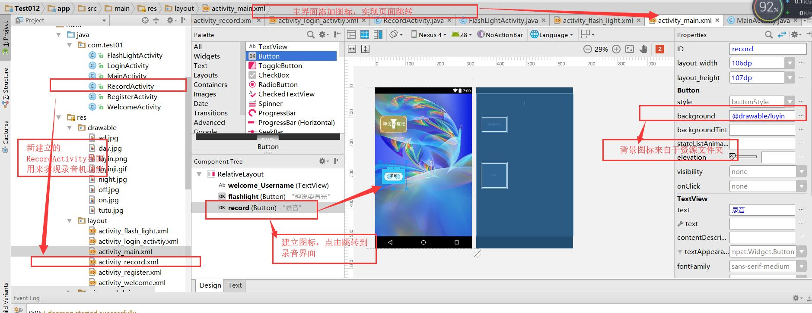
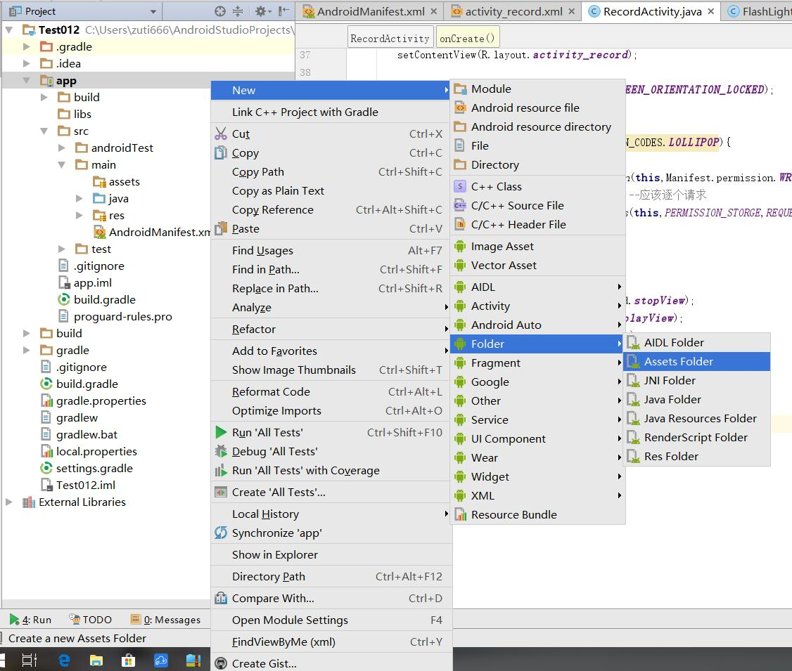

# 广告 录音机功能

## 1.进入软件时的倒计时广告

1.创建一个Activity,添加背景，并创建一个控件用来显示倒计时

注意修改布局为 relativeLayout ,并给layout加一个id


2.建立Timer计时器线程

小技巧，可以安装插件来快速查找控件。


```java
//变量声明 全局变量
private TextView timeover;
Timer timer = new Timer();
int num =6; //想看到五，就从六开始
//onCreate函数里面
timeover = (TextView) findViewById(R.id.timeover);
TimerTask task =new TimerTask() {

            @Override
            public void run() {
                runOnUiThread(new Runnable() {
                    @Override
                    public void run() {
                        num--;
                        timeover.setText("-"+num+"秒 -\n跳过");
                        if(num<=1){
                            timer.cancel();//关闭计时器线程
                            Intent intent = new Intent();
                            intent.setClass(WelcomeActivity.this,LoginActivity.class);
                            startActivity(intent);
                            WelcomeActivity.this.finish(); //关闭这个界面，从登录界面就不会返回到广告界面
                        }
                    }
                });
            }

        };
timer.schedule(task,1000,1000);
```

3.点击跳过，跳过广告

```java
//点击跳转，跳过广告
        timeover.setOnClickListener(new View.OnClickListener() {
            @Override
            public void onClick(View v) {
                timer.cancel();//关闭计时器线程
                Intent intent = new Intent();
                intent.setClass(WelcomeActivity.this,LoginActivity.class);
                startActivity(intent);
                WelcomeActivity.this.finish(); //关闭这个界面，从登录界面就不会返回到广告界面
            }
        });
```

4.点击广告，跳转到其他界面（）

```java
//变量声明，全局变量
RelativeLayout adL;
 adL=(RelativeLayout)findViewById(R.id.adLayout);//Welcome.xml中的layout的id
//点广告其他位置跳转其他页面
       adL.setOnClickListener(new View.OnClickListener() {
           @Override
           public void onClick(View v) {
               timer.cancel();//关闭计时器线程
               Intent intent = new Intent();
               intent.setClass(WelcomeActivity.this,MainActivity.class);
               startActivity(intent);
               WelcomeActivity.this.finish(); //关闭这个界面，从登录界面就不会返回到广告界面
           }
       });

```

WelcomeActivity代码

```java
package com.test01;

import android.content.Intent;
import android.support.v7.app.AppCompatActivity;
import android.os.Bundle;
import android.text.Layout;
import android.view.View;
import android.widget.RelativeLayout;
import android.widget.TextView;

import java.util.Timer;
import java.util.TimerTask;

public class WelcomeActivity extends AppCompatActivity {
    private TextView timeover;
    Timer timer = new Timer();
    int num =6; //想看到五，就从六开始
    RelativeLayout adL;

    @Override
    protected void onCreate(Bundle savedInstanceState) {
        super.onCreate(savedInstanceState);
        setContentView(R.layout.activity_welcome);

        //多线程
        timeover = (TextView) findViewById(R.id.timeover);
        adL=(RelativeLayout)findViewById(R.id.adLayout);//Welcome.xml中的layout的id

        TimerTask task =new TimerTask() {

            @Override
            public void run() {
                runOnUiThread(new Runnable() {
                    @Override
                    public void run() {
                        num--;
                        timeover.setText("-"+num+"秒 -\n跳过");
                        if(num<=1){
                            timer.cancel();//关闭计时器线程
                            Intent intent = new Intent();
                            intent.setClass(WelcomeActivity.this,LoginActivity.class);
                            startActivity(intent);
                            WelcomeActivity.this.finish(); //关闭这个界面，从登录界面就不会返回到广告界面
                        }
                    }
                });
            }

        };
        timer.schedule(task,1000,1000);
        //点击跳转，跳过广告
        timeover.setOnClickListener(new View.OnClickListener() {
            @Override
            public void onClick(View v) {
                timer.cancel();//关闭计时器线程
                Intent intent = new Intent();
                intent.setClass(WelcomeActivity.this,LoginActivity.class);
                startActivity(intent);
                WelcomeActivity.this.finish(); //关闭这个界面，从登录界面就不会返回到广告界面
            }
        });

        //点广告其他位置跳转其他页面
       adL.setOnClickListener(new View.OnClickListener() {
           @Override
           public void onClick(View v) {
               timer.cancel();//关闭计时器线程
               Intent intent = new Intent();
               intent.setClass(WelcomeActivity.this,MainActivity.class);
               startActivity(intent);
               WelcomeActivity.this.finish(); //关闭这个界面，从登录界面就不会返回到广告界面
           }
       });


    }
}

```

## 2.录音机

1.寻找一个精美的录音机gif动图，将图片放到资源文件夹下。新建RecordActivity，修改xml文件为相对布局。


2.在mianActivity中建立录音机的图标，并设置点击跳转到录音机界面




在mainActivity中实现跳转的代码

```java
        Button  record;
        record = (Button) findViewById(R.id.record);
        record.setOnClickListener(new View.OnClickListener() {
            @Override
            public void onClick(View v) {
                Intent intent = new Intent();
                intent.setClass(MainActivity.this,RecordActivity.class);
                startActivity(intent);
        }
});
```

3.在record.xml界面设置。

添加控件imageView,将精美图片添加进去，设置图像大小为属性里的的大小，我的文件是250*250像素的，设置为250px

发现动图没有动。这是由于android机制决定的。


搜索WebView，让其覆盖在ImageView，令其大小与ImageView大小相同。

添加四个按钮，给按钮设置id，并设置显示的文字。


xml代码如下

```xml
<?xml version="1.0" encoding="utf-8"?>
<RelativeLayout xmlns:android="http://schemas.android.com/apk/res/android"
    xmlns:app="http://schemas.android.com/apk/res-auto"
    xmlns:tools="http://schemas.android.com/tools"
    android:layout_width="match_parent"
    android:layout_height="match_parent"
    tools:context="com.test01.LoginActivity"
    >


    <Button
        android:id="@+id/start"
        android:layout_width="wrap_content"
        android:layout_height="wrap_content"
        android:text="开始录音"
        android:layout_alignBaseline="@+id/end"
        android:layout_alignBottom="@+id/end"
        android:layout_alignStart="@+id/play" />

    <Button
        android:id="@+id/stop"
        android:layout_width="wrap_content"
        android:layout_height="wrap_content"
        android:text="停止录音"
        android:layout_marginEnd="67dp"
        android:layout_marginBottom="58dp"
        android:layout_alignParentBottom="true"
        android:layout_alignParentEnd="true" />

    <Button
        android:id="@+id/play"
        android:layout_width="wrap_content"
        android:layout_height="wrap_content"
        android:text="播放录音"
        android:layout_marginStart="41dp"
        android:layout_marginTop="68dp"
        android:layout_below="@+id/start"
        android:layout_alignParentStart="true" />

    <Button
        android:id="@+id/end"
        android:layout_width="wrap_content"
        android:layout_height="wrap_content"
        android:text="停止播放"
        android:layout_above="@+id/stop"
        android:layout_alignStart="@+id/stop"
        android:layout_marginBottom="38dp" />

    <ImageView
        android:id="@+id/stopView"
        android:layout_width="wrap_content"
        android:layout_height="wrap_content"
        app:srcCompat="@drawable/luyinji"
        android:layout_alignParentTop="true"
        android:layout_alignEnd="@+id/end" />

    <WebView
        android:id="@+id/playView"
        android:layout_width="match_parent"
        android:layout_height="match_parent"
        android:layout_alignBottom="@+id/stopView"
        android:layout_alignEnd="@+id/stopView"
        android:layout_alignParentTop="true"
        android:layout_alignStart="@+id/stopView"
        android:visibility="invisible" />

</RelativeLayout>

```


在对应的Activity中获取控件，可以通过右键加FindViewByMe得到。


activity文件内容如下

```java
package com.test01;

import android.support.v7.app.AppCompatActivity;
import android.os.Bundle;
import android.webkit.WebView;
import android.widget.Button;
import android.widget.ImageView;

public class RecordActivity extends AppCompatActivity {
    private ImageView stopView;
    private WebView playView;
    private Button start;
    private Button stop;
    private Button play;
    private Button end;
    @Override
    protected void onCreate(Bundle savedInstanceState) {
        super.onCreate(savedInstanceState);
        setContentView(R.layout.activity_record);

        stopView = (ImageView) findViewById(R.id.stopView);
        playView = (WebView) findViewById(R.id.playView);
        start = (Button) findViewById(R.id.start);
        stop = (Button) findViewById(R.id.stop);
        play = (Button) findViewById(R.id.play);
        end = (Button) findViewById(R.id.end);
//使用webView载入图片
        playView.loadUrl("file:///android_asset/luyinji.gif");
    }
}

```

4.权限设置。

在AndroidManifest.xml中添加使用的权限


```xml
	<!-- 录音权限 -->
    <uses-permission android:name="android.permission.RECORD_AUDIO"/>
    <!-- 文件写入权限 -->
    <uses-permission android:name="android.permission.WRITE_EXTERNAL_STORAGE"/>
    <!-- 读写系统文件权限 -->
    <uses-permission android:name="android.permission.MOUNT_UNMOUNT_FILESYSTEM"/>
```

同样，在RecordActivity中

使用数组及判断版本


5.点击，动图变化实现

webView显示图片，由于路径问题需要新建立文件夹并把文件放进去。




注意文件路径应该是三条斜线

设置按钮点击事件，实现动图的显示

```java

        //点击开始录音按钮时，动图显示
        start.setOnClickListener(new View.OnClickListener() {
            @Override
            public void onClick(View v) {
                stopView.setVisibility(View.INVISIBLE);
                playView.setVisibility(View.VISIBLE);
            }
        });
        //点击开始播放录音，动图显示
        play.setOnClickListener(new View.OnClickListener() {
            @Override
            public void onClick(View v) {
                stopView.setVisibility(View.INVISIBLE);
                playView.setVisibility(View.VISIBLE);
            }
        });
        //点击停止录音按钮时，动图不显示
        stop.setOnClickListener(new View.OnClickListener() {
            @Override
            public void onClick(View v) {
                stopView.setVisibility(View.VISIBLE);
                playView.setVisibility(View.INVISIBLE);
            }
        });
        //点击停止播放录音按钮时，动图不显示
        end.setOnClickListener(new View.OnClickListener() {
            @Override
            public void onClick(View v) {
                stopView.setVisibility(View.VISIBLE);
                playView.setVisibility(View.INVISIBLE);
            }
        });
```

作业，思考如果录音没有开始，能不能点击等逻辑问题。

6.功能实现

录音

```

```

